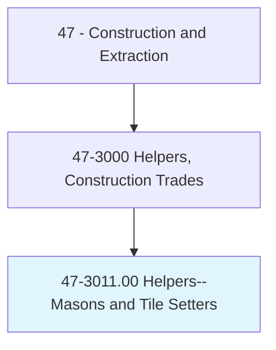
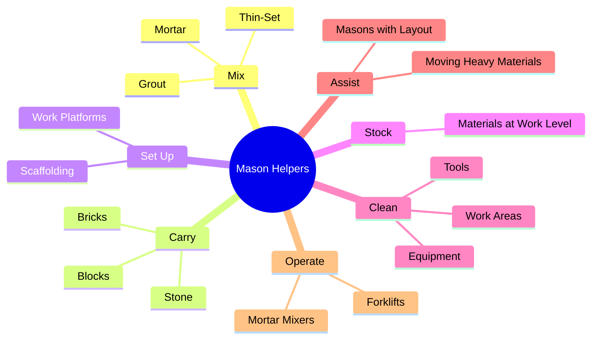
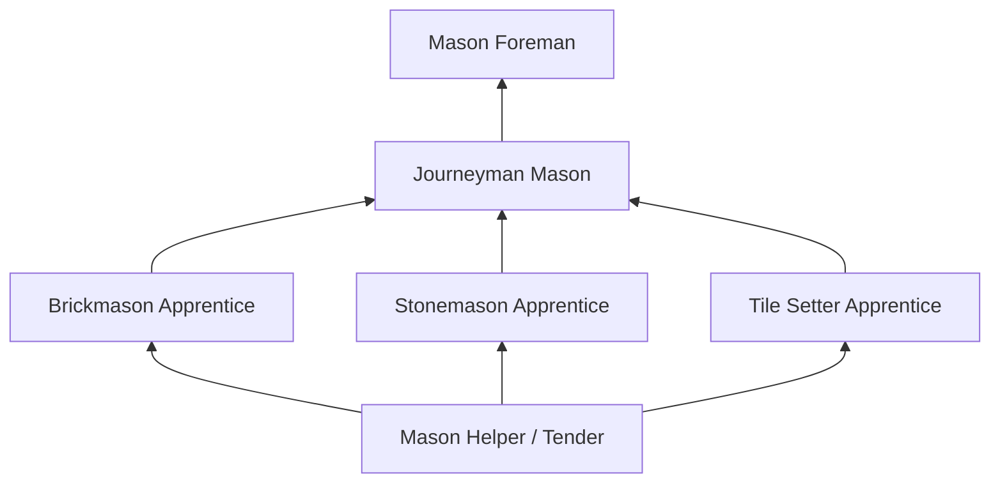
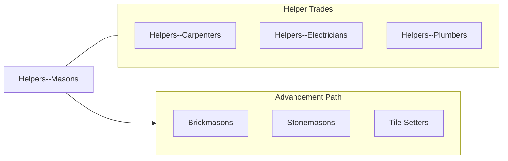

# Helpers--Brickmasons, Blockmasons, Stonemasons, and Tile and Marble Setters

> Help brickmasons, blockmasons, stonemasons, or tile and marble setters by performing duties requiring less skill.

## Overview

Masonry helpers, commonly known as mason tenders or hod carriers, support brickmasons, blockmasons, stonemasons, and tile setters by performing the essential labor tasks that keep skilled masons productive. They mix mortar and grout, carry bricks and blocks to work areas using hods and wheelbarrows, set up and move scaffolding, and maintain clean, organized work areas. Without efficient helpers, masonry production slows dramatically, making this role critical to project schedules.

The work is among the most physically demanding in construction. Helpers routinely lift and carry loads of 50-80 pounds, often on scaffolding and at heights. They mix hundreds of pounds of mortar daily, stock materials ahead of the masons, and keep waste cleared. Despite the physical demands, the position provides invaluable exposure to masonry trades and serves as the traditional entry point for aspiring brickmasons, stonemasons, and tile setters.

Experienced helpers develop a working knowledge of masonry materials, tools, and techniques through daily observation and hands-on support. Many helpers progress into formal apprenticeships after demonstrating aptitude and reliability. The role requires physical fitness, a strong work ethic, and the ability to anticipate the needs of the masons they support.

## Classification Hierarchy

## Key Statistics

| Metric | Value |
|--------|-------|
| SOC Code | 47-3011.00 |
| Job Zone | 1 (Little or No Preparation) |
| Category | [Construction and Extraction](/occupations/Construction/index) |
| Task Count | 108 |
| Median Salary | $38,400 / year |
| Employment | ~22,000 |
| Job Outlook | 2% (Slower than average) |
| Physical Demands | Very Heavy |
| Source | O*NET |

## Core Tasks

### mix.Mortar

Helpers mix mortar and grout to the consistency specified by the mason.

**Actions:**
- `mix.Mortar.to.SpecifiedConsistency`
- `mix.Grout.for.MasonryJoints`
- `mix.ThinSet.for.TileInstallation`

### carry.Materials

Helpers transport masonry materials to the work area using hods, wheelbarrows, and mechanical aids.

**Actions:**
- `carry.Bricks.to.WorkArea`
- `carry.Blocks.to.ScaffoldLevel`
- `carry.Stone.using.MechanicalAids`

## Skills & Competencies

### Technical Skills
- **Mortar Mixing** - Developing to Advanced
- **Material Handling** - Advanced
- **Scaffold Setup** - Developing
- **Basic Masonry Knowledge** - Developing
- **Tool Maintenance** - Developing
- **Forklift Operation** - Developing

### Soft Skills
- **Physical Stamina** - Critical
- **Reliability** - Critical
- **Work Ethic** - Critical
- **Teamwork** - Essential
- **Willingness to Learn** - Essential

## Education & Certifications

| Requirement | Details |
|-------------|---------|
| Typical Education | No formal requirements |
| On-the-Job Training | Ongoing |
| Physical Requirements | Must be able to lift 80+ lbs repeatedly |

### Certifications
- **OSHA 10-Hour Construction** - Safety certification
- **Scaffold User Certification** - For scaffold work
- **Forklift/Telehandler Certification** - Material handling
- **First Aid/CPR** - Recommended

## Career Progression

## Tools & Equipment

- Mortar mixers (gas and electric)
- Hods and mortar boards
- Wheelbarrows and hand trucks
- Scaffolding components
- Shovels, buckets, and brooms
- Forklifts and material handlers
- PPE (hard hat, gloves, boots, safety glasses)

## Safety Considerations

- **Heavy Lifting** - Repetitive lifting of heavy materials; proper technique essential
- **Scaffold Falls** - Working at heights; fall protection and scaffold safety
- **Mortar Burns** - Alkaline mortar; skin protection
- **Struck-By Hazards** - Falling bricks and materials
- **Heat Stress** - Outdoor work; hydration required

## Related Occupations

## Industries

- [Masonry Contractors](/industries/SpecialtyTrade) - Primary Employment
- [Building Construction](/industries/BuildingConstruction) - High Employment
- [Tile and Stone Contractors](/industries/SpecialtyTrade) - Moderate Employment

## Departments

This occupation typically works in:
- [Field Operations](/departments/FieldOperations)
- [Masonry Division](/departments/Masonry)

---

*Source: O*NET 47-3011.00 - ONETOccupation*
