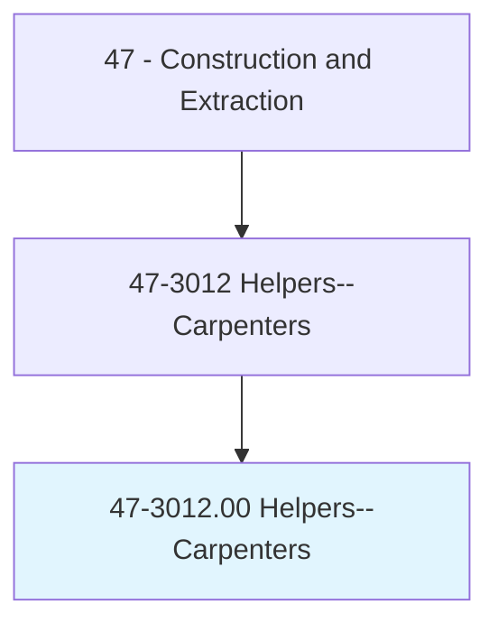
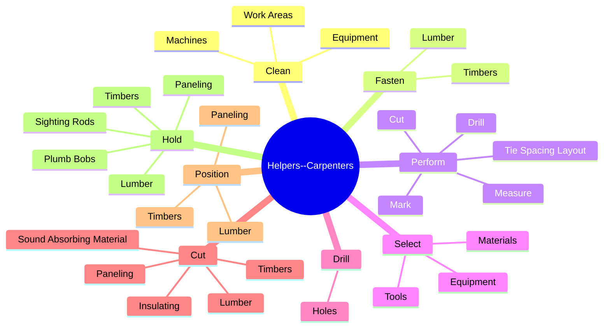
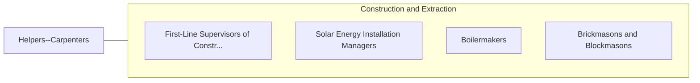

# Helpers--Carpenters

> Help carpenters by performing duties requiring less skill. Duties include using, supplying, or holding materials or tools, and cleaning work area and equipment.

## Overview

Helpers--Carpenters is an occupation within the Construction and Extraction category. Help carpenters by performing duties requiring less skill. 

## Classification Hierarchy

## Key Statistics

| Metric | Value |
|--------|-------|
| SOC Code | 47-3012.00 |
| Category | [Construction and Extraction](/occupations/Construction/index) |
| Task Count | 79 |
| Source | O*NET |

## Core Tasks

### clean.WorkAreas

Helpers--Carpenters clean work areas as part of their core responsibilities.

**Actions:**
- `clean.WorkAreas.to.maintain.CleanJobSite`
- `clean.WorkAreas.to.SafeJobSite`
- `clean.Machines.to.maintain.CleanJobSite`
- `clean.Machines.to.SafeJobSite`

### fasten.Timbers

Helpers--Carpenters fasten timbers as part of their core responsibilities.

**Actions:**
- `fasten.Timbers.with.Glue`
- `fasten.Timbers.with.Screws`
- `fasten.Timbers.with.Pegs`
- `fasten.Timbers.with.NailsHardware`

### perform.TieSpacingLayout

Helpers--Carpenters perform tie spacing layout as part of their core responsibilities.

**Actions:**
- `perform.TieSpacingLayout`
- `perform.Measure`
- `perform.Mark`
- `perform.Drill`

## Skills & Competencies

### Technical Skills
- **Construction Methods** - Advanced
- **Blueprint Reading** - Advanced
- **Safety Compliance** - Advanced

### Soft Skills
- **Communication** - Essential
- **Problem Solving** - Essential
- **Critical Thinking** - Important
- **Teamwork** - Important
- **Adaptability** - Important

## Related Occupations

## Industries

This occupation is found across multiple industries. See [Industries](/industries) for sector-specific employment data.

## Career Progression

---

*Source: O*NET 47-3012.00 - ONETOccupation*
