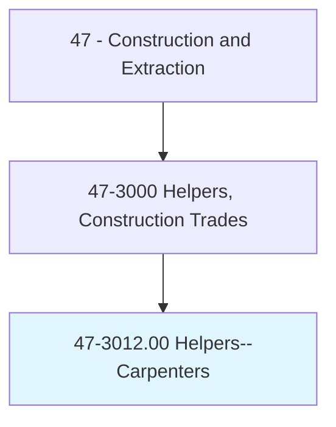
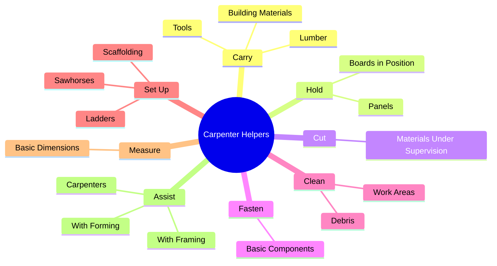
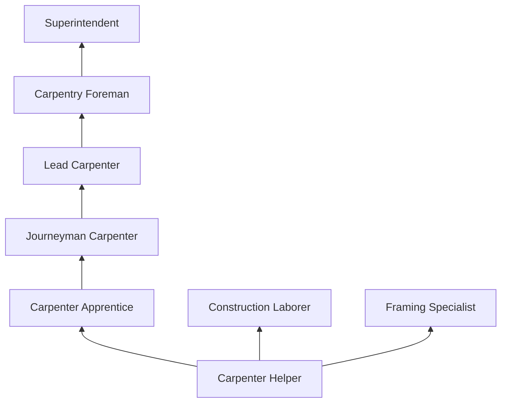
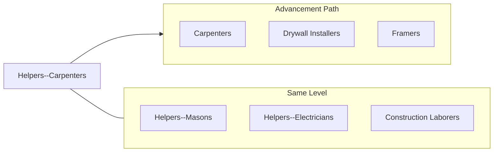

# Helpers--Carpenters

> Help carpenters by performing duties requiring less skill.

## Overview

Carpenter helpers support journeyman carpenters by performing labor-intensive tasks that keep the skilled workers productive. They carry lumber and building materials, hold boards and panels in position, clean work areas, set up and dismantle scaffolding, and perform basic cutting and fastening tasks under supervision. This is the traditional entry path into the carpentry trade, one of the largest and most versatile construction occupations.

The role provides exposure to a wide range of carpentry activities including rough framing, finish carpentry, form work, and cabinetry. Helpers learn to identify wood species and grades, use basic hand and power tools, read tape measures, and understand construction sequences. Those who demonstrate aptitude and reliability are typically offered apprenticeship positions or advancement to more skilled roles.

Carpenter helpers work on residential, commercial, and industrial projects in both new construction and renovation. The work is physically demanding, involving lifting heavy materials, working at heights on scaffolding and ladders, and performing repetitive tasks in all weather conditions. The position builds the fundamental skills and physical conditioning needed for a successful carpentry career.

## Classification Hierarchy

## Key Statistics

| Metric | Value |
|--------|-------|
| SOC Code | 47-3012.00 |
| Job Zone | 1 (Little or No Preparation) |
| Category | [Construction and Extraction](/occupations/Construction/index) |
| Task Count | 95 |
| Median Salary | $36,800 / year |
| Employment | ~40,000 |
| Job Outlook | 3% (Slower than average) |
| Physical Demands | Heavy |
| Source | O*NET |

## Core Tasks

### carry.Materials

Carpenter helpers transport building materials to work areas.

**Actions:**
- `carry.Lumber.to.WorkAreas`
- `carry.BuildingMaterials.to.Carpenters`
- `carry.Tools.to.JobSites`

### assist.Carpenters

Helpers support carpenters with skilled tasks requiring two workers.

**Actions:**
- `assist.Carpenters.with.Framing`
- `assist.Carpenters.with.Forming`
- `assist.Carpenters.by.holding.MaterialsInPosition`

## Skills & Competencies

### Technical Skills
- **Basic Tool Use (Hand and Power)** - Developing
- **Material Identification** - Developing
- **Basic Measurement** - Developing
- **Safety Awareness** - Developing
- **Scaffold Assembly** - Developing

### Soft Skills
- **Physical Stamina** - Critical
- **Reliability** - Critical
- **Willingness to Learn** - Critical
- **Teamwork** - Essential
- **Following Instructions** - Essential

## Education & Certifications

| Requirement | Details |
|-------------|---------|
| Typical Education | No formal requirements (high school preferred) |
| On-the-Job Training | Ongoing |

### Certifications
- **OSHA 10-Hour Construction** - Safety certification
- **First Aid/CPR** - Recommended
- **Scaffold User** - If working on scaffolding

## Career Progression

## Tools & Equipment

- Basic hand tools (hammer, tape measure, utility knife, square)
- Power tools under supervision (circular saw, drill)
- Scaffolding components and ladders
- Sawhorses and workbenches
- Wheelbarrows and material carts
- PPE (hard hat, safety glasses, gloves, boots)

## Safety Considerations

- **Power Tool Injuries** - Operating tools under supervision; proper training required
- **Falls** - Scaffold and ladder work; fall protection awareness
- **Heavy Lifting** - Lumber and panel handling; proper lifting techniques
- **Struck-By Hazards** - Falling materials and tools
- **Nail and Splinter Injuries** - Wood handling; gloves recommended

## Related Occupations

## Industries

- [Building Construction](/industries/BuildingConstruction) - Primary Employment
- [Specialty Trade Contractors](/industries/SpecialtyTrade) - High Employment
- [Residential Construction](/industries/ResidentialConstruction) - High Employment

## Departments

This occupation typically works in:
- [Field Operations](/departments/FieldOperations)
- [Carpentry Division](/departments/Carpentry)

---

*Source: O*NET 47-3012.00 - ONETOccupation*
