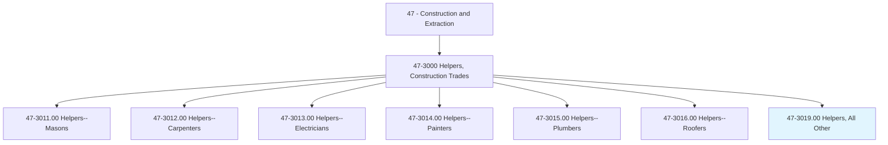
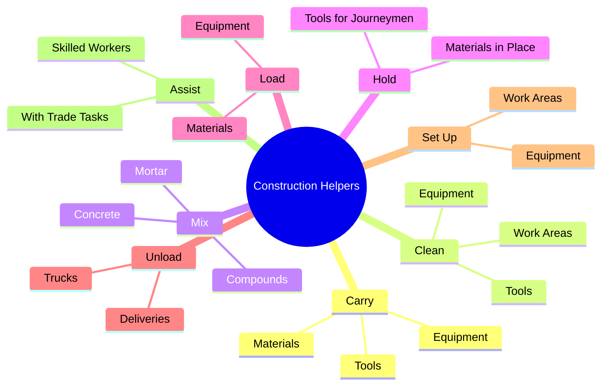
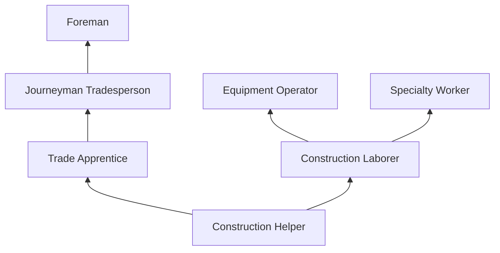
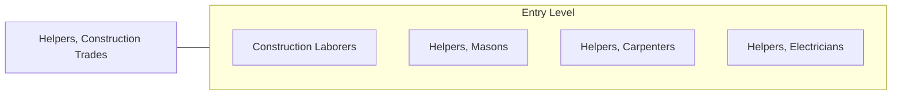

# Helpers, Construction Trades, All Other

> All construction trades helpers not listed separately.

## Overview

Helpers in Construction Trades, All Other, encompasses entry-level support workers who assist skilled trade workers across various construction disciplines not covered by specific helper classifications. These workers provide essential labor support on construction sites, performing tasks that include carrying materials, holding tools and equipment, cleaning work areas, mixing materials, and assisting journeyman-level workers with their daily tasks. This classification captures helpers working with trades such as glaziers, insulation workers, sheet metal workers, and other specialties.

Helper positions serve as the primary entry point into the construction industry for workers who lack prior trade experience. Through on-the-job exposure, helpers learn trade fundamentals, safety practices, tool identification, and construction terminology. Many helpers use these positions as stepping stones to formal apprenticeships or advancement within a specific trade. The work is physically demanding and forms the foundation of the construction workforce pipeline.

The role requires willingness to perform a wide variety of tasks, adaptability to different trade environments, and the physical capability to handle demanding manual labor. Helpers who demonstrate reliability, initiative, and aptitude for a particular trade are typically offered advancement opportunities, making this an important career launch point for construction workers.

## Classification Hierarchy

## Key Statistics

| Metric | Value |
|--------|-------|
| SOC Code | 47-3019.00 |
| Job Zone | 1 (Little or No Preparation) |
| Category | [Construction and Extraction](/occupations/Construction/index) |
| Task Count | Variable |
| Median Salary | $36,200 / year |
| Employment | ~25,000 |
| Job Outlook | 3% (Slower than average) |
| Physical Demands | Heavy |
| Source | O*NET |

## Core Tasks

### carry.Materials

Helpers transport materials and supplies to work areas.

**Actions:**
- `carry.Materials.to.WorkAreas`
- `carry.Tools.to.Tradespeople`
- `carry.Equipment.to.JobSites`

### assist.SkilledWorkers

Helpers support journeyman-level trade workers with their tasks.

**Actions:**
- `assist.SkilledWorkers.with.TradeTasks`
- `assist.SkilledWorkers.by.holding.MaterialsInPlace`
- `assist.SkilledWorkers.by.operating.SimpleEquipment`

## Skills & Competencies

### Technical Skills
- **Basic Construction Knowledge** - Entry Level
- **Tool Identification** - Entry Level
- **Material Handling** - Developing
- **Safety Awareness** - Developing
- **Basic Measurement** - Entry Level

### Soft Skills
- **Physical Stamina** - Critical
- **Willingness to Learn** - Critical
- **Reliability** - Critical
- **Teamwork** - Essential
- **Following Instructions** - Essential
- **Adaptability** - Essential

## Education & Certifications

| Requirement | Details |
|-------------|---------|
| Typical Education | No formal requirements (high school preferred) |
| On-the-Job Training | Ongoing |
| Pre-Employment | Basic physical fitness |

### Certifications
- **OSHA 10-Hour Construction** - Often required or provided
- **First Aid/CPR** - Recommended
- **Forklift Certification** - If operating material handling equipment

## Career Progression

## Specializations

Helpers typically support various trades including:
- Glazing
- Insulation
- Sheet metal
- Ironwork
- Flooring
- General construction support

## Tools & Equipment

### Basic Tools
- Shovels, brooms, and rakes
- Wheelbarrows and hand trucks
- Buckets and mixing tools
- Basic hand tools
- Safety equipment (hard hat, vest, glasses, boots, gloves)

## Safety Considerations

- **Heavy Lifting** - Frequent manual material handling
- **Struck-By Hazards** - Working near active construction
- **Fall Hazards** - Working near edges and openings
- **Tool and Equipment Injuries** - Learning to use unfamiliar tools
- **Environmental Exposure** - Heat, cold, rain, dust

## Related Occupations

## Industries

- [Specialty Trade Contractors](/industries/SpecialtyTrade) - Primary Employment
- [Building Construction](/industries/BuildingConstruction) - High Employment
- [Heavy and Civil Engineering](/industries/HeavyCivil) - Moderate Employment

## Departments

This occupation typically works in:
- [Field Operations](/departments/FieldOperations)
- [Various Trade Divisions](/departments/Trades)

---

*Source: O*NET 47-3019.00 - ONETOccupation*
