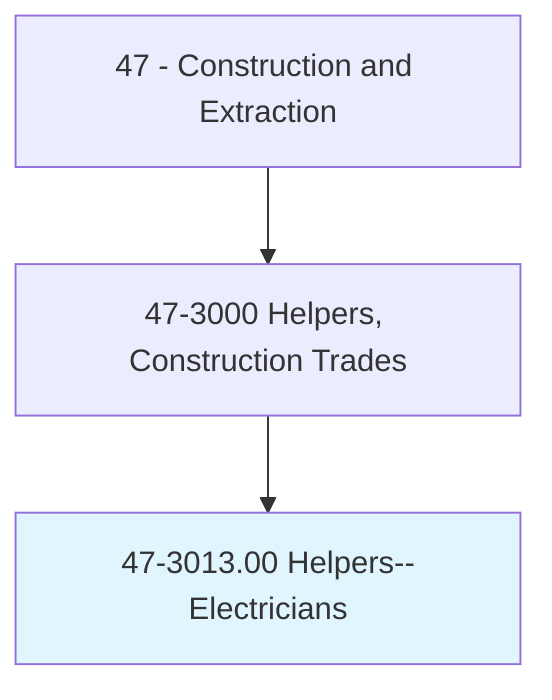
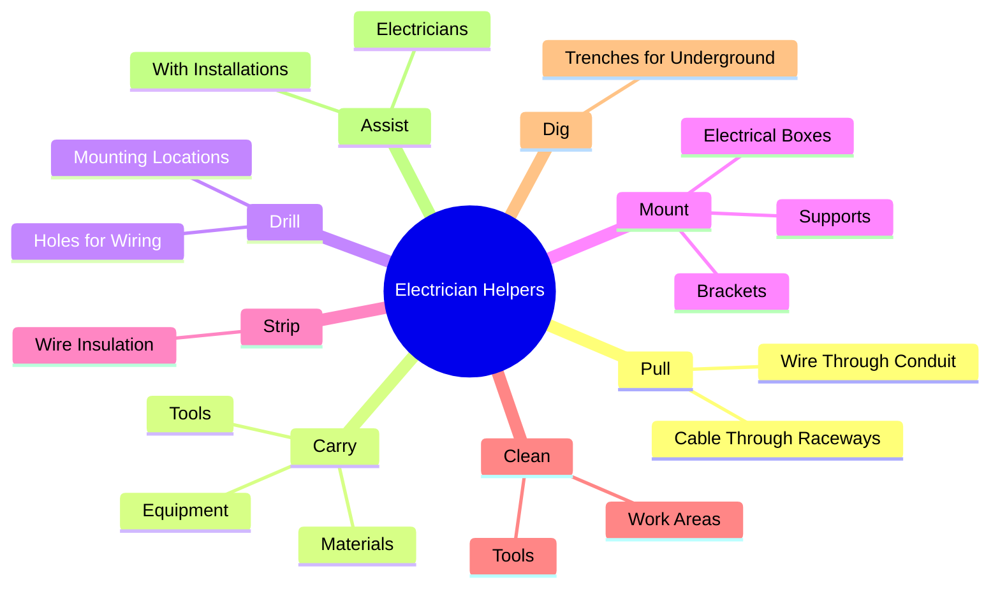
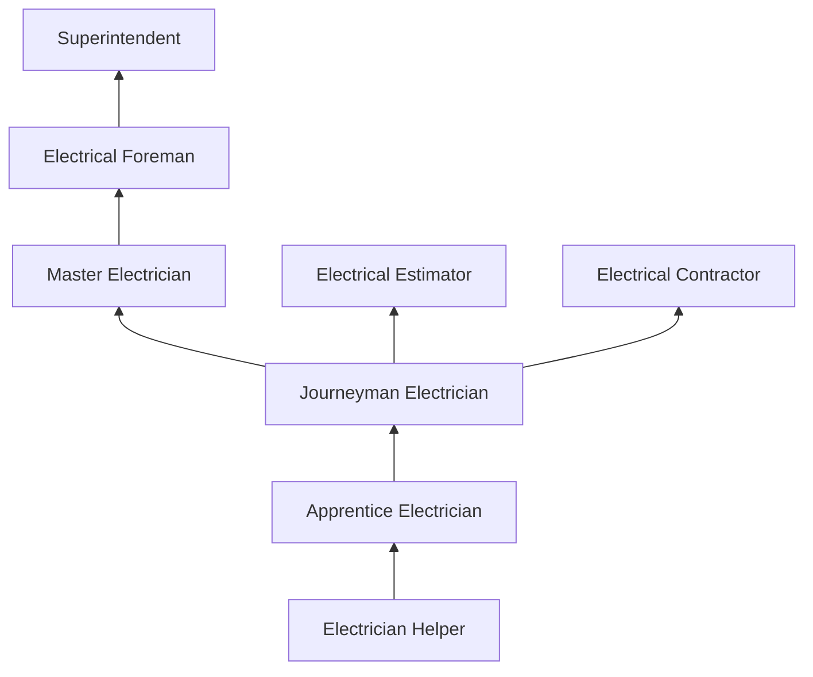
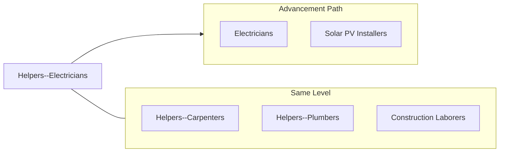

# Helpers--Electricians

> Help electricians by performing duties requiring less skill. Duties include using, supplying, or holding materials or tools, and cleaning work area and equipment.

## Overview

Electrician helpers assist licensed electricians by performing support tasks on electrical installations in residential, commercial, and industrial settings. They pull wire through conduit, carry materials and tools, drill holes for wiring runs, mount electrical boxes, strip wire insulation, and maintain organized work areas. This position is the primary gateway into the electrical trade, one of the highest-paying and most in-demand construction occupations.

Working alongside experienced electricians, helpers gain essential knowledge of electrical theory, wiring methods, code requirements, and safety practices. They learn to identify wire types and sizes, understand circuit configurations, and use basic electrical tools. The electrical trade requires a strong foundation in mathematics and physics, so helpers who aspire to advance should develop these academic skills alongside their hands-on experience.

The role carries inherent electrical hazards, as helpers work near energized circuits and equipment. Proper lockout/tagout procedures, personal protective equipment, and constant safety awareness are non-negotiable requirements. The transition from helper to apprentice electrician typically requires passing an aptitude test and demonstrating both mechanical ability and academic readiness for the classroom component of the apprenticeship.

## Classification Hierarchy

## Key Statistics

| Metric | Value |
|--------|-------|
| SOC Code | 47-3013.00 |
| Job Zone | 1 (Little or No Preparation) |
| Category | [Construction and Extraction](/occupations/Construction/index) |
| Task Count | 102 |
| Median Salary | $37,500 / year |
| Employment | ~75,000 |
| Job Outlook | 6% (Faster than average) |
| Physical Demands | Heavy |
| Source | O*NET |

## Core Tasks

### pull.Wire

Electrician helpers pull wire and cable through conduit and raceways.

**Actions:**
- `pull.Wire.through.Conduit`
- `pull.Cable.through.Raceways`
- `pull.Wire.using.FishTape`

### assist.Electricians

Helpers support electricians with installation and maintenance tasks.

**Actions:**
- `assist.Electricians.with.PanelInstallations`
- `assist.Electricians.with.FixtureMounting`
- `assist.Electricians.by.holding.MaterialsInPosition`

## Skills & Competencies

### Technical Skills
- **Basic Electrical Knowledge** - Developing
- **Wire Pulling Techniques** - Developing
- **Basic Tool Use** - Developing
- **Conduit and Raceway Knowledge** - Developing
- **Safety Procedures (LOTO)** - Developing
- **Basic Math** - Required

### Soft Skills
- **Physical Stamina** - Critical
- **Reliability** - Critical
- **Willingness to Learn** - Critical
- **Safety Consciousness** - Critical
- **Teamwork** - Essential

## Education & Certifications

| Requirement | Details |
|-------------|---------|
| Typical Education | High school diploma (math and science recommended) |
| On-the-Job Training | Ongoing |
| Aptitude Test | Required for apprenticeship entry |

### Certifications
- **OSHA 10-Hour Construction** - Safety certification
- **First Aid/CPR** - Recommended
- **Aerial Lift Certification** - If operating lifts

## Career Progression

## Tools & Equipment

- Wire strippers and cutters
- Screwdrivers (insulated)
- Pliers (lineman's, needle-nose, channel-lock)
- Fish tape and cable pullers
- Drill and bits
- Tape measures and levels
- PPE (safety glasses, gloves, hard hat, boots)
- Voltage testers (non-contact)

## Safety Considerations

- **Electrical Shock** - Working near energized circuits; LOTO procedures critical
- **Arc Flash** - Proximity to electrical panels; appropriate PPE
- **Falls** - Ladder and lift work; fall protection
- **Heavy Lifting** - Wire spools and conduit bundles
- **Confined Spaces** - Electrical rooms and vaults
- **Cuts and Abrasions** - Wire and conduit handling

## Related Occupations

## Industries

- [Electrical Contractors](/industries/SpecialtyTrade) - Primary Employment
- [Building Construction](/industries/BuildingConstruction) - High Employment
- [Industrial Construction](/industries/IndustrialConstruction) - Moderate Employment

## Departments

This occupation typically works in:
- [Field Operations](/departments/FieldOperations)
- [Electrical Division](/departments/Electrical)

---

*Source: O*NET 47-3013.00 - ONETOccupation*
