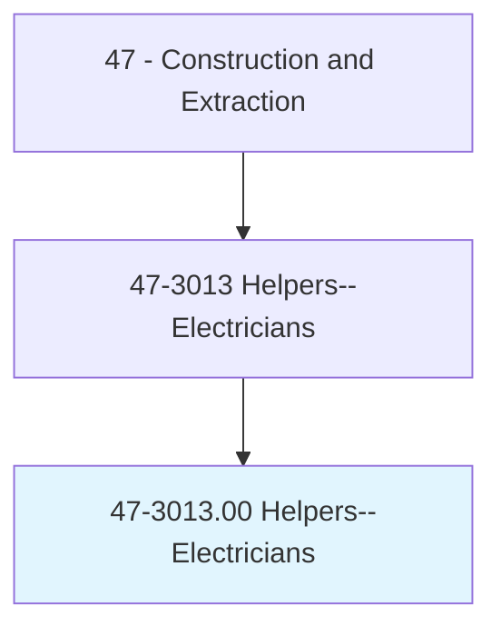
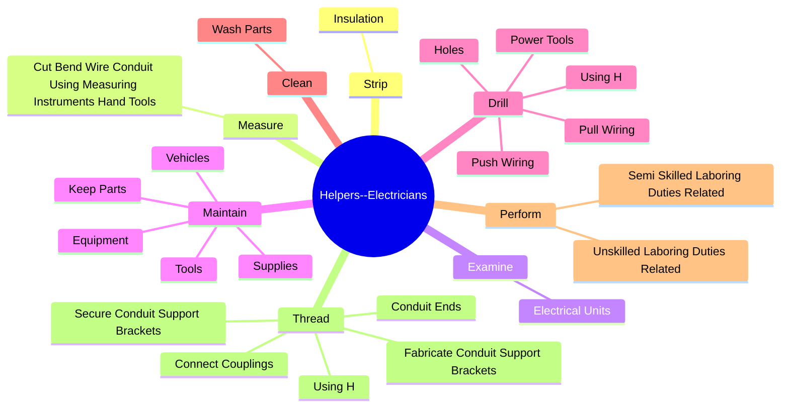
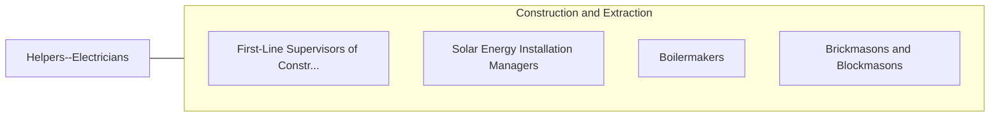

# Helpers--Electricians

> Help electricians by performing duties requiring less skill. Duties include using, supplying, or holding materials or tools, and cleaning work area and equipment.

## Overview

Helpers--Electricians is an occupation within the Construction and Extraction category. Help electricians by performing duties requiring less skill. 

## Classification Hierarchy

## Key Statistics

| Metric | Value |
|--------|-------|
| SOC Code | 47-3013.00 |
| Category | [Construction and Extraction](/occupations/Construction) |
| Task Count | 116 |
| Source | O*NET |

## Core Tasks

### strip.Insulation

Helpers--Electricians strip insulation as part of their core responsibilities.

**Actions:**
- `strip.Insulation.from.WireEnds`
- `strip.Insulation.from.UsingWireStrippingPliers`
- `strip.Insulation.from.AttachWiresToTerminalsForSubsequentSoldering`

### measure.CutBendWireConduitUsingMeasuringInstrumentsHandTools

Helpers--Electricians measure cut bend wire conduit using measuring instruments hand tools as part of their core responsibilities.

**Actions:**
- `measure.CutBendWireConduitUsingMeasuringInstrumentsHandTools`

### examine.ElectricalUnits

Helpers--Electricians examine electrical units as part of their core responsibilities.

**Actions:**
- `examine.ElectricalUnits.for.LooseConnectionsInsulationTightenConnections`
- `examine.ElectricalUnits.for.BrokenInsulationTightenConnections`
- `examine.ElectricalUnits.for.UsingH`
- `examine.ElectricalUnits.for.Tools`

## Skills & Competencies

### Technical Skills
- **Construction Methods** - Advanced
- **Blueprint Reading** - Advanced
- **Safety Compliance** - Advanced

### Soft Skills
- **Communication** - Essential
- **Problem Solving** - Essential
- **Critical Thinking** - Important
- **Teamwork** - Important
- **Adaptability** - Important

## Related Occupations

## Industries

This occupation is found across multiple industries. See [Industries](/industries) for sector-specific employment data.

## Career Progression

---

*Source: O*NET 47-3013.00 - ONETOccupation*
