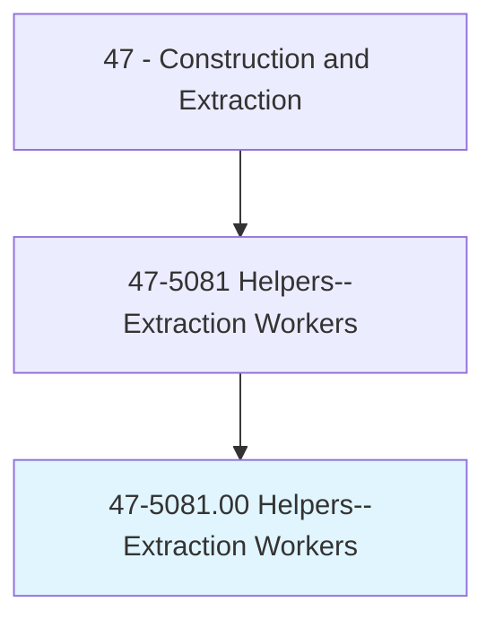
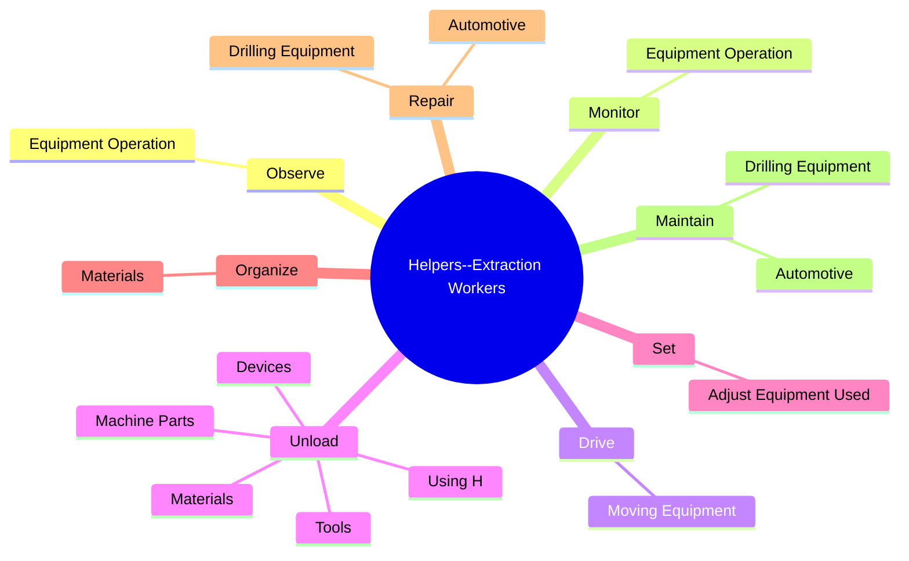
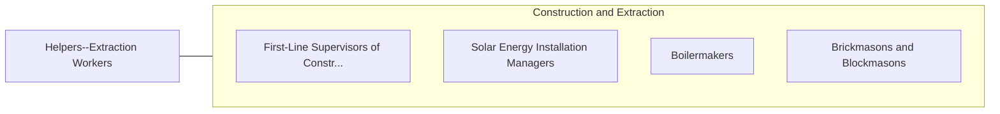

# Helpers--Extraction Workers

> Help extraction craft workers, such as earth drillers, blasters and explosives workers, derrick operators, and mining machine operators, by performing duties requiring less skill. Duties include supplying equipment or cleaning work area.

## Overview

Helpers--Extraction Workers is an occupation within the Construction and Extraction category. Help extraction craft workers, such as earth drillers, blasters and explosives workers, derrick operators, and mining machine operators, by performing duties requiring less skill. 

## Classification Hierarchy

## Key Statistics

| Metric | Value |
|--------|-------|
| SOC Code | 47-5081.00 |
| Category | [Construction and Extraction](/occupations/Construction/index) |
| Task Count | 43 |
| Source | O*NET |

## Core Tasks

### observe.EquipmentOperation

Helpers--Extraction Workers observe equipment operation as part of their core responsibilities.

**Actions:**
- `observe.EquipmentOperation.during.ExtractionProcess.to.detect.Problems`

### monitor.EquipmentOperation

Helpers--Extraction Workers monitor equipment operation as part of their core responsibilities.

**Actions:**
- `monitor.EquipmentOperation.during.ExtractionProcess.to.detect.Problems`

### drive.MovingEquipment

Helpers--Extraction Workers drive moving equipment as part of their core responsibilities.

**Actions:**
- `drive.MovingEquipment.to.transport.MaterialsToExcavationSites`
- `drive.MovingEquipment.to.PartsToExcavationSites`

## Skills & Competencies

### Technical Skills
- **Construction Methods** - Advanced
- **Blueprint Reading** - Advanced
- **Safety Compliance** - Advanced

### Soft Skills
- **Communication** - Essential
- **Problem Solving** - Essential
- **Critical Thinking** - Important
- **Teamwork** - Important
- **Adaptability** - Important

## Related Occupations

## Industries

This occupation is found across multiple industries. See [Industries](/industries) for sector-specific employment data.

## Career Progression

---

*Source: O*NET 47-5081.00 - ONETOccupation*
