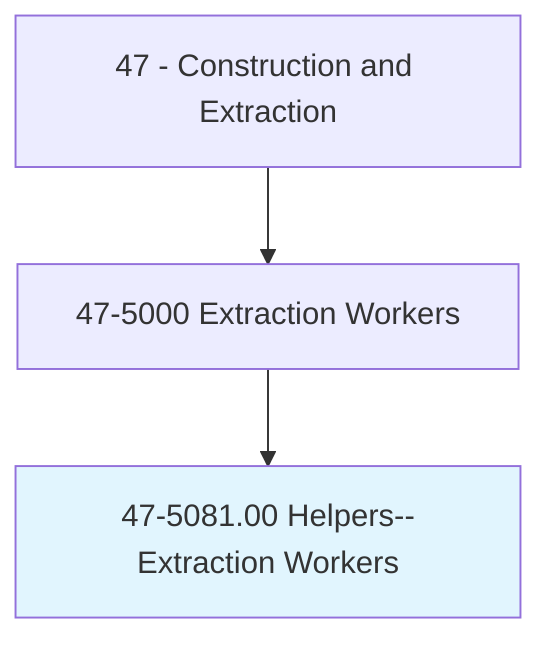
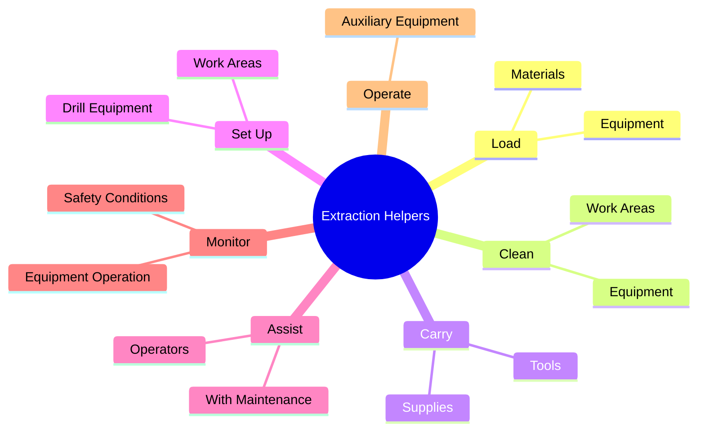
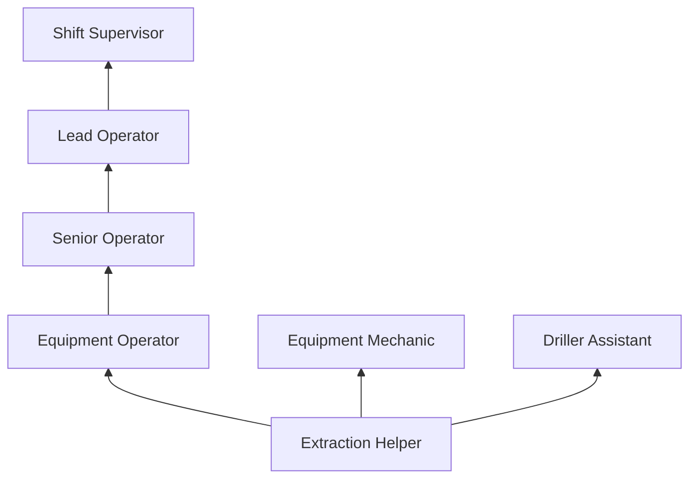
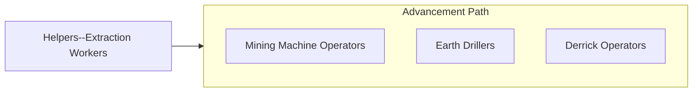

# Helpers--Extraction Workers

> Help extraction craft workers, such as earth drillers, blasters and explosives workers, derrick operators, and mining machine operators, by performing duties requiring less skill.

## Overview

Extraction worker helpers support skilled operators in mining, drilling, and quarrying operations by performing labor-intensive tasks that keep production equipment and processes running. They load and unload materials, clean and maintain equipment, carry tools and supplies, set up work areas, and assist operators with equipment changes and maintenance. The work takes place in challenging environments including underground mines, open-pit operations, oil and gas well sites, and quarries.

These entry-level positions provide essential workforce support in extraction industries where production efficiency depends on skilled operators staying focused on their primary equipment. Helpers perform the surrounding tasks: setting up drill steel, mixing drilling fluids, operating auxiliary equipment, hauling waste materials, and maintaining the work area. Through daily exposure to extraction operations, helpers develop the knowledge and skills needed to advance into operator positions.

The work is physically demanding and often hazardous, with helpers exposed to the same environmental conditions as the operators they support: underground confinement, dust, noise, heavy equipment, and extreme weather on surface operations. Proper safety training is mandatory before helpers can enter mining or drilling environments, with MSHA requirements applying to all mining operations.

## Classification Hierarchy

## Key Statistics

| Metric | Value |
|--------|-------|
| SOC Code | 47-5081.00 |
| Job Zone | 1 (Little or No Preparation) |
| Category | [Construction and Extraction](/occupations/Construction/index) |
| Task Count | 85 |
| Median Salary | $39,200 / year |
| Employment | ~10,000 |
| Job Outlook | -2% (Decline) |
| Physical Demands | Very Heavy |
| Source | O*NET |

## Core Tasks

### assist.Operators

Helpers support extraction equipment operators with production tasks.

**Actions:**
- `assist.Operators.with.EquipmentChanges`
- `assist.Operators.with.Maintenance`
- `assist.Operators.by.setting.UpEquipment`

## Skills & Competencies

### Technical Skills
- **Basic Equipment Knowledge** - Developing
- **Material Handling** - Advanced
- **Safety Procedures (MSHA)** - Developing
- **Basic Maintenance** - Developing
- **Tool Identification** - Developing

### Soft Skills
- **Physical Stamina** - Critical
- **Reliability** - Critical
- **Safety Consciousness** - Critical
- **Teamwork** - Essential
- **Adaptability** - Essential

## Education & Certifications

| Requirement | Details |
|-------------|---------|
| Typical Education | High school diploma or equivalent |
| MSHA Training | Required before entering mine site |
| On-the-Job Training | Ongoing |

### Certifications
- **MSHA New Miner Training** - Part 46 or 48 (mandatory)
- **MSHA Annual Refresher** - 8-hour annual requirement
- **First Aid/CPR** - Required
- **H2S Alive** - For oil and gas operations

## Career Progression

## Safety Considerations

- **Underground Hazards** - Roof falls, gas accumulation, confined spaces
- **Heavy Equipment** - Working near massive machinery; exclusion zones
- **Noise and Dust** - Hearing and respiratory protection required
- **Physical Demands** - Heavy lifting in challenging conditions
- **Chemical Exposure** - Drilling fluids and mining chemicals

## Related Occupations

## Industries

- [Mining](/industries/Mining) - Primary Employment
- [Oil and Gas Extraction](/industries/OilGasExtraction) - Moderate Employment
- [Support Activities for Mining](/industries/MiningSupport) - High Employment

## Departments

This occupation typically works in:
- [Mining Operations](/departments/MiningOps)
- [Drilling Operations](/departments/DrillingOps)
- [Maintenance](/departments/Maintenance)

---

*Source: O*NET 47-5081.00 - ONETOccupation*
