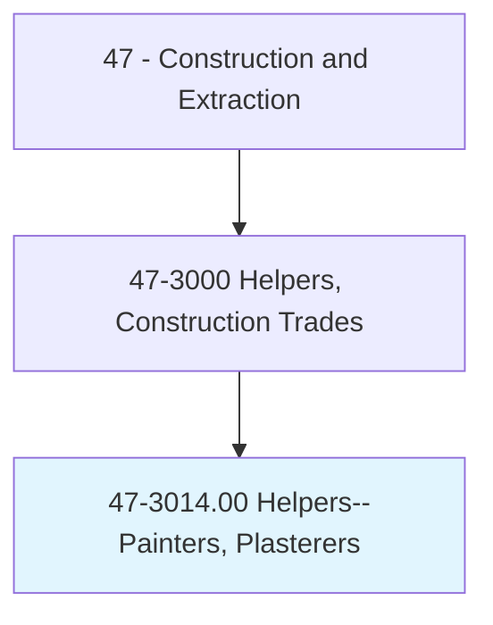
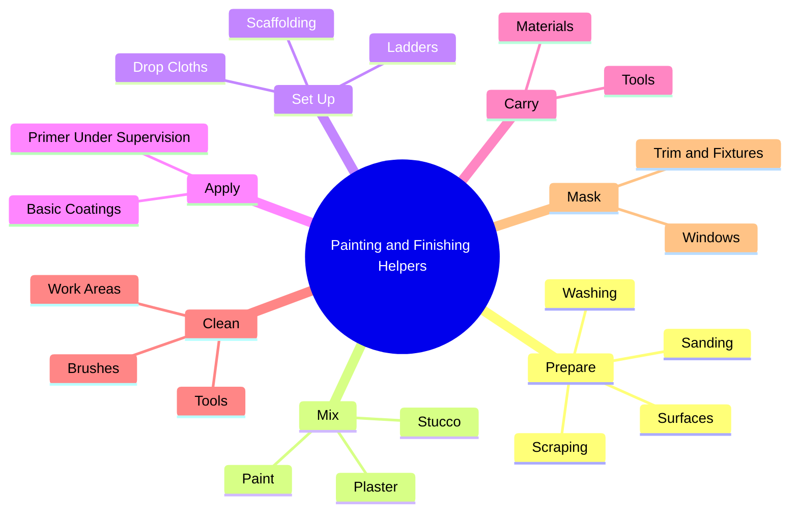
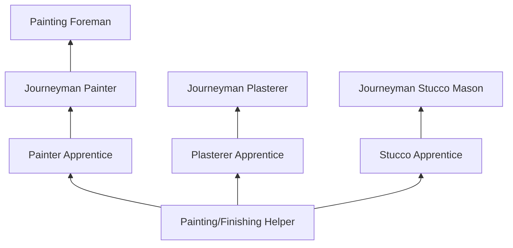
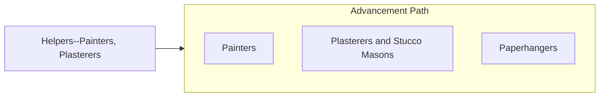

# Helpers--Painters, Paperhangers, Plasterers, and Stucco Masons

> Help painters, paperhangers, plasterers, or stucco masons by performing duties requiring less skill.

## Overview

Helpers in the painting and finishing trades support skilled painters, paperhangers, plasterers, and stucco masons by performing preparatory and labor-intensive tasks. They prepare surfaces by scraping, sanding, and washing walls; mix and carry paint, plaster, and stucco; set up ladders, scaffolding, and drop cloths; apply primer and basic coatings under supervision; and clean tools and work areas. These helpers work across residential, commercial, and industrial painting and finishing projects.

The finishing trades are among the last to work on a construction project, and helpers in these trades learn the importance of surface preparation, material selection, and clean workmanship. Through daily exposure, they develop skills in color mixing, surface analysis, application techniques, and coating systems that prepare them for advancement into skilled positions. The work provides a pathway into painting, papering, plastering, or stucco -- each a distinct specialty with its own techniques and career ladder.

The role is physically demanding, involving prolonged standing, overhead reaching, ladder and scaffold work, and exposure to paint fumes and dust from surface preparation. Helpers must be detail-oriented, as the finishing trades determine the final visual appearance of every surface in a building.

## Classification Hierarchy

## Key Statistics

| Metric | Value |
|--------|-------|
| SOC Code | 47-3014.00 |
| Job Zone | 1 (Little or No Preparation) |
| Category | [Construction and Extraction](/occupations/Construction/index) |
| Task Count | 92 |
| Median Salary | $35,900 / year |
| Employment | ~15,000 |
| Job Outlook | 2% (Slower than average) |
| Physical Demands | Heavy |
| Source | O*NET |

## Core Tasks

### prepare.Surfaces

Helpers prepare surfaces for painting, plastering, or stucco application.

**Actions:**
- `prepare.Surfaces.by.Scraping`
- `prepare.Surfaces.by.Sanding`
- `prepare.Surfaces.by.Washing`
- `prepare.Surfaces.by.Masking`

### mix.Materials

Helpers mix paint, plaster, and stucco to specified consistency.

**Actions:**
- `mix.Paint.to.SpecifiedColor`
- `mix.Plaster.to.ProperConsistency`
- `mix.Stucco.to.ApplicationReadiness`

## Skills & Competencies

### Technical Skills
- **Surface Preparation** - Developing
- **Material Mixing** - Developing
- **Basic Application Techniques** - Developing
- **Tool and Equipment Care** - Developing
- **Safety Awareness** - Developing

### Soft Skills
- **Physical Stamina** - Critical
- **Attention to Detail** - Important
- **Reliability** - Critical
- **Willingness to Learn** - Essential
- **Teamwork** - Essential

## Education & Certifications

| Requirement | Details |
|-------------|---------|
| Typical Education | No formal requirements |
| On-the-Job Training | Ongoing |

### Certifications
- **OSHA 10-Hour Construction** - Safety certification
- **EPA RRP Certified (Lead-Safe)** - For work on pre-1978 buildings
- **Scaffold User Certification** - If working on scaffolding
- **First Aid/CPR** - Recommended

## Career Progression

## Safety Considerations

- **Chemical Fumes** - Paint and solvent exposure; ventilation and respirators
- **Lead Paint** - Pre-1978 buildings; EPA RRP compliance
- **Falls** - Ladder and scaffold work; fall protection
- **Repetitive Motion** - Sanding and scraping; ergonomic awareness
- **Skin Irritation** - Chemical contact; gloves and protective clothing
- **Eye Protection** - Splashing and dripping; safety glasses

## Related Occupations

## Industries

- [Painting Contractors](/industries/SpecialtyTrade) - Primary Employment
- [Building Construction](/industries/BuildingConstruction) - High Employment
- [Plastering and Stucco Contractors](/industries/SpecialtyTrade) - Moderate Employment

## Departments

This occupation typically works in:
- [Field Operations](/departments/FieldOperations)
- [Painting Division](/departments/Painting)
- [Plastering Division](/departments/Plastering)

---

*Source: O*NET 47-3014.00 - ONETOccupation*
