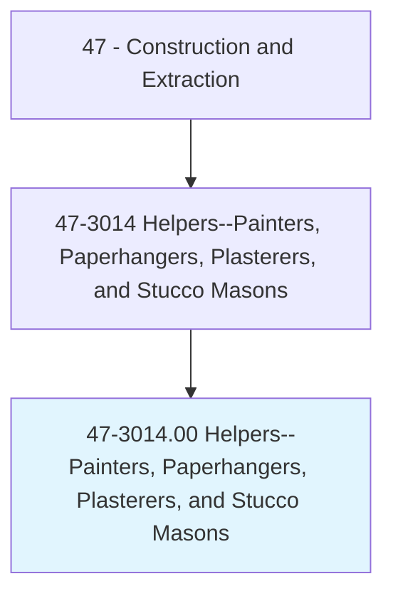
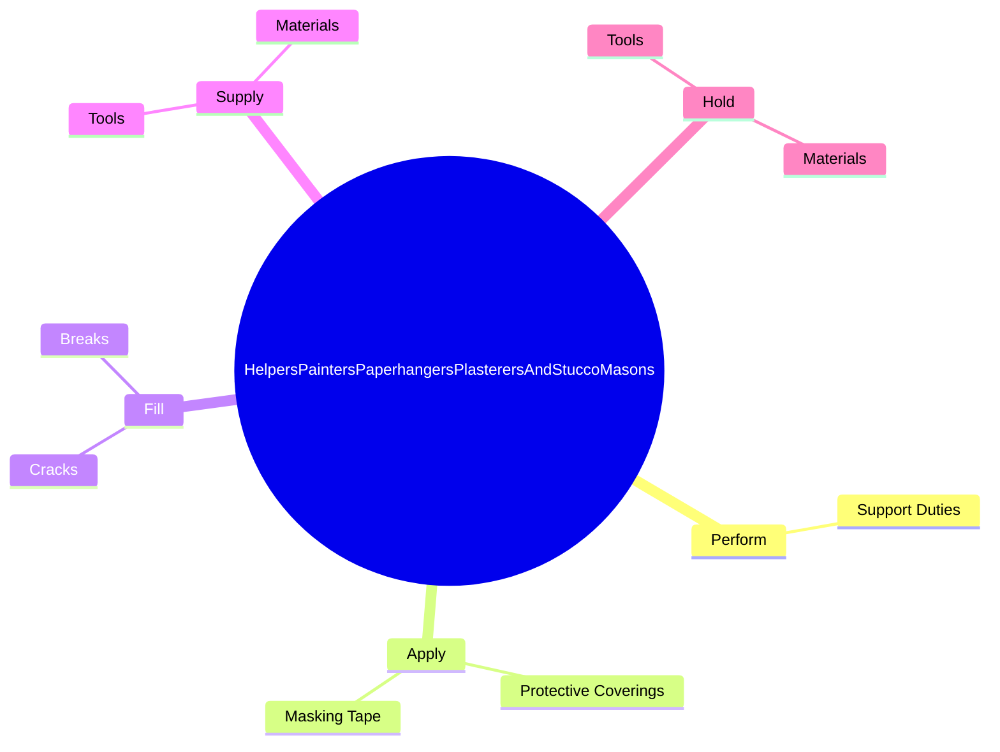

# Helpers--Painters, Paperhangers, Plasterers, and Stucco Masons

> Help painters, paperhangers, plasterers, or stucco masons by performing duties requiring less skill. Duties include using, supplying, or holding materials or tools, and cleaning work area and equipment.

## Overview

Helpers--Painters, Paperhangers, Plasterers, and Stucco Masons is an occupation within the Construction and Extraction category. Help painters, paperhangers, plasterers, or stucco masons by performing duties requiring less skill. 

## Classification Hierarchy

## Key Statistics

| Metric | Value |
|--------|-------|
| SOC Code | 47-3014.00 |
| Category | [Construction and Extraction](/occupations/Construction/index) |
| Task Count | 28 |
| Source | O*NET |

## Core Tasks

### perform.SupportDuties

Helpers--Painters, Paperhangers, Plasterers, and Stucco Masons perform support duties as part of their core responsibilities.

**Actions:**
- `perform.SupportDuties.to.assist.Painters`
- `perform.SupportDuties.to.Paperhangers`
- `perform.SupportDuties.to.Plasterers`
- `perform.SupportDuties.to.Masons`

### apply.ProtectiveCoverings

Helpers--Painters, Paperhangers, Plasterers, and Stucco Masons apply protective coverings as part of their core responsibilities.

**Actions:**
- `apply.ProtectiveCoverings.to.ArticlesCouldBeDamagedStainedByWorkProcesses`
- `apply.ProtectiveCoverings.to.AreasCouldBeDamagedStainedByWorkProcesses`
- `apply.MaskingTape.to.ArticlesCouldBeDamagedStainedByWorkProcesses`
- `apply.MaskingTape.to.AreasCouldBeDamagedStainedByWorkProcesses`

### fill.Cracks

Helpers--Painters, Paperhangers, Plasterers, and Stucco Masons fill cracks as part of their core responsibilities.

**Actions:**
- `fill.Cracks.in.Surfaces.of.PlasterArticlesWithPuttyEpoxyCompounds`
- `fill.Cracks.in.Areas.with.PuttyEpoxyCompounds`
- `fill.Breaks.in.Surfaces.of.PlasterArticlesWithPuttyEpoxyCompounds`
- `fill.Breaks.in.Areas.with.PuttyEpoxyCompounds`

## Skills & Competencies

### Technical Skills
- **Construction Methods** - Advanced
- **Blueprint Reading** - Advanced
- **Safety Compliance** - Advanced

### Soft Skills
- **Communication** - Essential
- **Problem Solving** - Essential
- **Critical Thinking** - Important
- **Teamwork** - Important
- **Adaptability** - Important

## Related Occupations

## Industries

This occupation is found across multiple industries. See [Industries](/industries) for sector-specific employment data.

## Career Progression

---

*Source: O*NET 47-3014.00 - ONETOccupation*
