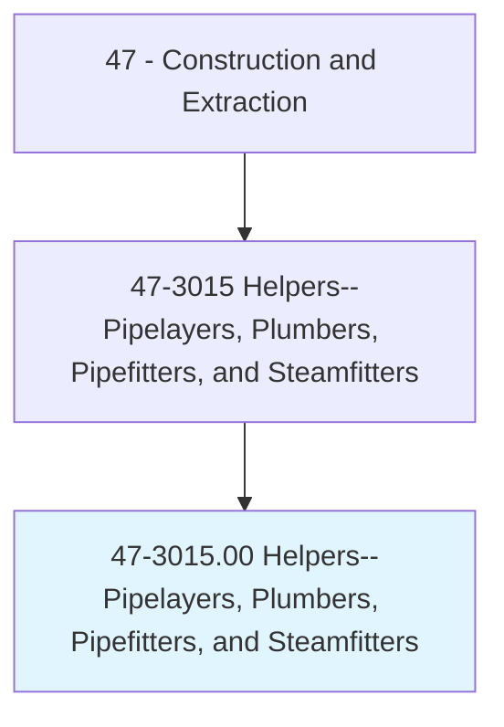
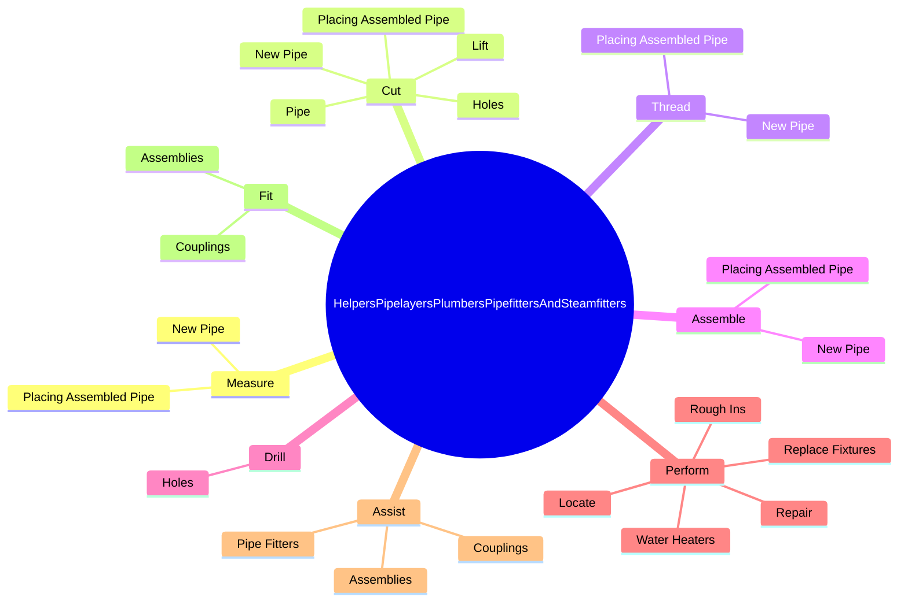
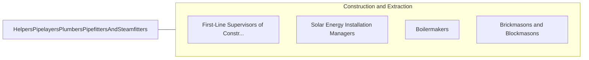

# Helpers--Pipelayers, Plumbers, Pipefitters, and Steamfitters

> Help plumbers, pipefitters, steamfitters, or pipelayers by performing duties requiring less skill. Duties include using, supplying, or holding materials or tools, and cleaning work area and equipment.

## Overview

Helpers--Pipelayers, Plumbers, Pipefitters, and Steamfitters is an occupation within the Construction and Extraction category. Help plumbers, pipefitters, steamfitters, or pipelayers by performing duties requiring less skill. 

## Classification Hierarchy

## Key Statistics

| Metric | Value |
|--------|-------|
| SOC Code | 47-3015.00 |
| Category | [Construction and Extraction](/occupations/Construction/index) |
| Task Count | 110 |
| Source | O*NET |

## Core Tasks

### measure.NewPipe

Helpers--Pipelayers, Plumbers, Pipefitters, and Steamfitters measure new pipe as part of their core responsibilities.

**Actions:**
- `measure.NewPipe.in.HangersSupports`
- `measure.NewPipe.in.OtherSupports`
- `measure.PlacingAssembledPipe.in.HangersSupports`
- `measure.PlacingAssembledPipe.in.OtherSupports`

### cut.NewPipe

Helpers--Pipelayers, Plumbers, Pipefitters, and Steamfitters cut new pipe as part of their core responsibilities.

**Actions:**
- `cut.NewPipe.in.HangersSupports`
- `cut.NewPipe.in.OtherSupports`
- `cut.PlacingAssembledPipe.in.HangersSupports`
- `cut.PlacingAssembledPipe.in.OtherSupports`

### thread.NewPipe

Helpers--Pipelayers, Plumbers, Pipefitters, and Steamfitters thread new pipe as part of their core responsibilities.

**Actions:**
- `thread.NewPipe.in.HangersSupports`
- `thread.NewPipe.in.OtherSupports`
- `thread.PlacingAssembledPipe.in.HangersSupports`
- `thread.PlacingAssembledPipe.in.OtherSupports`

## Skills & Competencies

### Technical Skills
- **Construction Methods** - Advanced
- **Blueprint Reading** - Advanced
- **Safety Compliance** - Advanced

### Soft Skills
- **Communication** - Essential
- **Problem Solving** - Essential
- **Critical Thinking** - Important
- **Teamwork** - Important
- **Adaptability** - Important

## Related Occupations

## Industries

This occupation is found across multiple industries. See [Industries](/industries) for sector-specific employment data.

## Career Progression

---

*Source: O*NET 47-3015.00 - ONETOccupation*
