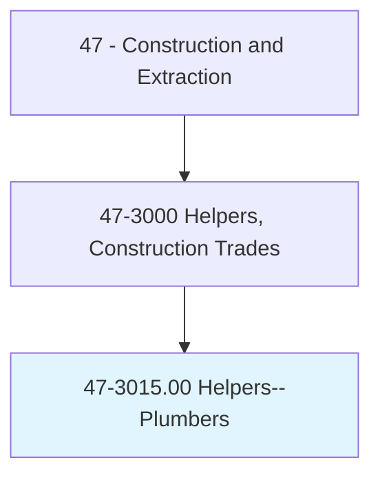
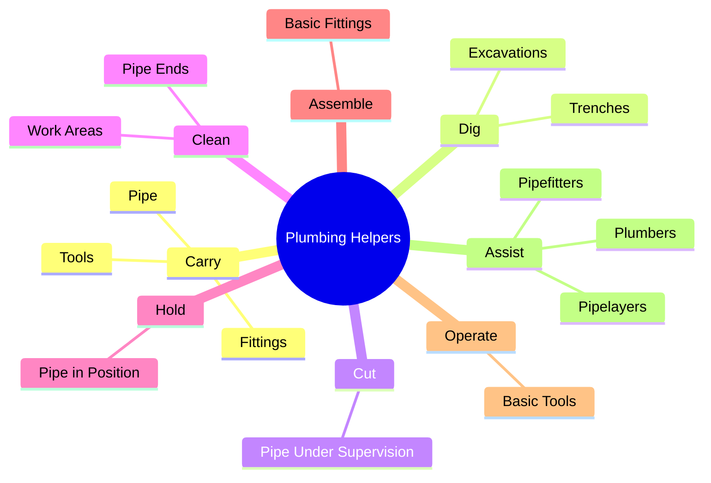
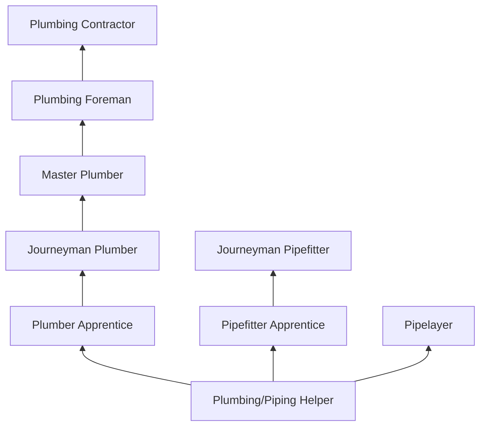
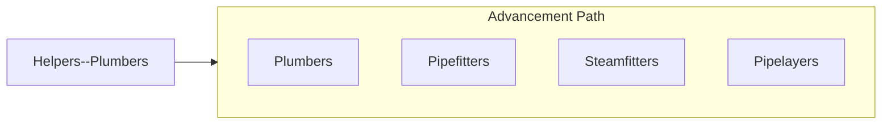

# Helpers--Pipelayers, Plumbers, Pipefitters, and Steamfitters

> Help plumbers, pipefitters, steamfitters, or pipelayers by performing duties requiring less skill.

## Overview

Plumbing and pipefitting helpers support skilled piping trade workers by performing essential labor tasks on residential, commercial, industrial, and civil construction projects. They carry pipe, fittings, and tools; dig trenches for underground piping; cut pipe to specified lengths under supervision; clean and prepare pipe ends for joining; hold pipe in position during assembly; and maintain organized work areas. This entry-level role provides exposure to one of the most diverse and well-compensated construction trades.

The piping trades encompass a broad range of specialties, and helpers may support plumbers working on water supply and drainage systems, pipefitters assembling industrial process piping, steamfitters installing high-pressure steam systems, or pipelayers installing underground utilities. Each specialty uses different materials (copper, PVC, steel, cast iron, HDPE), joining methods (soldering, welding, solvent cement, mechanical coupling), and code requirements (Uniform Plumbing Code, International Plumbing Code, ASME B31).

Through hands-on experience, helpers learn pipe identification, basic fitting assembly, tool operation, and safety procedures that prepare them for formal apprenticeship. The plumbing and pipefitting trades offer some of the strongest career advancement and earning potential in construction, making the helper position a valuable starting point.

## Classification Hierarchy

## Key Statistics

| Metric | Value |
|--------|-------|
| SOC Code | 47-3015.00 |
| Job Zone | 1 (Little or No Preparation) |
| Category | [Construction and Extraction](/occupations/Construction/index) |
| Task Count | 98 |
| Median Salary | $37,200 / year |
| Employment | ~60,000 |
| Job Outlook | 5% (Faster than average) |
| Physical Demands | Heavy |
| Source | O*NET |

## Core Tasks

### carry.Pipe

Helpers transport pipe and materials to work locations.

**Actions:**
- `carry.Pipe.to.WorkAreas`
- `carry.Fittings.to.Plumbers`
- `carry.Tools.to.JobSites`

### assist.Plumbers

Helpers support skilled piping workers during installation.

**Actions:**
- `assist.Plumbers.with.PipeInstallation`
- `assist.Pipefitters.with.Assembly`
- `assist.Pipelayers.with.TrenchWork`

## Skills & Competencies

### Technical Skills
- **Pipe Identification** - Developing
- **Basic Pipe Cutting** - Developing
- **Trenching** - Developing
- **Tool Use** - Developing
- **Safety Procedures** - Developing
- **Basic Math** - Required

### Soft Skills
- **Physical Stamina** - Critical
- **Reliability** - Critical
- **Willingness to Learn** - Critical
- **Teamwork** - Essential
- **Safety Consciousness** - Essential

## Education & Certifications

| Requirement | Details |
|-------------|---------|
| Typical Education | High school diploma (math recommended) |
| On-the-Job Training | Ongoing |

### Certifications
- **OSHA 10-Hour Construction** - Safety certification
- **First Aid/CPR** - Recommended
- **Trench Safety Awareness** - For underground work

## Career Progression

## Safety Considerations

- **Trench Cave-In** - Underground work; trench protection required
- **Burns** - Soldering and welding proximity; heat protection
- **Chemical Exposure** - Solvent cements, flux, and pipe dope
- **Heavy Lifting** - Cast iron and steel pipe sections
- **Confined Spaces** - Utility vaults and crawl spaces
- **Struck-By Hazards** - Falling pipe and materials

## Related Occupations

## Industries

- [Plumbing Contractors](/industries/SpecialtyTrade) - Primary Employment
- [Mechanical Contractors](/industries/MechanicalContractors) - High Employment
- [Building Construction](/industries/BuildingConstruction) - High Employment
- [Civil Construction](/industries/HeavyCivil) - Moderate Employment

## Departments

This occupation typically works in:
- [Field Operations](/departments/FieldOperations)
- [Plumbing Division](/departments/Plumbing)
- [Mechanical Division](/departments/Mechanical)

---

*Source: O*NET 47-3015.00 - ONETOccupation*
