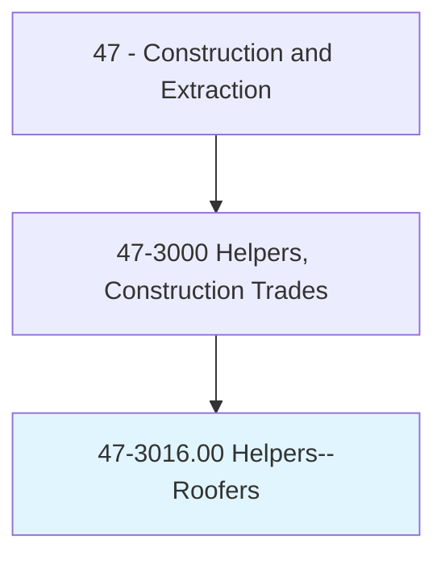
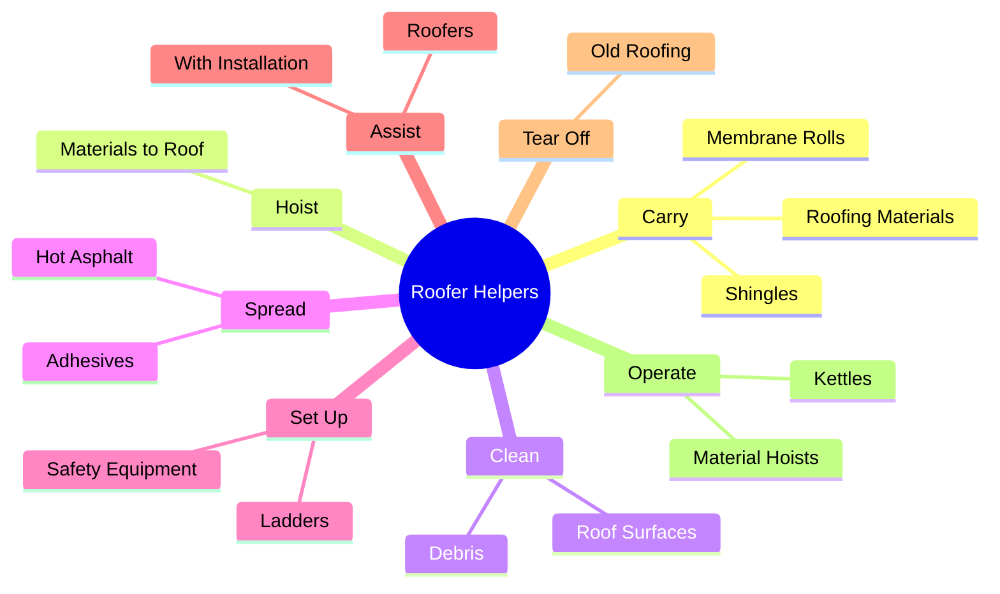
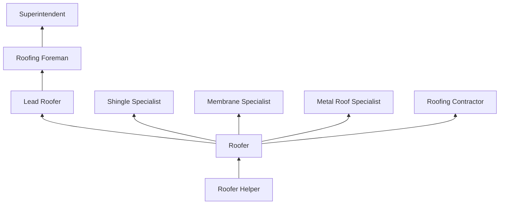
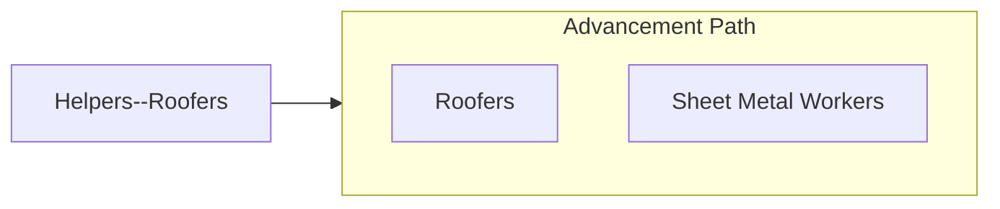

# Helpers--Roofers

> Help roofers by performing duties requiring less skill.

## Overview

Roofer helpers support skilled roofers by performing the labor-intensive tasks essential to roofing operations. They carry roofing materials (shingles, rolls, membranes) up ladders and onto roofs, operate material hoists, clean roof surfaces before installation, spread hot asphalt or adhesives, and maintain work areas. This entry-level position provides direct exposure to the roofing trade, which encompasses a wide variety of systems from residential shingles to commercial membrane and metal roofing.

Roofing is among the most physically demanding and hazardous construction trades, and helpers share these conditions. They work at heights on sloped and flat roofs, often in extreme heat (rooftop temperatures can exceed 150 degrees F in summer), and handle heavy materials while maintaining balance on elevated surfaces. Despite these challenges, roofing offers rapid skill development and strong advancement opportunities for workers who demonstrate capability and endurance.

Helpers learn the fundamentals of roof systems, weather protection, flashing, and drainage while supporting experienced roofers. Those who show aptitude can advance to skilled roofer positions relatively quickly compared to trades that require lengthy formal apprenticeships, though apprenticeship programs do exist for those seeking comprehensive training.

## Classification Hierarchy

## Key Statistics

| Metric | Value |
|--------|-------|
| SOC Code | 47-3016.00 |
| Job Zone | 1 (Little or No Preparation) |
| Category | [Construction and Extraction](/occupations/Construction/index) |
| Task Count | 65 |
| Median Salary | $35,200 / year |
| Employment | ~12,000 |
| Job Outlook | 3% (Slower than average) |
| Physical Demands | Very Heavy |
| Source | O*NET |

## Core Tasks

### carry.RoofingMaterials

Helpers transport heavy roofing materials to the work area.

**Actions:**
- `carry.RoofingMaterials.to.RoofLevel`
- `carry.Shingles.up.Ladders`
- `hoist.Materials.using.MaterialHoist`

### assist.Roofers

Helpers support skilled roofers during installation operations.

**Actions:**
- `assist.Roofers.with.MembraneInstallation`
- `assist.Roofers.with.ShingleApplication`
- `assist.Roofers.by.spreading.Adhesives`

## Skills & Competencies

### Technical Skills
- **Material Handling** - Advanced
- **Basic Roofing Knowledge** - Developing
- **Hoist and Ladder Operation** - Developing
- **Safety Procedures** - Developing
- **Basic Tool Use** - Developing

### Soft Skills
- **Physical Stamina** - Critical
- **Heights Comfort** - Critical
- **Heat Tolerance** - Critical
- **Reliability** - Critical
- **Teamwork** - Essential

## Education & Certifications

| Requirement | Details |
|-------------|---------|
| Typical Education | No formal requirements |
| On-the-Job Training | Ongoing |
| Physical Requirements | Ability to work at heights in heat |

### Certifications
- **OSHA 10-Hour Construction** - Safety certification
- **Fall Protection Training** - Required for elevated work
- **First Aid/CPR** - Recommended

## Career Progression

## Safety Considerations

- **Falls from Heights** - Leading cause of roofing fatalities; 100% fall protection
- **Heat Illness** - Extreme rooftop temperatures; mandatory hydration and rest
- **Burns** - Hot asphalt and torch-applied membranes
- **Heavy Lifting** - Carrying bundles up ladders (60-80 lbs each)
- **Slippery Surfaces** - Wet or coated roof surfaces
- **Falling Objects** - Materials sliding off sloped roofs

## Related Occupations

## Industries

- Roofing Contractors - Primary Employment
- Building Construction - High Employment
- Building Maintenance - Moderate Employment

## Departments

This occupation typically works in:
- Field Operations
- Roofing Division

---

*Source: O*NET 47-3016.00 - ONETOccupation*
