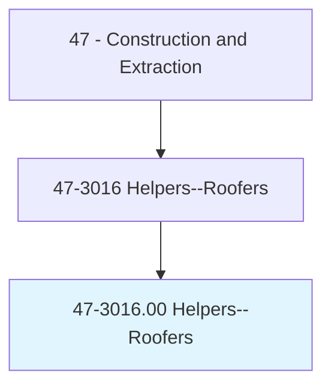
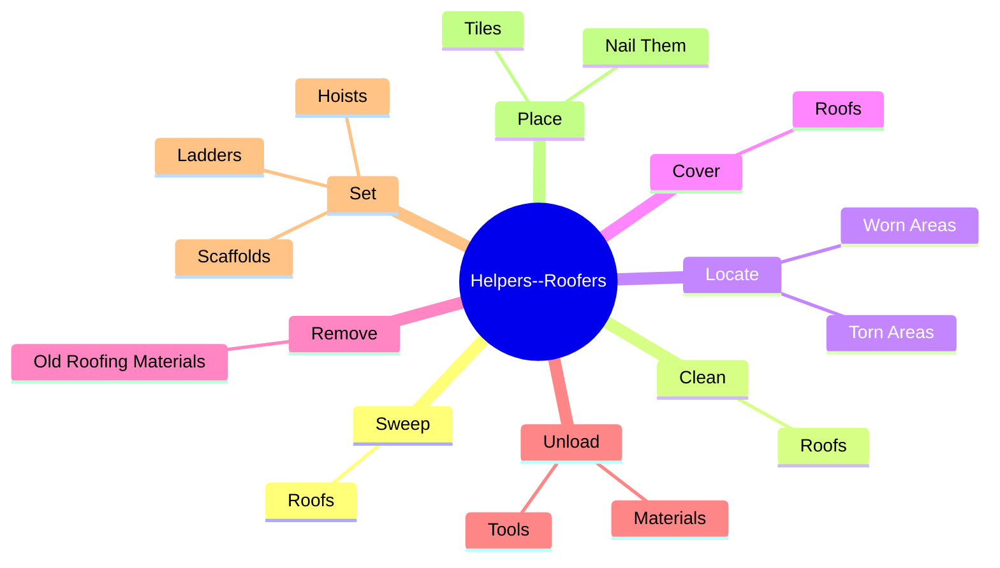
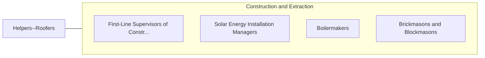

# Helpers--Roofers

> Help roofers by performing duties requiring less skill. Duties include using, supplying, or holding materials or tools, and cleaning work area and equipment.

## Overview

Helpers--Roofers is an occupation within the Construction and Extraction category. Help roofers by performing duties requiring less skill. 

## Classification Hierarchy

## Key Statistics

| Metric | Value |
|--------|-------|
| SOC Code | 47-3016.00 |
| Category | [Construction and Extraction](/occupations/Construction) |
| Task Count | 46 |
| Source | O*NET |

## Core Tasks

### sweep.Roofs

Helpers--Roofers sweep roofs as part of their core responsibilities.

**Actions:**
- `sweep.Roofs.to.prepare.ThemForApplicationOfNewRoofingMaterials`

### clean.Roofs

Helpers--Roofers clean roofs as part of their core responsibilities.

**Actions:**
- `clean.Roofs.to.prepare.ThemForApplicationOfNewRoofingMaterials`

### locate.WornAreas

Helpers--Roofers locate worn areas as part of their core responsibilities.

**Actions:**
- `locate.WornAreas.in.Roofs`
- `locate.TornAreas.in.Roofs`

## Skills & Competencies

### Technical Skills
- **Construction Methods** - Advanced
- **Blueprint Reading** - Advanced
- **Safety Compliance** - Advanced

### Soft Skills
- **Communication** - Essential
- **Problem Solving** - Essential
- **Critical Thinking** - Important
- **Teamwork** - Important
- **Adaptability** - Important

## Related Occupations

## Industries

This occupation is found across multiple industries. See [Industries](/industries) for sector-specific employment data.

## Career Progression

---

*Source: O*NET 47-3016.00 - ONETOccupation*
