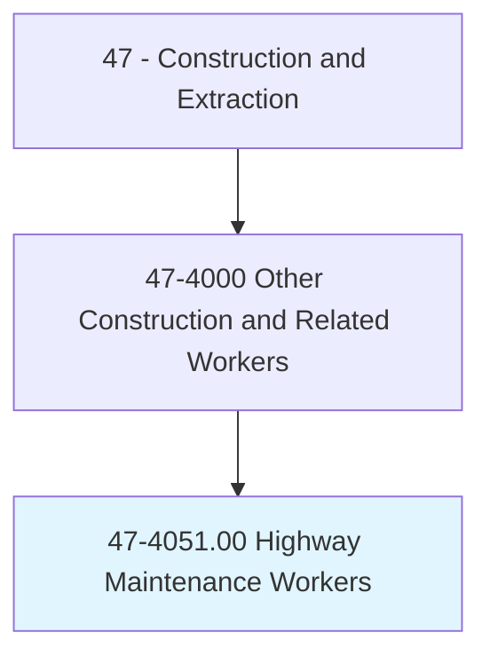
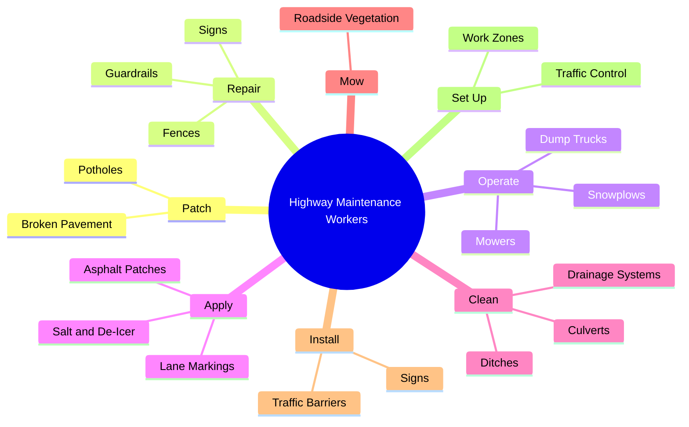
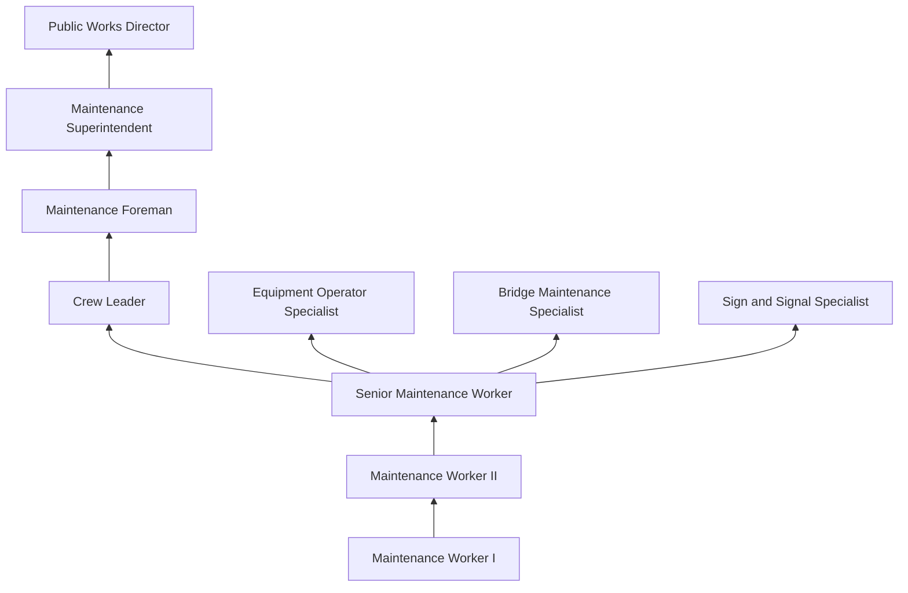
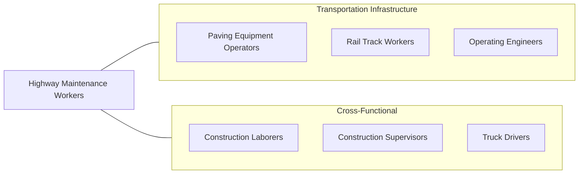

# Highway Maintenance Workers

> Maintain highways, municipal and rural roads, airport runways, and rights-of-way. Duties include patching broken or eroded pavement, repairing guard rails, highway markers, and snow fences. May also mow or clear brush from along road or plow snow from roadway.

## Overview

Highway Maintenance Workers keep the transportation infrastructure safe and functional by performing routine maintenance, emergency repairs, and seasonal operations on roads, highways, bridges, and associated structures. Their work directly impacts public safety, as deteriorated road surfaces, malfunctioning signals, obscured signage, and snow-covered highways create dangerous driving conditions. These workers are often the first responders to road emergencies including accidents, debris, flooding, and severe weather events.

The work encompasses a broad range of tasks that vary by season. In warmer months, workers patch potholes, repair pavement, mow roadside vegetation, paint lane markings, repair guardrails and signs, and maintain drainage systems. During winter, they operate snowplows, apply salt and de-icing materials, and perform emergency response operations during storms. Many highway maintenance workers operate multiple types of heavy equipment including dump trucks, snowplows, pavers, mowers, and brush cutters.

Highway maintenance is primarily a public-sector occupation, with most workers employed by state departments of transportation, county highway departments, or municipal public works agencies. The work involves significant exposure to traffic hazards, as workers often perform tasks in active travel lanes or on highway shoulders. Proper work zone safety, traffic control, and high-visibility clothing are essential for survival in this occupation.

## Classification Hierarchy

## Key Statistics

| Metric | Value |
|--------|-------|
| SOC Code | 47-4051.00 |
| Job Zone | 2 (Some Preparation) |
| Category | [Construction and Extraction](/occupations/Construction/index) |
| Task Count | 110 |
| Median Salary | $44,100 / year |
| Employment | ~150,000 |
| Job Outlook | 5% (Faster than average) |
| Physical Demands | Heavy |
| Source | O*NET |

## Core Tasks

### patch.Potholes

Workers repair road surface defects to maintain safe driving conditions.

**Actions:**
- `patch.Potholes.using.ColdMixAsphalt`
- `patch.Potholes.using.HotMixAsphalt`
- `patch.BrokenPavement.using.InfraredRepair`

### operate.Snowplows

Workers operate snowplows and spreaders during winter storm events.

**Actions:**
- `operate.Snowplows.to.clear.Highways`
- `operate.SaltSpreaders.to.deice.Roads`
- `operate.DumpTrucks.for.MaterialTransport`

## Skills & Competencies

### Technical Skills
- **Road Maintenance Techniques** - Expert
- **Heavy Equipment Operation** - Advanced
- **Traffic Control and Work Zone Safety** - Expert
- **Asphalt Patching** - Advanced
- **Snow and Ice Control** - Advanced
- **Equipment Maintenance** - Advanced
- **CDL Driving** - Required
- **Drainage Systems** - Intermediate

### Trade-Specific Skills
- **Pothole Repair** - Cold patch, hot mix, infrared methods
- **Guardrail Repair** - W-beam, cable barrier systems
- **Pavement Marking** - Striping, thermoplastic, epoxy
- **Sign Installation** - MUTCD-compliant placement
- **Bridge Maintenance** - Deck repair, joint maintenance

### Soft Skills
- **Safety Consciousness** - Critical
- **Physical Stamina** - Critical
- **Reliability** - Critical (emergency call-out duty)
- **Teamwork** - Essential
- **Adaptability** - Essential (weather-dependent work)

## Education & Certifications

| Requirement | Details |
|-------------|---------|
| Typical Education | High school diploma or equivalent |
| CDL | Class A or B with endorsements |
| On-the-Job Training | 6-12 months |

### Certifications
- **CDL Class A/B** - With air brake and tanker endorsements
- **ATSSA Traffic Control Technician** - Work zone safety
- **Flagger Certification** - Traffic control
- **OSHA 10-Hour Construction** - Safety certification
- **Pesticide Applicator License** - For roadside vegetation management
- **First Aid/CPR** - Required
- **Snow Plow Operator Training** - Agency-specific

## Career Progression

## Specializations

### Pavement Maintenance
- Pothole and crack repair
- Chip seal and micro-surfacing
- Pavement marking and striping

### Winter Operations
- Snow plowing and removal
- Anti-icing and de-icing
- Emergency storm response

### Bridge Maintenance
- Deck patching and repair
- Joint maintenance
- Drainage system cleaning

### Roadside Maintenance
- Mowing and vegetation control
- Guardrail and sign repair
- Drainage and culvert maintenance

## Tools & Equipment

### Vehicles and Equipment
- Dump trucks with plows and spreaders
- Patch trucks (hot and cold)
- Mowers (rotary, boom arm, flail)
- Brush cutters and chippers
- Pavement marking machines
- Loader/backhoes

### Hand Tools
- Asphalt rakes and lutes
- Shovels and tampers
- Post drivers
- Chainsaws
- Wrenches and basic hand tools

### Safety Equipment
- High-visibility clothing (ANSI Class 3)
- Arrow boards and message signs
- Traffic cones and channelizers
- Truck-mounted attenuators (TMA)

## Safety Considerations

- **Struck-By Vehicles** - Working in active traffic; highest fatality risk
- **Work Zone Safety** - MUTCD-compliant traffic control required
- **Equipment Operation** - Heavy vehicle hazards; CDL standards
- **Weather Exposure** - All-weather operations; hypothermia and heat illness
- **Night Work** - Reduced visibility; reflective gear and lighting
- **Chemical Exposure** - Herbicides, de-icing chemicals, asphalt
- **Fatigue** - Extended shifts during storms and emergencies

## Related Occupations

## Industries

- [State Government (DOT)](/industries/Government) - Primary Employment
- [Local Government (Public Works)](/industries/Government) - Primary Employment
- [Highway and Bridge Construction](/industries/HeavyCivil) - Moderate Employment

## Departments

This occupation typically works in:
- [Highway Maintenance](/departments/HighwayMaintenance)
- [Public Works](/departments/PublicWorks)
- [Winter Operations](/departments/WinterOps)
- [Bridge Maintenance](/departments/BridgeMaintenance)

---

*Source: O*NET 47-4051.00 - ONETOccupation*
