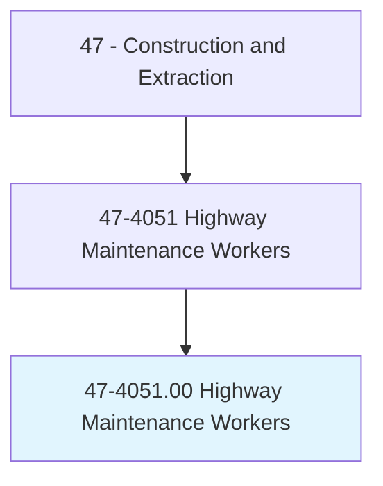
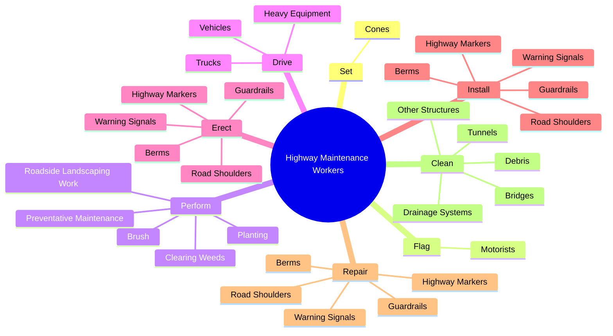
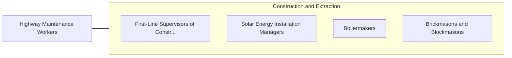

# Highway Maintenance Workers

> Maintain highways, municipal and rural roads, airport runways, and rights-of-way. Duties include patching broken or eroded pavement and repairing guard rails, highway markers, and snow fences. May also mow or clear brush from along road, or plow snow from roadway.

## Overview

Highway Maintenance Workers is an occupation within the Construction and Extraction category. Maintain highways, municipal and rural roads, airport runways, and rights-of-way. Duties include patching broken or eroded pavement and repairing guard rails, highway markers, and snow fences.

## Classification Hierarchy

## Key Statistics

| Metric | Value |
|--------|-------|
| SOC Code | 47-4051.00 |
| Category | [Construction and Extraction](/occupations/Construction/index) |
| Task Count | 115 |
| Source | O*NET |

## Core Tasks

### set.Cones

Highway Maintenance Workers set cones as part of their core responsibilities.

**Actions:**
- `set.Cones.around.WorkAreasToDivertTraffic`

### flag.Motorists

Highway Maintenance Workers flag motorists as part of their core responsibilities.

**Actions:**
- `flag.Motorists.to.warn.ThemOfObstacles`
- `flag.Motorists.to.repair.WorkAhead`

### perform.PreventativeMaintenance

Highway Maintenance Workers perform preventative maintenance as part of their core responsibilities.

**Actions:**
- `perform.PreventativeMaintenance.on.VehiclesEquipment`
- `perform.PreventativeMaintenance.on.HeavyEquipment`
- `perform.RoadsideLandscapingWork`
- `perform.ClearingWeeds`

## Skills & Competencies

### Technical Skills
- **Construction Methods** - Advanced
- **Blueprint Reading** - Advanced
- **Safety Compliance** - Advanced

### Soft Skills
- **Communication** - Essential
- **Problem Solving** - Essential
- **Critical Thinking** - Important
- **Teamwork** - Important
- **Adaptability** - Important

## Related Occupations

## Industries

This occupation is found across multiple industries. See [Industries](/industries) for sector-specific employment data.

## Career Progression

---

*Source: O*NET 47-4051.00 - ONETOccupation*
