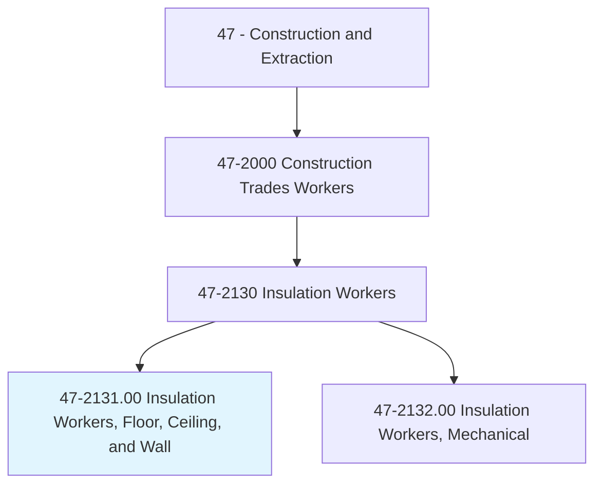
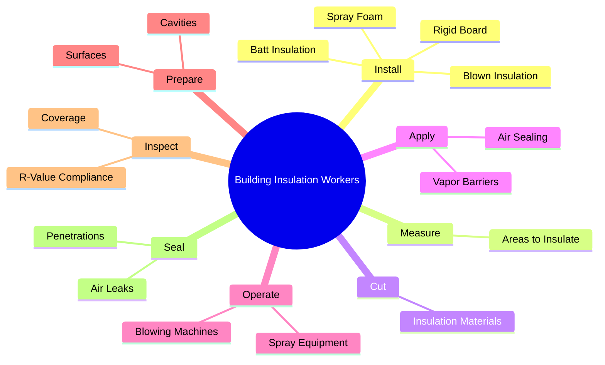
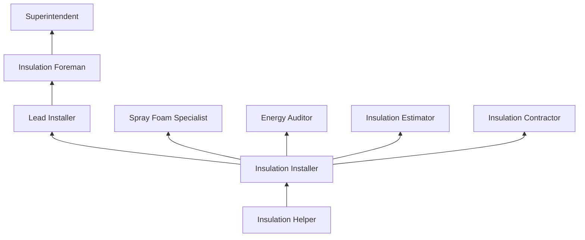
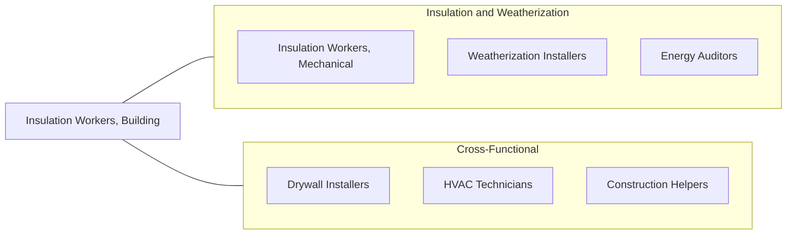

# Insulation Workers, Floor, Ceiling, and Wall

> Line and cover structures with insulating materials. May work with batt, roll, or blown insulation materials.

## Overview

Building Insulation Workers install thermal and acoustic insulation in residential and commercial structures to improve energy efficiency, reduce noise transmission, and meet building code requirements. They work with fiberglass batts, blown cellulose, spray foam, rigid board, and mineral wool insulation, placing materials in wall cavities, attic spaces, floors, and other building assemblies. Proper insulation installation is critical to building performance, energy costs, and occupant comfort.

The trade has grown in importance with increasingly stringent energy codes, green building standards, and rising energy costs. Modern insulation workers must understand thermal envelope principles, vapor barrier placement, air sealing techniques, and the interaction between insulation, ventilation, and moisture management. Improper installation can lead to thermal bridging, condensation, mold growth, and significantly reduced insulation performance, making skilled workers essential.

The work involves operating in tight, confined spaces including attics, crawl spaces, and wall cavities. Workers handle materials that can cause skin and respiratory irritation, requiring proper protective equipment. Spray foam applicators work with two-component chemical systems that require additional training and safety precautions. The occupation serves both new construction and retrofit/weatherization markets.

## Classification Hierarchy

## Key Statistics

| Metric | Value |
|--------|-------|
| SOC Code | 47-2131.00 |
| Job Zone | 2 (Some Preparation) |
| Category | [Construction and Extraction](/occupations/Construction/index) |
| Task Count | 82 |
| Median Salary | $42,500 / year |
| Employment | ~50,000 |
| Job Outlook | 5% (Faster than average) |
| Physical Demands | Heavy |
| Source | O*NET |

## Core Tasks

### install.BattInsulation

Workers install batt and roll insulation in wall, floor, and ceiling cavities.

**Actions:**
- `install.BattInsulation.in.WallCavities`
- `install.BattInsulation.in.AtticSpaces`
- `install.BattInsulation.in.FloorJoists`

### operate.BlowingMachines

Workers operate machines to blow loose-fill insulation into cavities and attic spaces.

**Actions:**
- `operate.BlowingMachines.to.fill.AtticSpaces`
- `operate.BlowingMachines.to.fill.WallCavities`
- `operate.SprayFoamEquipment.to.seal.BuildingEnvelope`

## Skills & Competencies

### Technical Skills
- **Batt and Roll Installation** - Expert
- **Blown-In Insulation** - Expert
- **Spray Foam Application** - Advanced
- **Air Sealing Techniques** - Advanced
- **Vapor Barrier Installation** - Advanced
- **Building Science Basics** - Intermediate
- **Energy Code Knowledge** - Intermediate
- **Equipment Operation** - Advanced

### Trade-Specific Skills
- **Dense Pack Cellulose** - Wall cavity retrofit technique
- **Open and Closed Cell Foam** - Different applications and properties
- **Fire Blocking** - Code-required fire stops at penetrations
- **Sound Insulation** - STC-rated assembly installation
- **Weatherization** - Existing building energy upgrades

### Soft Skills
- **Physical Stamina** - Critical
- **Attention to Detail** - Essential
- **Safety Consciousness** - Critical
- **Reliability** - Essential
- **Problem Solving** - Important

## Education & Certifications

| Requirement | Details |
|-------------|---------|
| Typical Education | High school diploma or equivalent |
| On-the-Job Training | 6-12 months |
| Specialty Training | Spray foam requires manufacturer certification |

### Certifications
- **OSHA 10-Hour Construction** - Safety certification
- **BPI Building Analyst** - For weatherization work
- **Spray Foam Alliance Certification** - Spray foam applicator
- **NAIMA Certification** - Fiberglass insulation installer
- **EPA 608 (if applicable)** - Refrigerant handling (spray foam)
- **First Aid/CPR** - Recommended

## Career Progression

## Specializations

### Residential New Construction
- Batt insulation in framed walls
- Attic blown-in insulation
- Crawl space insulation

### Commercial Insulation
- Rigid board insulation
- Spray foam in commercial buildings
- Sound insulation systems

### Retrofit and Weatherization
- Dense pack wall insulation
- Attic air sealing and insulation
- Crawl space encapsulation

### Spray Foam
- Open-cell foam (interior)
- Closed-cell foam (exterior, moisture barrier)
- Roofing foam applications

## Tools & Equipment

### Installation Equipment
- Insulation blowing machines
- Spray foam rigs (proportioners)
- Utility knives and insulation saws
- Staple guns and fasteners
- Caulk guns and foam dispensers

### Measuring Equipment
- Tape measures
- Insulation depth gauges
- Infrared cameras (quality verification)
- Blower door equipment (for testing)

### Safety Equipment
- Respirators (N95 minimum, supplied air for foam)
- Tyvek suits and gloves
- Safety glasses/goggles
- Knee pads
- Hard hats

## Safety Considerations

- **Respiratory Hazards** - Fiberglass fibers, cellulose dust, foam chemicals; respirators required
- **Skin Irritation** - Fiberglass and chemical contact; full body coverage
- **Confined Spaces** - Attics, crawl spaces; heat stress and ventilation
- **Chemical Exposure** - Spray foam isocyanates (MDI); specialized training and PPE
- **Heat Stress** - Attic work in summer; temperature monitoring
- **Electrical Hazards** - Working near wiring in walls and attics
- **Fall Hazards** - Attic work; proper footing on joists

## Related Occupations

## Industries

- [Insulation Contractors](/industries/SpecialtyTrade) - Primary Employment
- [Residential Building Construction](/industries/ResidentialConstruction) - High Employment
- [Commercial Building Construction](/industries/CommercialConstruction) - Moderate Employment
- [Weatherization Programs](/industries/Government) - Moderate Employment

## Departments

This occupation typically works in:
- [Field Operations](/departments/FieldOperations)
- [Insulation Division](/departments/Insulation)
- [Weatherization Division](/departments/Weatherization)
- [Estimating](/departments/Estimating)

---

*Source: O*NET 47-2131.00 - ONETOccupation*
