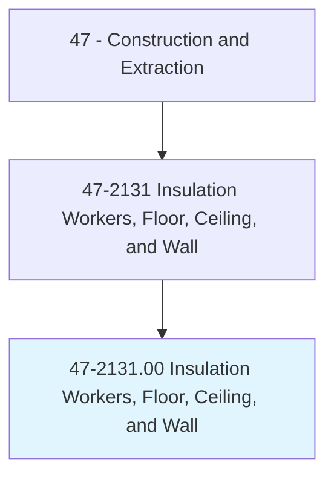
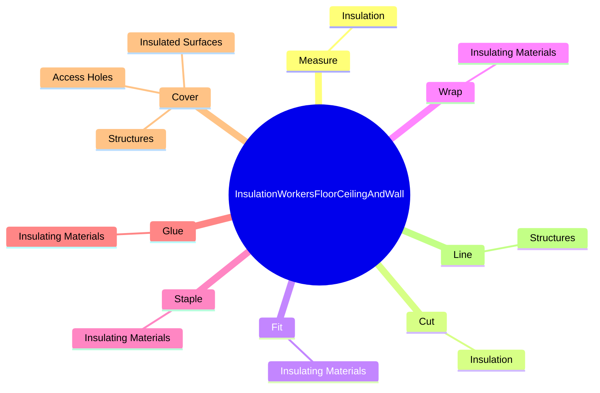
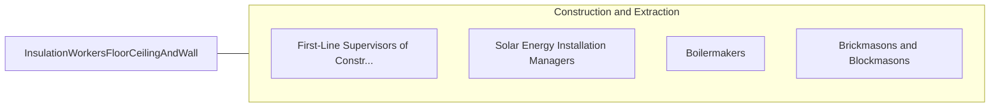

# Insulation Workers, Floor, Ceiling, and Wall

> Line and cover structures with insulating materials. May work with batt, roll, or blown insulation materials.

## Overview

Insulation Workers, Floor, Ceiling, and Wall is an occupation within the Construction and Extraction category. Line and cover structures with insulating materials. 

## Classification Hierarchy

## Key Statistics

| Metric | Value |
|--------|-------|
| SOC Code | 47-2131.00 |
| Category | [Construction and Extraction](/occupations/Construction/index) |
| Task Count | 120 |
| Source | O*NET |

## Core Tasks

### measure.Insulation

Insulation Workers, Floor, Ceiling, and Wall measure insulation as part of their core responsibilities.

**Actions:**
- `measure.Insulation.for.CoveringSurfaces`
- `measure.Insulation.for.UsingTapeMeasures`
- `measure.Insulation.for.Handsaws`
- `measure.Insulation.for.PowerSaws`

### cut.Insulation

Insulation Workers, Floor, Ceiling, and Wall cut insulation as part of their core responsibilities.

**Actions:**
- `cut.Insulation.for.CoveringSurfaces`
- `cut.Insulation.for.UsingTapeMeasures`
- `cut.Insulation.for.Handsaws`
- `cut.Insulation.for.PowerSaws`

### fit.InsulatingMaterials

Insulation Workers, Floor, Ceiling, and Wall fit insulating materials as part of their core responsibilities.

**Actions:**
- `fit.InsulatingMaterials.to.structures`
- `fit.InsulatingMaterials.to.Surfaces`
- `fit.InsulatingMaterials.to.UsingH`
- `fit.InsulatingMaterials.to.Tools`

## Skills & Competencies

### Technical Skills
- **Construction Methods** - Advanced
- **Blueprint Reading** - Advanced
- **Safety Compliance** - Advanced

### Soft Skills
- **Communication** - Essential
- **Problem Solving** - Essential
- **Critical Thinking** - Important
- **Teamwork** - Important
- **Adaptability** - Important

## Related Occupations

## Industries

This occupation is found across multiple industries. See [Industries](/industries) for sector-specific employment data.

## Career Progression

---

*Source: O*NET 47-2131.00 - ONETOccupation*
