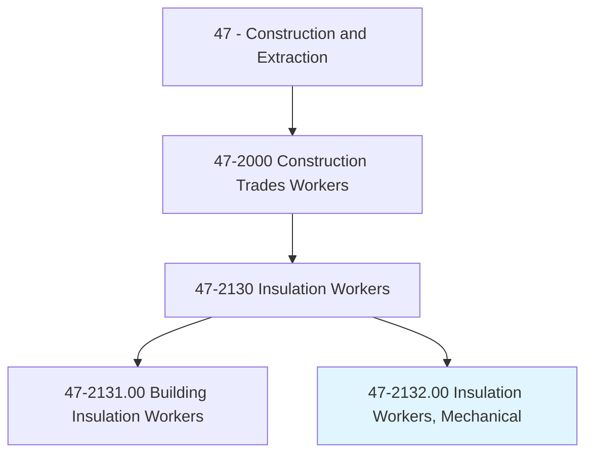
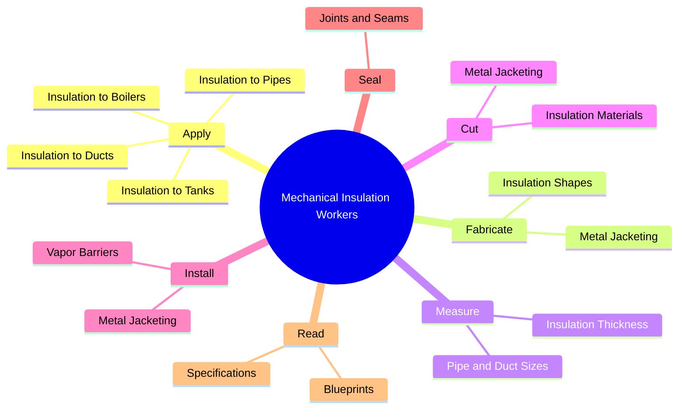
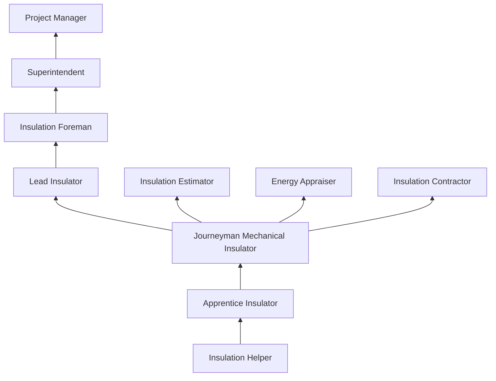
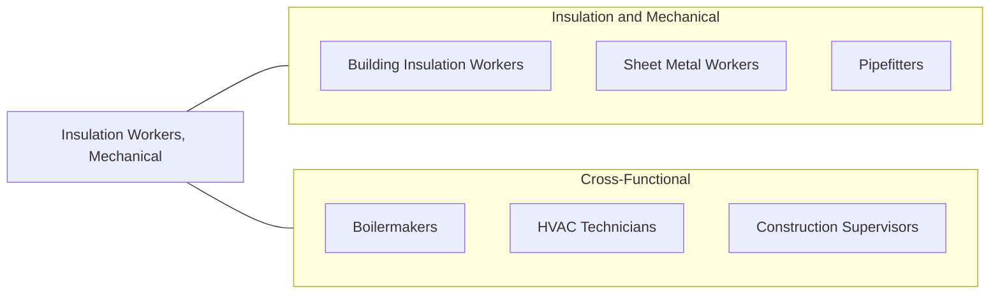

# Insulation Workers, Mechanical

> Apply insulating materials to pipes or ductwork, or other mechanical systems in order to help control and maintain temperature.

## Overview

Mechanical Insulation Workers apply insulating materials to pipes, ducts, tanks, boilers, and other mechanical systems to maintain temperature, prevent condensation, conserve energy, and protect personnel from hot surfaces. This specialized trade works primarily in industrial, commercial, and institutional settings where mechanical systems operate at extreme temperatures -- from cryogenic processes below -300F to steam systems above 1,000F. The energy savings from proper mechanical insulation are substantial, often providing the fastest payback of any energy conservation measure.

The work requires knowledge of thermal engineering principles, material properties, and jacketing systems. Mechanical insulators work with fiberglass, mineral wool, calcium silicate, cellular glass, aerogel, and elastomeric foam, selecting materials based on temperature range, moisture conditions, and fire ratings. They fabricate and install metal jacketing (aluminum, stainless steel) to protect the insulation and provide a finished appearance. Working in industrial environments demands awareness of process hazards including hot surfaces, chemical exposure, and confined spaces.

Mechanical insulation is distinct from building insulation in its complexity and precision requirements. Insulators must calculate material thickness for specified thermal performance, fabricate custom shapes for complex piping configurations, and maintain vapor barriers on cold systems. The trade offers excellent compensation and is represented by the International Association of Heat and Frost Insulators (IAHFI).

## Classification Hierarchy

## Key Statistics

| Metric | Value |
|--------|-------|
| SOC Code | 47-2132.00 |
| Job Zone | 3 (Medium Preparation) |
| Category | [Construction and Extraction](/occupations/Construction/index) |
| Task Count | 88 |
| Median Salary | $53,700 / year |
| Employment | ~28,000 |
| Job Outlook | 5% (Faster than average) |
| Physical Demands | Heavy |
| Source | O*NET |

## Core Tasks

### apply.InsulationToPipes

Mechanical insulators apply insulation materials to piping systems.

**Actions:**
- `apply.Insulation.to.HotPipes`
- `apply.Insulation.to.ColdPipes`
- `apply.Insulation.to.Ducts`
- `apply.Insulation.to.Tanks`

### fabricate.InsulationShapes

Insulators fabricate custom shapes to fit complex piping configurations.

**Actions:**
- `fabricate.InsulationShapes.for.Elbows`
- `fabricate.InsulationShapes.for.Valves`
- `fabricate.MetalJacketing.for.Protection`

## Skills & Competencies

### Technical Skills
- **Pipe and Duct Insulation** - Expert
- **Metal Jacketing Fabrication** - Expert
- **Blueprint Reading** - Advanced
- **Thermal Calculation** - Advanced
- **Material Selection** - Expert
- **Sheet Metal Work** - Advanced
- **Vapor Barrier Installation** - Expert

### Trade-Specific Skills
- **High-Temperature Systems** - Steam, boiler, exhaust insulation
- **Cryogenic Systems** - LNG, cold storage, refrigeration
- **Industrial Process Insulation** - Refineries, power plants, chemical plants
- **Removable/Reusable Insulation** - Blankets for valves and fittings
- **Firestopping** - Fire-rated penetration sealing

### Soft Skills
- **Precision and Craftsmanship** - Critical
- **Physical Stamina** - Critical
- **Safety Consciousness** - Critical
- **Problem Solving** - Essential
- **Mathematics** - Essential

## Education & Certifications

| Requirement | Details |
|-------------|---------|
| Typical Education | High school diploma or equivalent |
| Apprenticeship | 4-year IAHFI apprenticeship |
| On-the-Job Training | 6,000-8,000 hours |
| Classroom Training | 144+ hours/year |

### Certifications
- **IAHFI Journeyman Card** - Union credential
- **OSHA 10/30-Hour Construction** - Safety certification
- **Scaffold User Certification** - For elevated work
- **Confined Space Entry** - For vessel and tank work
- **Asbestos Awareness** - For renovation/repair work
- **NIA Certified Insulation Energy Appraiser** - Energy assessment
- **First Aid/CPR** - Required

## Career Progression

## Specializations

### Industrial Insulation
- Refinery and petrochemical
- Power generation
- Pulp and paper
- Food and beverage processing

### Commercial HVAC
- Ductwork insulation
- Chilled water piping
- Heating system insulation
- Noise control

### Cryogenic and Cold Systems
- LNG facilities
- Cold storage and freezer
- Refrigeration piping
- Condensation prevention

## Tools & Equipment

### Hand Tools
- Insulation knives
- Sheet metal snips (aviation, straight)
- Scribes and compasses
- Duct and pipe measuring tools
- Caulking guns
- Band clamp tools

### Power Tools
- Sheet metal brakes and rollers
- Shears (electric)
- Band saws
- Drills and impact drivers

### Equipment
- Scaffolding
- Scissor lifts
- Welding equipment (for metal jacketing)
- Material handling equipment

## Safety Considerations

- **Thermal Burns** - Hot pipes and surfaces; temperature verification before work
- **Skin and Respiratory Irritation** - Fiberglass and mineral wool; PPE required
- **Asbestos Exposure** - Older insulation systems; awareness and abatement procedures
- **Confined Spaces** - Boiler interiors, vessels, and tanks
- **Heights** - Scaffold and elevated work in industrial settings
- **Chemical Exposure** - Industrial process chemicals; site-specific hazards
- **Noise** - Industrial environments; hearing protection

## Related Occupations

## Industries

- [Mechanical Insulation Contractors](/industries/SpecialtyTrade) - Primary Employment
- [Industrial Construction](/industries/IndustrialConstruction) - High Employment
- [Petroleum Refining](/industries/Refining) - High Employment
- [Power Generation](/industries/Utilities) - Moderate Employment
- [Commercial HVAC](/industries/MechanicalContractors) - Moderate Employment

## Departments

This occupation typically works in:
- [Field Operations](/departments/FieldOperations)
- [Insulation Division](/departments/Insulation)
- [Industrial Services](/departments/IndustrialServices)
- [Estimating](/departments/Estimating)

---

*Source: O*NET 47-2132.00 - ONETOccupation*
