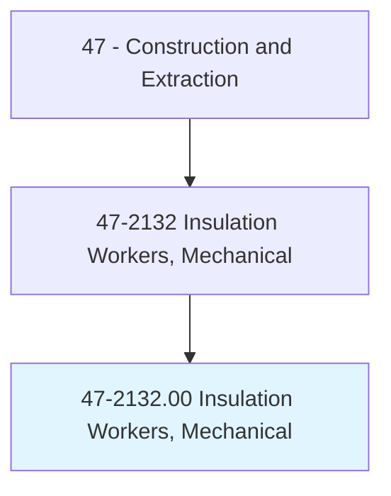
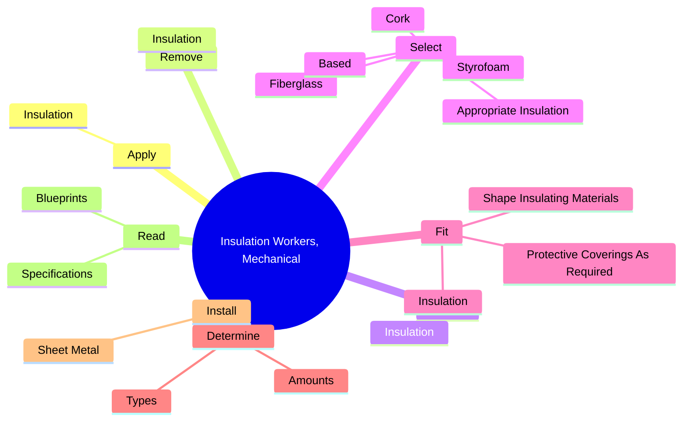
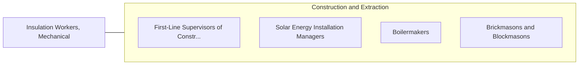

# Insulation Workers, Mechanical

> Apply insulating materials to pipes or ductwork, or other mechanical systems in order to help control and maintain temperature.

## Overview

Insulation Workers, Mechanical is classified under Construction and Extraction (SOC 47). Apply insulating materials to pipes or ductwork, or other mechanical systems in order to help control and maintain temperature.

## Classification Hierarchy

## Key Statistics

| Metric | Value |
|--------|-------|
| SOC Code | 47-2132.00 |
| Category | [Construction and Extraction](/occupations/Construction) |
| Task Count | 56 |
| Source | O*NET |

## Core Tasks

### apply.Insulation

Insulation Workers, Mechanical apply insulation as part of their core responsibilities.

**Actions:**
- `apply.Insulation.on.IndustrialEquipment`
- `apply.Insulation.on.Pipes`
- `apply.Insulation.on.Ductwork`
- `apply.Insulation.on.OtherMechanicalSystems`

### remove.Insulation

Insulation Workers, Mechanical remove insulation as part of their core responsibilities.

**Actions:**
- `remove.Insulation.on.IndustrialEquipment`
- `remove.Insulation.on.Pipes`
- `remove.Insulation.on.Ductwork`
- `remove.Insulation.on.OtherMechanicalSystems`

### repair.Insulation

Insulation Workers, Mechanical repair insulation as part of their core responsibilities.

**Actions:**
- `repair.Insulation.on.IndustrialEquipment`
- `repair.Insulation.on.Pipes`
- `repair.Insulation.on.Ductwork`
- `repair.Insulation.on.OtherMechanicalSystems`

## Skills & Competencies

### Technical Skills
- **Construction Methods** - Advanced
- **Blueprint Reading** - Advanced
- **Safety Compliance** - Advanced

### Soft Skills
- **Communication** - Essential
- **Problem Solving** - Essential
- **Critical Thinking** - Important
- **Teamwork** - Important
- **Adaptability** - Important

## Related Occupations

## Industries

This occupation is found across multiple industries. See [Industries](/industries) for sector-specific employment data.

## Career Progression

---

*Source: O*NET 47-2132.00 - ONETOccupation*
