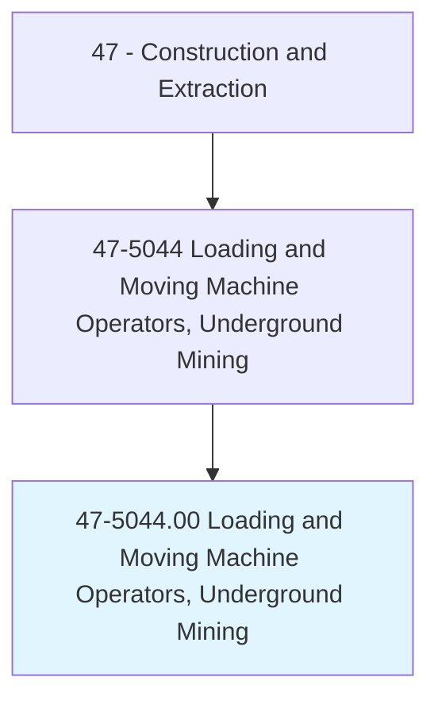
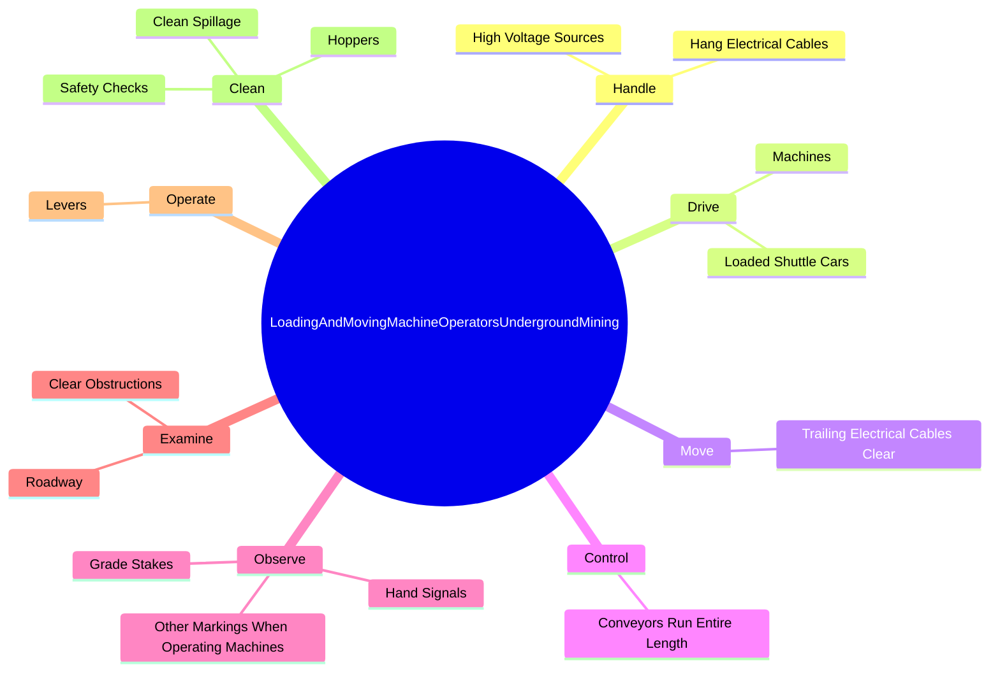
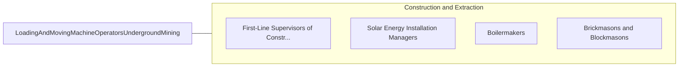

# Loading and Moving Machine Operators, Underground Mining

> Operate underground loading or moving machine to load or move coal, ore, or rock using shuttle or mine car or conveyors. Equipment may include power shovels, hoisting engines equipped with cable-drawn scraper or scoop, or machines equipped with gathering arms and conveyor.

## Overview

Loading and Moving Machine Operators, Underground Mining is an occupation within the Construction and Extraction category. Operate underground loading or moving machine to load or move coal, ore, or rock using shuttle or mine car or conveyors. 

## Classification Hierarchy

## Key Statistics

| Metric | Value |
|--------|-------|
| SOC Code | 47-5044.00 |
| Category | [Construction and Extraction](/occupations/Construction) |
| Task Count | 108 |
| Source | O*NET |

## Core Tasks

### handle.HighVoltageSources

Loading and Moving Machine Operators, Underground Mining handle high voltage sources as part of their core responsibilities.

**Actions:**
- `handle.HighVoltageSources`
- `handle.HangElectricalCables`

### drive.LoadedShuttleCars

Loading and Moving Machine Operators, Underground Mining drive loaded shuttle cars as part of their core responsibilities.

**Actions:**
- `drive.LoadedShuttleCars.to.Ramps`
- `drive.LoadedShuttleCars.to.move.ControlsToDischargeLoadsIntoMineCarsConveyors`
- `drive.LoadedShuttleCars.to.OntoConveyors`
- `drive.Machines.into.Piles.of.MaterialBlastedFromWorkingFaces`

### move.TrailingElectricalCablesClear

Loading and Moving Machine Operators, Underground Mining move trailing electrical cables clear as part of their core responsibilities.

**Actions:**
- `move.TrailingElectricalCablesClear.of.Obstructions`
- `move.TrailingElectricalCablesClear.of.UsingRubberSafetyGloves`

## Skills & Competencies

### Technical Skills
- **Construction Methods** - Advanced
- **Blueprint Reading** - Advanced
- **Safety Compliance** - Advanced

### Soft Skills
- **Communication** - Essential
- **Problem Solving** - Essential
- **Critical Thinking** - Important
- **Teamwork** - Important
- **Adaptability** - Important

## Related Occupations

## Industries

This occupation is found across multiple industries. See [Industries](/industries) for sector-specific employment data.

## Career Progression

---

*Source: O*NET 47-5044.00 - ONETOccupation*
