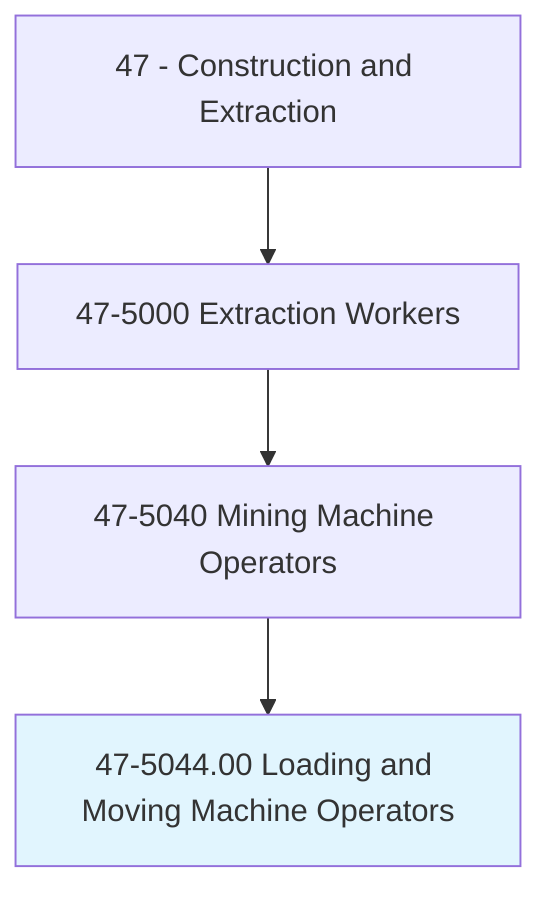
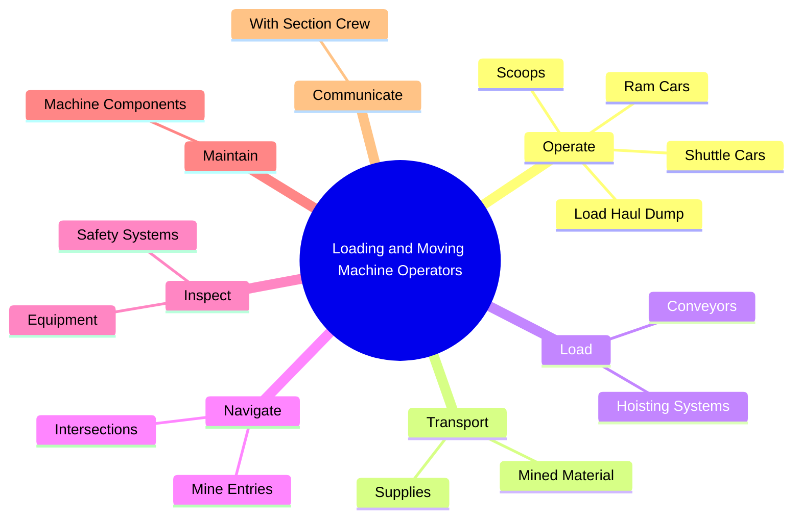
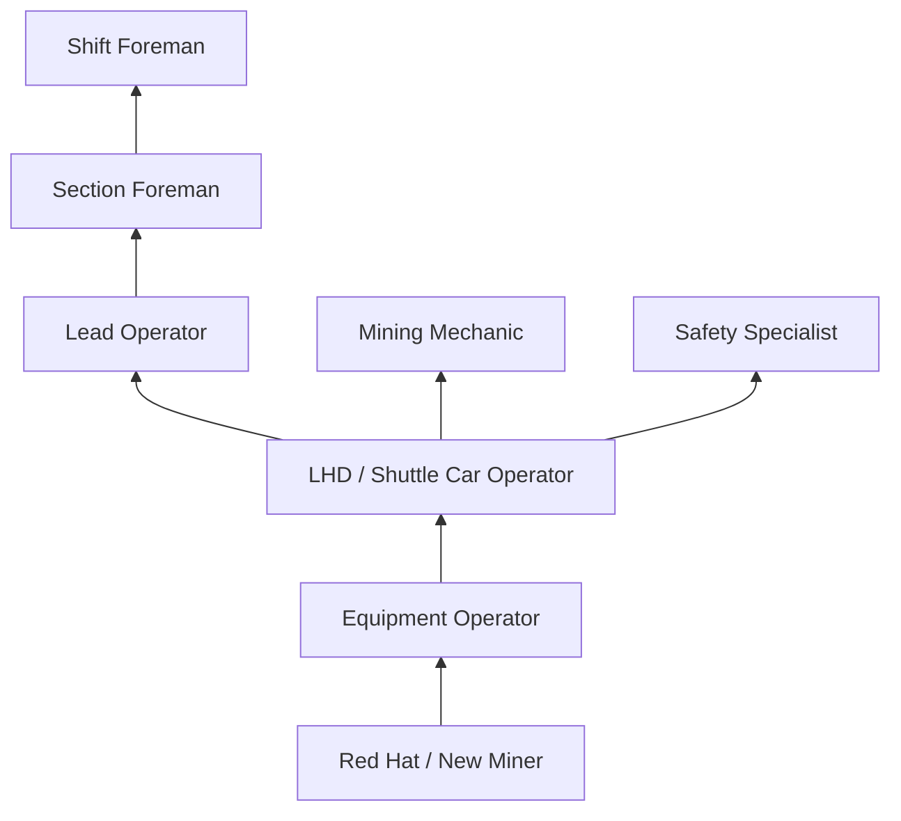
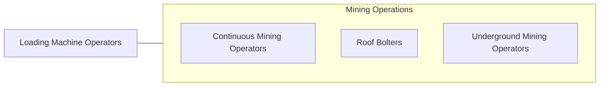

# Loading and Moving Machine Operators, Underground Mining

> Operate underground loading or moving machines to load and move materials in underground mines.

## Overview

Loading and Moving Machine Operators in underground mining operate shuttle cars, ram cars, load-haul-dump (LHD) vehicles, and other mobile equipment to transport extracted material from the mine face to conveyors, bunkers, or hoisting systems. They are essential links in the underground production chain, responsible for keeping extracted material moving efficiently from the cutting face to the surface. Any delay in haulage directly impacts the productivity of the entire mining section.

These operators work in confined underground environments with low ceilings, limited visibility, and continuous exposure to dust, noise, and diesel exhaust. They must navigate narrow mine entries, avoid other equipment and personnel, and maintain awareness of roof conditions while operating heavy mobile equipment. Modern underground haulage equipment increasingly features remote operation capability, proximity detection systems, and automated guidance, but most operations still require skilled operators.

The work demands excellent spatial awareness, mechanical aptitude, and the ability to perform in physically uncomfortable conditions. Operators often work in areas with limited head clearance, managing equipment that may weigh 20-40 tons in darkness illuminated only by cap lamps and machine-mounted lights. Safety training is mandatory and continuous, with MSHA regulations governing every aspect of underground mine operations.

## Classification Hierarchy

## Key Statistics

| Metric | Value |
|--------|-------|
| SOC Code | 47-5044.00 |
| Job Zone | 2 (Some Preparation) |
| Category | [Construction and Extraction](/occupations/Construction/index) |
| Task Count | 78 |
| Median Salary | $48,200 / year |
| Employment | ~5,000 |
| Job Outlook | -8% (Decline) |
| Physical Demands | Heavy |
| Source | O*NET |

## Core Tasks

### operate.ShuttleCars

Operators run shuttle cars and LHDs to transport material underground.

**Actions:**
- `operate.ShuttleCars.to.transport.MinedMaterial`
- `operate.LoadHaulDump.to.load.Conveyors`
- `operate.RamCars.to.move.Materials`

## Skills & Competencies

### Technical Skills
- **Underground Haulage Equipment** - Expert
- **Mine Navigation** - Advanced
- **Equipment Maintenance** - Advanced
- **Safety Systems** - Advanced
- **Communication Systems** - Intermediate

### Soft Skills
- **Spatial Awareness** - Critical
- **Safety Consciousness** - Critical
- **Physical Stamina** - Critical
- **Communication** - Essential
- **Reliability** - Critical

## Education & Certifications

| Requirement | Details |
|-------------|---------|
| Typical Education | High school diploma or equivalent |
| MSHA Training | 40-hour new miner + 8-hour annual refresher |
| Equipment Training | Company-provided |

### Certifications
- **MSHA New Miner Training (Part 48)** - Mandatory
- **MSHA Annual Refresher** - 8-hour requirement
- **Equipment-Specific Certification** - For each machine type
- **First Aid/CPR** - Required
- **State Mining License** - Where required

## Career Progression

## Safety Considerations

- **Roof/Rib Falls** - Underground collapse risk; constant awareness required
- **Equipment Collisions** - Limited visibility; proximity detection systems
- **Pinch Points** - Between equipment and mine walls
- **Diesel Exhaust** - Engine fumes underground; ventilation critical
- **Noise** - Equipment operation; hearing protection
- **Dust** - Respirable coal/mineral dust; monitoring required
- **Emergency Evacuation** - Mine escape routes and self-rescue procedures

## Related Occupations

## Industries

- [Coal Mining](/industries/CoalMining) - Primary Employment
- [Metal Ore Mining](/industries/MetalMining) - Moderate Employment
- [Nonmetallic Mineral Mining](/industries/MineralMining) - Moderate Employment

## Departments

- [Underground Operations](/departments/UndergroundOps)
- [Production](/departments/Production)
- [Equipment](/departments/Equipment)

---

*Source: O*NET 47-5044.00 - ONETOccupation*
