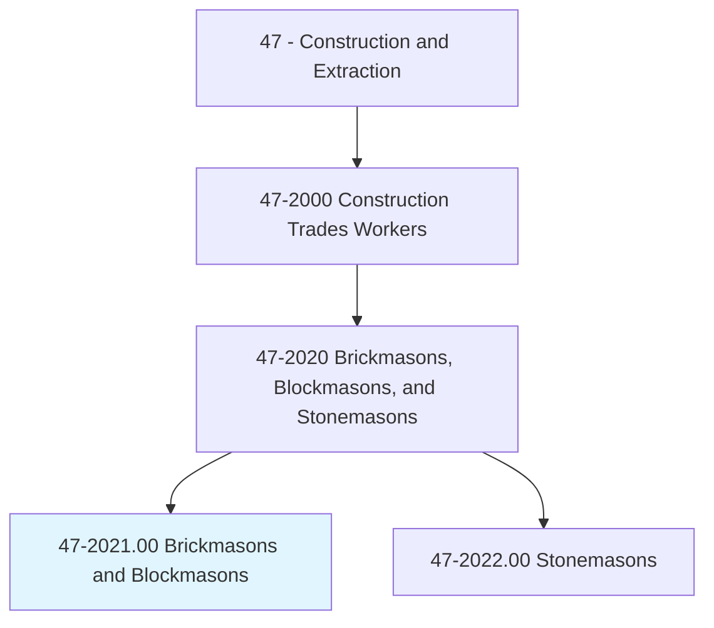
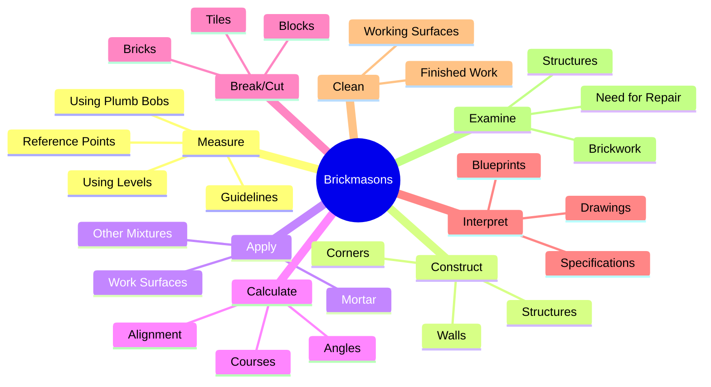
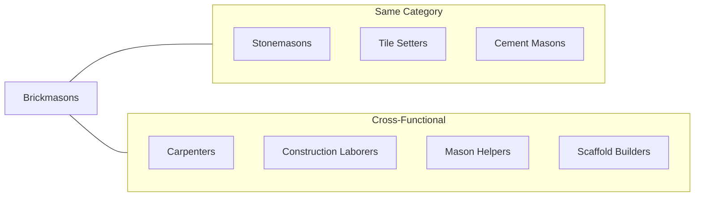
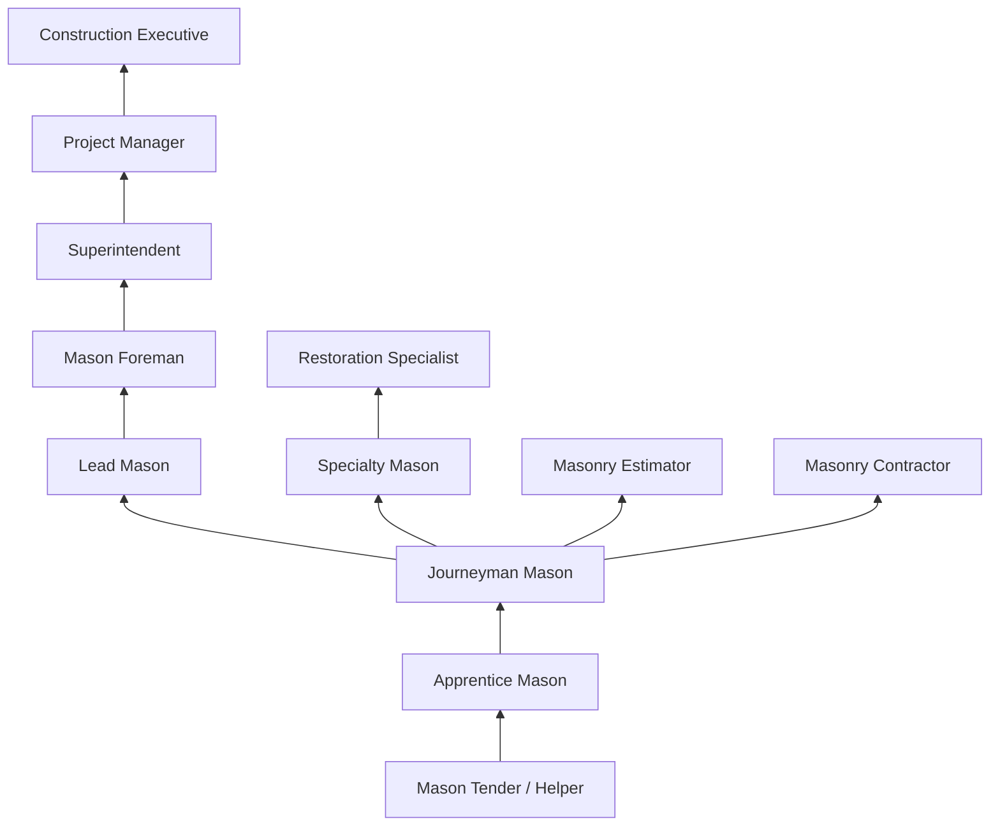

# Brickmasons and Blockmasons

> Lay and bind building materials, such as brick, structural tile, concrete block, cinder block, glass block, and terra-cotta block, with mortar and other substances, to construct or repair walls, partitions, arches, sewers, and other structures.

## Overview

Brickmasons and Blockmasons are skilled craftspeople who build and repair walls, floors, partitions, fireplaces, chimneys, and other structures using brick, concrete block, and similar masonry materials. This ancient trade combines artistry with technical precision, requiring the ability to interpret blueprints, calculate material requirements, and create structures that are both functional and aesthetically pleasing. Masons work on projects ranging from residential homes to large commercial buildings, and their work forms the visible exterior of many structures.

## Classification Hierarchy

## Key Statistics

| Metric | Value |
|--------|-------|
| SOC Code | 47-2021.00 |
| Job Zone | 3 (Medium Preparation) |
| Category | [Construction](/occupations/Construction) |
| Core Tasks | 15+ |
| Physical Demands | Heavy |
| Source | O*NET |

## Core Tasks

### measure.Distance

Brickmasons take precise measurements to ensure accurate layout and alignment.

**Actions:**
- `measure.Distance.from.ReferencePoints` - Establish starting points for construction
- `measure.Distance.from.MarkGuidelines.to.lay.OutWork` - Create reference lines for brick courses
- `measure.Distance.from.UsingPlumbBobs` - Verify vertical alignment
- `measure.Distance.from.Levels` - Check horizontal alignment

### construct.Corners

Masons build corners as critical reference points for wall construction.

**Actions:**
- `construct.Corners.by.Fastening.in.PlumbPositionCornerPole` - Set corner poles for alignment
- `construct.Corners.by.BuildingCornerPyramid.of.Bricks` - Create stepped corner leads
- `construct.Corners.by.FillingInBetweenCornersUsingLineFromCornerToCornerToGuideCourse` - Use string lines for straight courses

### apply.MortarMixture

Masons apply mortar to bind masonry units and create weatherproof joints.

**Actions:**
- `apply.MortarMixture.over.WorkSurface` - Spread mortar bed for brick placement
- `apply.OtherMixture.over.WorkSurface` - Use specialty adhesives or grout
- `smooth.MortarMixture.over.WorkSurface` - Create even mortar beds
- `smooth.OtherMixture.over.WorkSurface` - Finish specialty applications

### calculate.Angles

Masons calculate geometric relationships for accurate construction.

**Actions:**
- `calculate.AnglesDetermineVerticalHorizontalAlignment.of.Courses` - Compute wall angles and slopes
- `calculate.CoursesDetermineVerticalHorizontalAlignment.of.Courses` - Plan brick course heights

### break.Bricks

Masons cut and shape masonry units to fit specific locations.

**Actions:**
- `break.Bricks.to.Size` - Cut bricks for closures and corners
- `break.Bricks.to.UsingTrowelEdge` - Make quick cuts with hand tools
- `break.Bricks.to.hammer` - Use brick hammer for cutting
- `break.Bricks.to.PowerSaw` - Make precise cuts with masonry saw
- `cut.Blocks.to.Size` - Size concrete blocks
- `cut.Tiles.to.Size` - Trim structural tile

### interpret.Blueprints

Masons read technical drawings to understand project requirements.

**Actions:**
- `interpret.Blueprints.to.determine.SpecificationsCalculateMaterialsRequired` - Understand design requirements
- `interpret.Drawings.to.determine.SpecificationsCalculateMaterialsRequired` - Calculate brick and mortar quantities
- `interpret.Blueprints.to.ToCalculateMaterialsRequired` - Plan material ordering

### remove.ExcessMortar

Masons finish joints for appearance and weather resistance.

**Actions:**
- `remove.ExcessMortar.with.Trowels` - Strike off excess mortar
- `remove.ExcessMortar.with.HandTools` - Clean up joint edges
- `remove.ExcessMortar.with.FinishMortarJoints.with.JointingTools` - Tool joints for weather tightness

### clean.WorkingSurface

Masons prepare and clean surfaces throughout the construction process.

**Actions:**
- `clean.WorkingSurface.to.remove.Scale` - Prepare surfaces for new work
- `clean.WorkingSurface.to.dust` - Remove debris from work area
- `clean.WorkingSurface.to.Soot` - Clean restoration projects
- `clean.WorkingSurface.to.UsingBroom` - Sweep work areas
- `clean.WorkingSurface.to.wire.Brush` - Remove stubborn deposits

### examine.Brickwork

Masons inspect existing work to determine repair needs.

**Actions:**
- `examine.Brickwork.to.determine.NeedForRepair` - Assess masonry condition
- `examine.Structure.to.determine.NeedForRepair` - Evaluate structural integrity

### lay.Bricks

Masons construct various structures using masonry units.

**Actions:**
- `lay.Bricks.to.build.StructuresHighTemperatureEquipment` - Build industrial furnaces
- `lay.Bricks.to.repair.StructuresHighTemperatureEquipment` - Restore refractory linings
- `lay.Bricks.to.Kilns` - Construct kiln walls
- `lay.Bricks.to.Furnaces` - Build industrial furnaces
- `lay.Blocks.to.build.StructuresHighTemperatureEquipment` - Construct with concrete block

## Skills & Competencies

### Technical Skills
- **Blueprint Reading** - Advanced
- **Mortar Mixing** - Expert
- **Layout and Measurement** - Expert
- **Cutting and Shaping** - Expert
- **Joint Finishing** - Expert
- **Mathematics (Geometry)** - Advanced
- **Tool Operation** - Expert

### Soft Skills
- **Attention to Detail** - Critical
- **Physical Stamina** - Critical
- **Hand-Eye Coordination** - Critical
- **Problem Solving** - Essential
- **Teamwork** - Essential
- **Time Management** - Important

## Related Occupations

## Industry Variations

### Residential Construction
- Single-family homes and townhouses
- Brick veneer and facades
- Fireplaces and chimneys
- Decorative features
- Smaller crew sizes

### Commercial Construction
- Office buildings and retail spaces
- Large-scale brick and block work
- Structural masonry walls
- Facade systems
- Tight scheduling requirements

### Industrial Construction
- Refractory brick work
- High-temperature applications
- Furnaces and kilns
- Chemical-resistant installations
- Specialized material knowledge

### Restoration and Historical
- Historic building repair
- Matching historical materials
- Preservation techniques
- Tuckpointing and repointing
- Heritage compliance requirements

### Landscape and Hardscape
- Retaining walls
- Outdoor living spaces
- Patios and walkways
- Garden walls and features
- Decorative installations

## Industries

- [Residential Building Construction](/industries/ResidentialConstruction) - High Employment
- [Commercial Building Construction](/industries/CommercialConstruction) - High Employment
- [Specialty Trade Contractors](/industries/SpecialtyTrade) - High Employment
- [Foundation and Structure Contractors](/industries/FoundationContractors) - Moderate Employment
- [Heavy and Civil Engineering](/industries/HeavyCivil) - Moderate Employment

## Career Progression

## Education & Training

| Requirement | Details |
|-------------|---------|
| Typical Education | High school diploma or equivalent |
| Apprenticeship | 3-4 year apprenticeship program |
| On-the-Job Training | Continuous skills development |
| Certifications | NCCER, MCAA certifications available |

## Certifications

- **NCCER Masonry** - Industry-recognized credential
- **MCAA Certification** - Mason Contractors Association of America
- **OSHA 10/30-Hour Construction** - Safety certification
- **Forklift/Equipment Operator** - Material handling
- **Scaffold User** - Safety certification

## Tools and Equipment

### Hand Tools
- Trowels (brick, pointing, margin)
- Brick hammers and chisels
- Jointers and strikers
- Plumb bobs and levels
- Mason's line and blocks
- Brushes and scrapers

### Power Tools
- Masonry saws (wet and dry)
- Angle grinders
- Mortar mixers
- Power trowels
- Concrete vibrators

### Measuring Equipment
- Laser levels
- Story poles
- Tape measures
- Squares and straightedges
- Spacing tools

## Work Environment

### Physical Demands
- Heavy lifting (bricks, blocks, mortar)
- Prolonged standing and kneeling
- Working at heights on scaffolding
- Repetitive motions
- Outdoor work in various weather

### Safety Considerations
- Scaffold safety
- Eye protection from debris
- Respiratory protection from dust
- Back injury prevention
- Heat and cold exposure management

## Departments

This occupation typically works in:
- [Field Operations](/departments/FieldOperations)
- [Masonry Division](/departments/Masonry)
- [Restoration](/departments/Restoration)
- [Estimating](/departments/Estimating)

## Related Occupations in this Group

- [Stonemasons](./Stonemasons.mdx) - 47-2022.00

---

*Source: O*NET 47-2021.00 - ONETOccupation*
