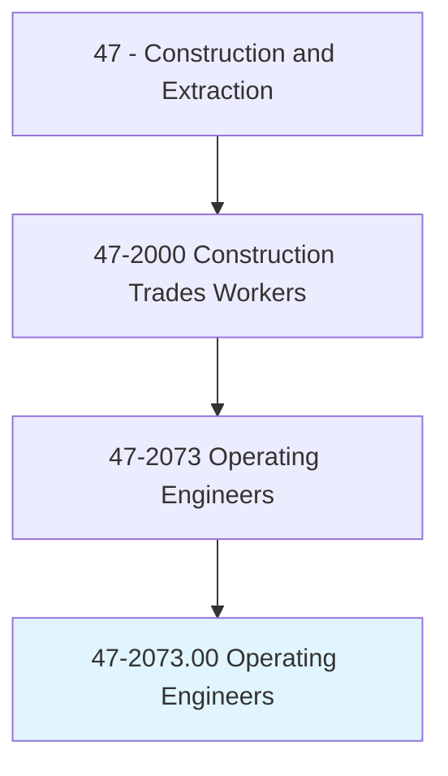
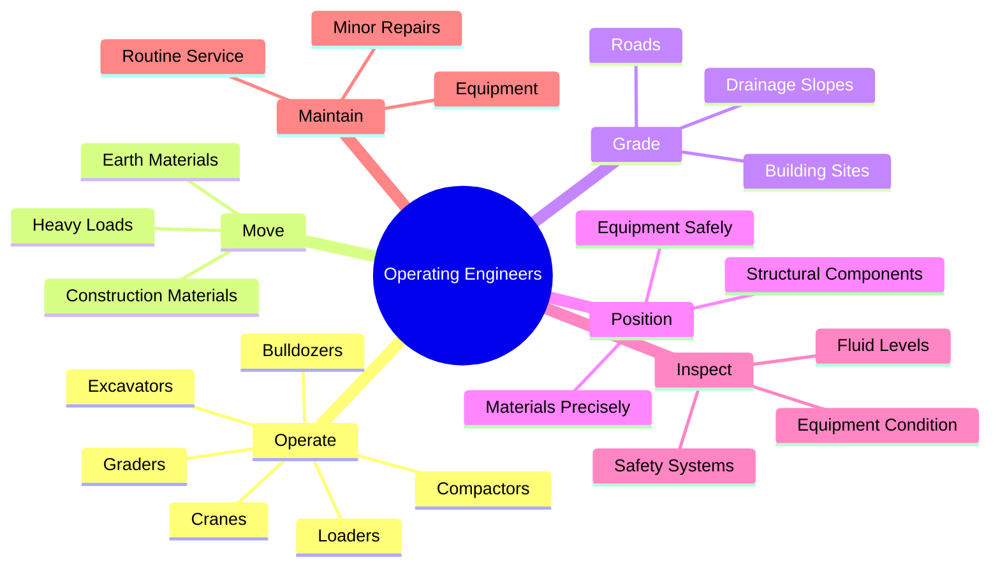
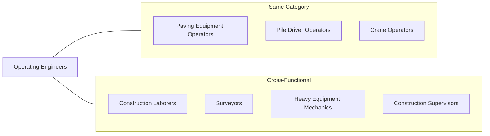
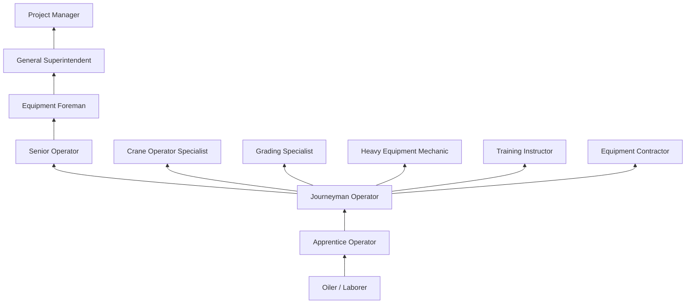

# Operating Engineers and Other Construction Equipment Operators

> Operate one or several types of power construction equipment, such as motor graders, bulldozers, scrapers, compressors, pumps, derricks, shovels, tractors, or front-end loaders to excavate, move, and grade earth, erect structures, or pour concrete or other hard surface pavement. May repair and maintain equipment in addition to other duties.

## Overview

Operating Engineers are skilled heavy equipment operators who control the powerful machines that shape construction sites and build infrastructure. These professionals operate bulldozers, excavators, cranes, graders, and other equipment essential for earthmoving, material handling, and construction operations. The occupation requires excellent hand-eye coordination, spatial awareness, and mechanical aptitude, as well as the ability to work safely around other workers and in challenging terrain. Operating engineers play a critical role in virtually every major construction project.

## Classification Hierarchy

## Key Statistics

| Metric | Value |
|--------|-------|
| SOC Code | 47-2073.00 |
| Job Zone | 3 (Medium Preparation) |
| Category | [Construction](/occupations/Construction/index) |
| Core Tasks | 12+ |
| Physical Demands | Heavy |
| Source | O*NET |

## Core Tasks

### operate.HeavyEquipment

Operating engineers control various types of construction machinery.

**Actions:**
- `operate.Bulldozers.to.Move.Earth` - Push and spread materials
- `operate.Excavators.to.Dig.Trenches` - Dig and load materials
- `operate.FrontEndLoaders.to.Move.Materials` - Scoop and transport
- `operate.MotorGraders.to.Grade.Surfaces` - Create smooth grades
- `operate.Cranes.to.Lift.Materials` - Hoist and position loads
- `operate.Compactors.to.Compact.Soil` - Densify fill materials
- `operate.Scrapers.to.Move.Earth` - Cut and haul large volumes
- `operate.Backhoes.to.Excavate.Sites` - Dig foundations and trenches

### move.Materials

Operating engineers relocate earth and construction materials.

**Actions:**
- `move.Earth.to.ConstructionSites` - Transport fill and cut
- `move.Materials.using.Equipment` - Handle construction supplies
- `load.Trucks.with.Materials` - Fill haul units
- `transport.Materials.across.Sites` - Move within project areas

### grade.Surfaces

Operating engineers create properly sloped and leveled surfaces.

**Actions:**
- `grade.Roads.to.Specifications` - Shape roadway surfaces
- `grade.BuildingSites.for.Construction` - Prepare pad elevations
- `grade.DrainageSlopes.for.Runoff` - Create proper drainage
- `grade.Subgrade.for.Paving` - Prepare base courses

### position.Equipment

Operating engineers place machines and materials precisely.

**Actions:**
- `position.Equipment.for.SafeOperation` - Set up machines properly
- `position.Materials.at.Locations` - Place items precisely
- `position.StructuralComponents.for.Installation` - Set steel and precast
- `signal.OtherOperators.for.Coordination` - Communicate positioning

### inspect.Equipment

Operating engineers check machines before and during operation.

**Actions:**
- `inspect.Equipment.before.Operation` - Perform pre-operation checks
- `inspect.SafetySystems.for.Function` - Verify safety devices
- `check.FluidLevels.in.Equipment` - Monitor oils and coolants
- `identify.MechanicalProblems.in.Equipment` - Detect issues early

### maintain.Equipment

Operating engineers perform routine service and minor repairs.

**Actions:**
- `maintain.Equipment.by.Servicing` - Perform scheduled maintenance
- `lubricate.Equipment.components` - Grease fittings and points
- `perform.MinorRepairs.on.Equipment` - Fix small problems
- `clean.Equipment.after.Use` - Keep machines maintained

## Equipment Types

### Earthmoving Equipment
- **Bulldozers (Dozers)** - Push and spread materials, clear land
- **Excavators** - Dig, lift, and load materials
- **Front-End Loaders** - Scoop and transport materials
- **Scrapers** - Cut, load, haul, and spread earth
- **Motor Graders** - Fine grade surfaces and slopes
- **Backhoes** - Dig trenches and load trucks

### Compaction Equipment
- **Vibratory Rollers** - Compact soil and asphalt
- **Sheepsfoot Rollers** - Compact cohesive soils
- **Pneumatic Rollers** - Finish compact asphalt
- **Plate Compactors** - Compact in tight areas

### Lifting Equipment
- **Mobile Cranes** - Lift and position materials
- **Tower Cranes** - Vertical construction lifting
- **Rough Terrain Cranes** - Off-road lifting
- **Forklifts (Telehandlers)** - Material handling

### Paving Equipment
- **Asphalt Pavers** - Place asphalt material
- **Concrete Pavers** - Place concrete slabs
- **Milling Machines** - Remove existing pavement

### Support Equipment
- **Compressors** - Supply compressed air
- **Pumps** - Dewatering and material transfer
- **Generators** - Provide temporary power
- **Concrete Pumps** - Place concrete at height/distance

## Skills & Competencies

### Technical Skills
- **Equipment Operation** - Expert
- **Mechanical Knowledge** - Advanced
- **Blueprint/Grade Reading** - Advanced
- **GPS/Machine Control** - Advanced
- **Safety Procedures** - Expert
- **Mathematics (Grades/Slopes)** - Advanced

### Soft Skills
- **Spatial Awareness** - Critical
- **Hand-Eye Coordination** - Critical
- **Depth Perception** - Critical
- **Concentration** - Critical
- **Communication** - Essential
- **Problem Solving** - Essential

## Related Occupations

## Industries

- [Heavy and Civil Construction](/industries/HeavyCivil) - High Employment
- [Specialty Trade Contractors](/industries/SpecialtyTrade) - High Employment
- [Mining](/industries/Mining/index) - Moderate Employment
- [Government](/industries/Government) - Moderate Employment
- [Utilities](/industries/Utilities/index) - Moderate Employment
- [Oil and Gas](/industries/OilGas) - Moderate Employment

## Career Progression

## Apprenticeship Path

| Year | Focus Areas | Hours |
|------|-------------|-------|
| Year 1 | Safety, equipment orientation, basic operation, maintenance | 2,000 OJT + 144 classroom |
| Year 2 | Intermediate equipment, grading basics, GPS systems | 2,000 OJT + 144 classroom |
| Year 3 | Advanced equipment, precision grading, specialized operations | 2,000 OJT + 144 classroom |
| Year 4 | Crane operation, troubleshooting, leadership skills | 2,000 OJT + 144 classroom |

**Total Program**: 3-4 years (6,000-8,000 hours on-the-job training + 432-576 hours classroom instruction)

## Education & Training

| Requirement | Details |
|-------------|---------|
| Typical Education | High school diploma or equivalent |
| Apprenticeship | 3-4 year program through union or employer |
| Certification | NCCCO or manufacturer certifications for cranes |
| Licensing | CDL may be required for some equipment |

## Certifications

- **NCCCO (National Commission for Crane Operator)** - Crane certification
- **NCCER Heavy Equipment Operations** - Industry credential
- **OSHA 10-Hour Construction** - Basic safety certification
- **OSHA 30-Hour Construction** - Comprehensive safety certification
- **Commercial Driver's License (CDL)** - For highway travel
- **Mine Safety (MSHA) Certification** - For mining operations
- **First Aid/CPR** - Emergency response certification
- **Manufacturer Training** - Equipment-specific certification

## Safety Requirements

### Personal Protective Equipment
- Hard hat
- Safety glasses / face shield
- Safety-toed boots
- High-visibility clothing
- Hearing protection
- Gloves (when appropriate)

### Equipment Safety
- Pre-operation inspections (walk-around)
- Seat belt use required
- Proper mounting/dismounting
- Load chart compliance (cranes)
- Swing radius awareness
- Underground utility awareness

### Common Hazards
- Rollovers and tip-overs
- Struck-by incidents
- Caught-between hazards
- Electrocution (power lines)
- Falls from equipment
- Noise exposure
- Silica dust exposure
- Vibration injuries

### Required Training
- Equipment-specific operation
- Hazard recognition
- Signal person procedures
- Utility locating
- Trench and excavation safety
- Load handling and rigging
- Emergency procedures

## Work Environment

### Physical Demands
- Sitting for extended periods
- Climbing on/off equipment
- Whole-body vibration
- Twisting and turning
- Noise exposure
- Dust and exhaust fumes

### Work Conditions
- Outdoor work in all weather
- Construction sites
- Mining operations
- Road construction
- Seasonal employment in some regions
- Travel to job sites
- Early start times

## Technology

### Modern Equipment Features
- **GPS/GNSS Machine Control** - Automated grading
- **Telematics** - Equipment monitoring
- **Grade Management Systems** - Real-time feedback
- **Collision Avoidance** - Safety systems
- **Remote Operation** - Distance control capabilities
- **Electric/Hybrid Equipment** - Emerging technology

## Departments

This occupation typically works in:
- [Heavy Equipment Division](/departments/HeavyEquipment)
- [Earthwork Division](/departments/Earthwork)
- [Paving Division](/departments/Paving)
- [Utilities Division](/departments/Utilities)
- [Crane Services](/departments/CraneServices)

## Union Affiliation

Many operating engineers are members of the International Union of Operating Engineers (IUOE), which provides:
- Apprenticeship training programs
- Job referral services through hiring halls
- Health and pension benefits
- Equipment training centers
- Safety training programs
- Continuing education opportunities

---

*Source: O*NET 47-2073.00 - ONETOccupation*
