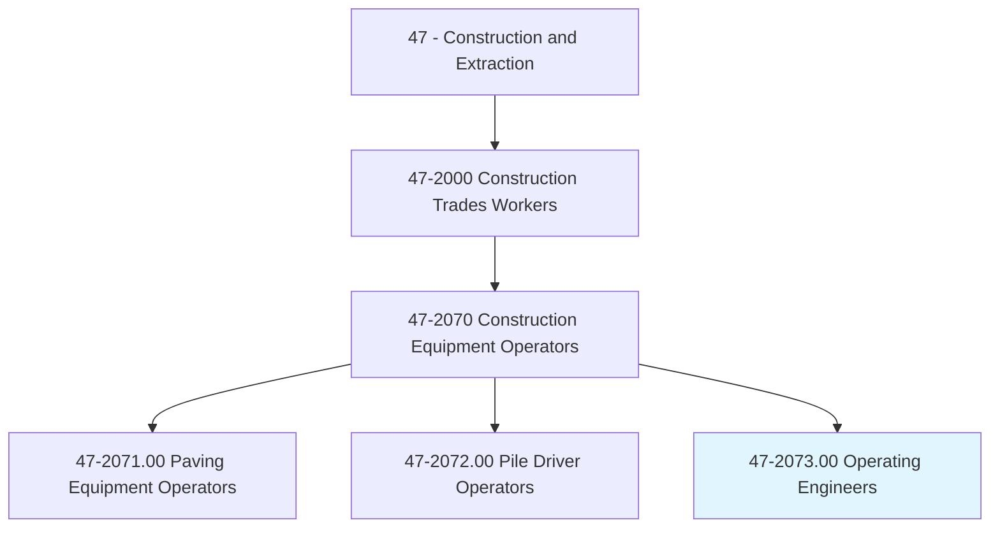
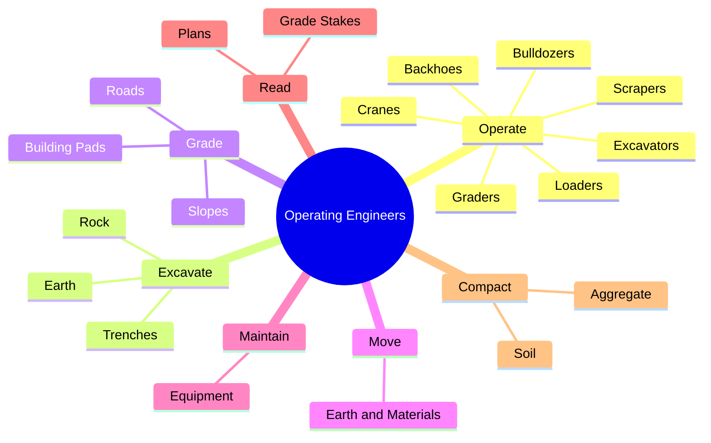
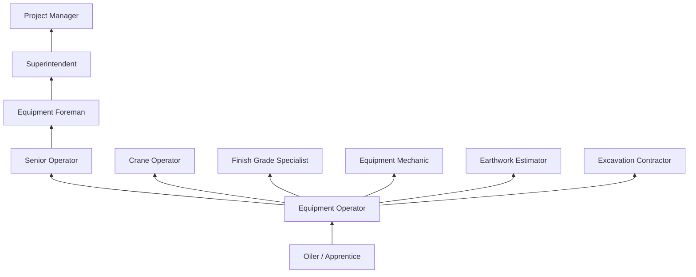
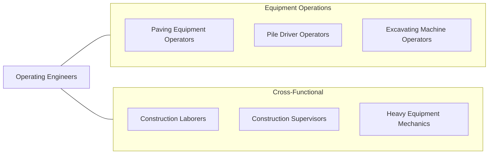

# Operating Engineers and Other Construction Equipment Operators

> Operate one or several types of power construction equipment, such as motor graders, bulldozers, scrapers, compressors, pumps, derricks, shovels, tractors, or front-end loaders to excavate, move, and grade earth, erect structures, or pour concrete or other hard surface pavement. May repair and maintain equipment in addition to other duties.

## Overview

Operating Engineers are highly skilled construction professionals who operate heavy equipment including excavators, bulldozers, cranes, loaders, graders, scrapers, backhoes, and other power-driven machines used to build roads, bridges, buildings, dams, and other infrastructure. This is one of the largest and most versatile construction occupations, as heavy equipment is required on virtually every type of construction project from residential site work to massive civil engineering endeavors.

The trade requires exceptional hand-eye-foot coordination, depth perception, and spatial awareness to safely control machines that can weigh over 100 tons and move thousands of cubic yards of earth per day. Modern equipment features GPS-guided machine control systems, telematics, and automated grading technology, but operator skill remains essential for efficient and safe production. Operators must read grade stakes, understand civil engineering plans, and work within tight tolerances to meet project specifications.

Operating Engineers are represented by the International Union of Operating Engineers (IUOE) and typically complete apprenticeships that cover multiple equipment types. The most skilled operators can transition between different machines as project needs change, though many develop specializations in particular equipment types such as cranes, excavators, or graders.

## Classification Hierarchy

## Key Statistics

| Metric | Value |
|--------|-------|
| SOC Code | 47-2073.00 |
| Job Zone | 3 (Medium Preparation) |
| Category | [Construction and Extraction](/occupations/Construction/index) |
| Task Count | 145 |
| Median Salary | $50,100 / year |
| Employment | ~430,000 |
| Job Outlook | 4% (As fast as average) |
| Physical Demands | Medium |
| Source | O*NET |

## Core Tasks

### operate.Excavators

Operating Engineers control hydraulic excavators for digging, loading, and grading.

**Actions:**
- `operate.Excavators.to.excavate.Earth`
- `operate.Bulldozers.to.grade.Surfaces`
- `operate.Loaders.to.move.Materials`
- `operate.Graders.to.finish.Roads`
- `operate.Cranes.to.lift.Materials`

### grade.Surfaces

Operating Engineers use equipment to achieve specified elevations and slopes.

**Actions:**
- `grade.BuildingPads.to.DesignElevation`
- `grade.Roads.to.SpecifiedCrossSections`
- `grade.Slopes.to.EngineeringSpecifications`

## Skills & Competencies

### Technical Skills
- **Heavy Equipment Operation (Multiple Types)** - Expert
- **GPS Machine Control** - Advanced
- **Grade Reading** - Expert
- **Blueprint and Plan Reading** - Advanced
- **Equipment Maintenance** - Advanced
- **Soil and Material Knowledge** - Intermediate
- **CDL Driving** - Required
- **Crane Operation** - Advanced (for crane operators)

### Trade-Specific Skills
- **Excavation** - Cut/fill calculations, slope stability
- **Fine Grading** - Laser and GPS-guided finish work
- **Crane Work** - Load charts, rigging, signal interpretation
- **Demolition** - Structural demolition with excavators
- **Utility Excavation** - Working around underground utilities

### Soft Skills
- **Hand-Eye-Foot Coordination** - Critical
- **Spatial Awareness** - Critical
- **Concentration** - Critical
- **Safety Consciousness** - Critical
- **Communication** - Essential

## Education & Certifications

| Requirement | Details |
|-------------|---------|
| Typical Education | High school diploma or equivalent |
| Apprenticeship | 3-4 year IUOE apprenticeship |
| On-the-Job Training | 4,000-6,000 hours |
| CDL | Class A or B required |

### Certifications
- **NCCER Heavy Equipment Operator** - Industry credential
- **NCCCO Crane Operator** - For crane operation
- **OSHA 10/30-Hour Construction** - Safety certification
- **CDL Class A/B** - Commercial vehicle operation
- **IUOE Journeyman Card** - Union credential
- **Competent Person (Excavation)** - OSHA requirement
- **First Aid/CPR** - Required

## Career Progression

## Specializations

### Earthwork and Grading
- Mass excavation and embankment
- Fine grading (GPS-guided)
- Site development

### Crane Operation
- Mobile cranes (hydraulic, lattice boom)
- Tower cranes
- Overhead/gantry cranes

### Demolition
- Structural demolition
- Selective interior demolition
- Concrete and asphalt removal

### Utility Installation
- Trench excavation for utilities
- Pipe bedding and backfill
- Directional boring support

## Tools & Equipment

### Primary Equipment
- Hydraulic excavators (Cat, Deere, Komatsu)
- Bulldozers (crawler dozers)
- Wheel loaders
- Motor graders
- Scrapers (single and tandem)
- Backhoe loaders
- Compaction rollers
- Cranes (mobile, tower)

### Technology
- GPS machine control (Trimble, Topcon, Leica)
- Laser grading systems
- Telematics and fleet management
- Load moment indicators (cranes)

## Safety Considerations

- **Struck-By/Run-Over** - Equipment blind spots; spotters and cameras
- **Excavation Cave-In** - Trench and excavation collapse; OSHA competent person
- **Overhead Power Lines** - Crane and equipment contact; minimum clearance distances
- **Rollovers** - Operating on slopes and uneven terrain; ROPS protection
- **Underground Utilities** - Gas, electric, telecom lines; 811 locating required
- **Noise and Vibration** - Prolonged equipment operation; PPE required
- **Pinch Points** - Between machine and structures

## Related Occupations

## Industries

- Highway and Street Construction - Primary Employment
- Building Construction - High Employment
- Utility Construction - High Employment
- [Mining](/industries/Mining) - Moderate Employment
- [Government](/industries/PublicAdministration) - Moderate Employment

## Departments

- Field Operations
- Equipment Division
- Earthwork Division
- Crane Division

---

*Source: O*NET 47-2073.00 - ONETOccupation*
