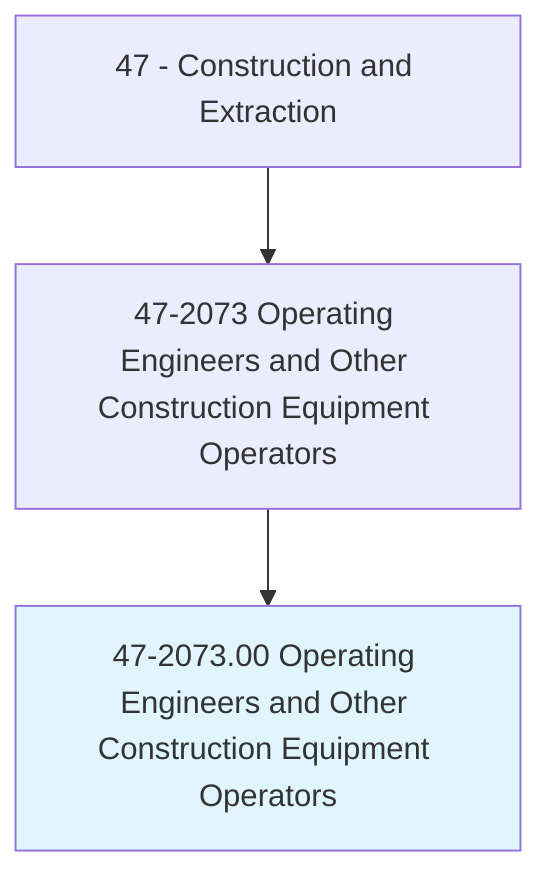
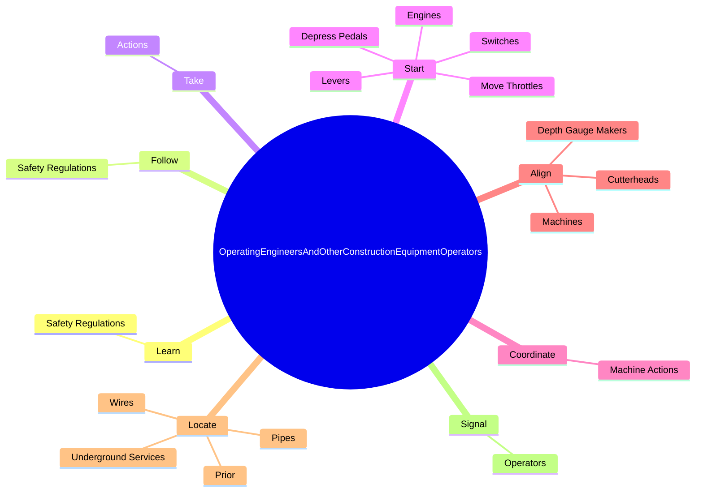
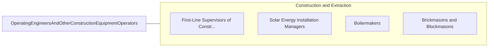

# Operating Engineers and Other Construction Equipment Operators

> Operate one or several types of power construction equipment, such as motor graders, bulldozers, scrapers, compressors, pumps, derricks, shovels, tractors, or front-end loaders to excavate, move, and grade earth, erect structures, or pour concrete or other hard surface pavement. May repair and maintain equipment in addition to other duties.

## Overview

Operating Engineers and Other Construction Equipment Operators is an occupation within the Construction and Extraction category. Operate one or several types of power construction equipment, such as motor graders, bulldozers, scrapers, compressors, pumps, derricks, shovels, tractors, or front-end loaders to excavate, move, and grade earth, erect structures, or pour concrete or other hard surface pavement. 

## Classification Hierarchy

## Key Statistics

| Metric | Value |
|--------|-------|
| SOC Code | 47-2073.00 |
| Category | [Construction and Extraction](/occupations/Construction) |
| Task Count | 159 |
| Source | O*NET |

## Core Tasks

### learn.SafetyRegulations

Operating Engineers and Other Construction Equipment Operators learn safety regulations as part of their core responsibilities.

**Actions:**
- `learn.SafetyRegulations`

### follow.SafetyRegulations

Operating Engineers and Other Construction Equipment Operators follow safety regulations as part of their core responsibilities.

**Actions:**
- `follow.SafetyRegulations`

### take.Actions

Operating Engineers and Other Construction Equipment Operators take actions as part of their core responsibilities.

**Actions:**
- `take.Actions.to.avoid.PotentialHazards`
- `take.Actions.to.Obstructions`
- `take.Actions.to.UtilityLines`
- `take.Actions.to.OtherEquipment`

## Skills & Competencies

### Technical Skills
- **Construction Methods** - Advanced
- **Blueprint Reading** - Advanced
- **Safety Compliance** - Advanced

### Soft Skills
- **Communication** - Essential
- **Problem Solving** - Essential
- **Critical Thinking** - Important
- **Teamwork** - Important
- **Adaptability** - Important

## Related Occupations

## Industries

This occupation is found across multiple industries. See [Industries](/industries) for sector-specific employment data.

## Career Progression

---

*Source: O*NET 47-2073.00 - ONETOccupation*
