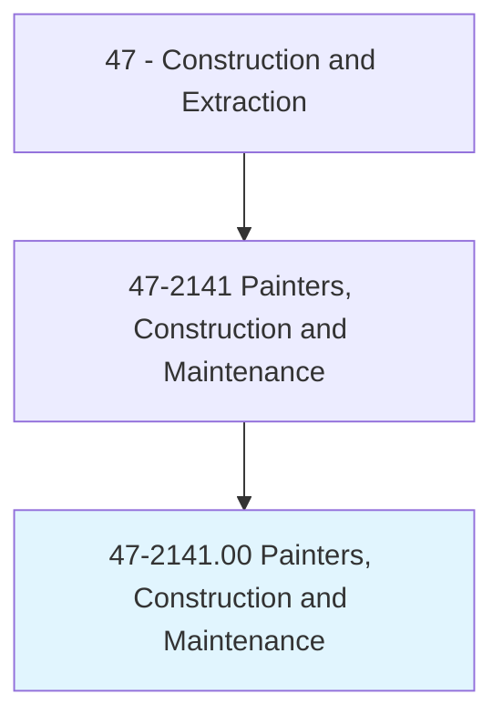
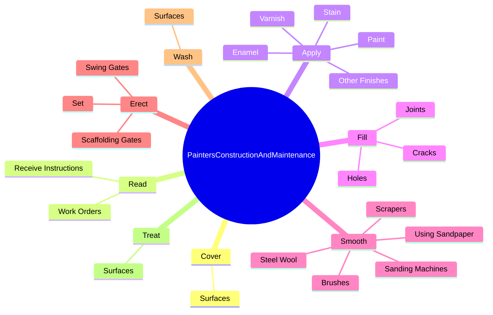
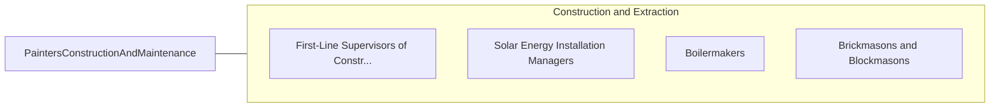

# Painters, Construction and Maintenance

> Paint walls, equipment, buildings, bridges, and other structural surfaces, using brushes, rollers, and spray guns. May remove old paint to prepare surface prior to painting. May mix colors or oils to obtain desired color or consistency.

## Overview

Painters, Construction and Maintenance is an occupation within the Construction and Extraction category. Paint walls, equipment, buildings, bridges, and other structural surfaces, using brushes, rollers, and spray guns. May remove old paint to prepare surface prior to painting.

## Classification Hierarchy

## Key Statistics

| Metric | Value |
|--------|-------|
| SOC Code | 47-2141.00 |
| Category | [Construction and Extraction](/occupations/Construction) |
| Task Count | 144 |
| Source | O*NET |

## Core Tasks

### cover.Surfaces

Painters, Construction and Maintenance cover surfaces as part of their core responsibilities.

**Actions:**
- `cover.Surfaces.with.Dropcloths`
- `cover.Surfaces.with.MaskingTape.to.protect.SurfacesDuringPainting`
- `cover.Surfaces.with.Paper.to.protect.SurfacesDuringPainting`

### read.WorkOrders

Painters, Construction and Maintenance read work orders as part of their core responsibilities.

**Actions:**
- `read.WorkOrders.from.Supervisors.to.determine.WorkRequirements`
- `read.WorkOrders.from.Homeowners.to.determine.WorkRequirements`
- `read.ReceiveInstructions.from.Supervisors.to.determine.WorkRequirements`
- `read.ReceiveInstructions.from.Homeowners.to.determine.WorkRequirements`

### apply.Paint

Painters, Construction and Maintenance apply paint as part of their core responsibilities.

**Actions:**
- `apply.Paint.to.Equipment`
- `apply.Paint.to.Buildings`
- `apply.Paint.to.bridges`
- `apply.Paint.to.OtherStructures`

## Skills & Competencies

### Technical Skills
- **Construction Methods** - Advanced
- **Blueprint Reading** - Advanced
- **Safety Compliance** - Advanced

### Soft Skills
- **Communication** - Essential
- **Problem Solving** - Essential
- **Critical Thinking** - Important
- **Teamwork** - Important
- **Adaptability** - Important

## Related Occupations

## Industries

This occupation is found across multiple industries. See [Industries](/industries) for sector-specific employment data.

## Career Progression

---

*Source: O*NET 47-2141.00 - ONETOccupation*
