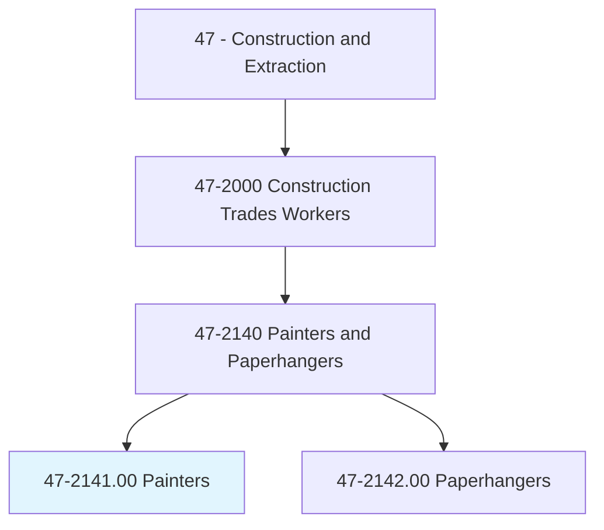
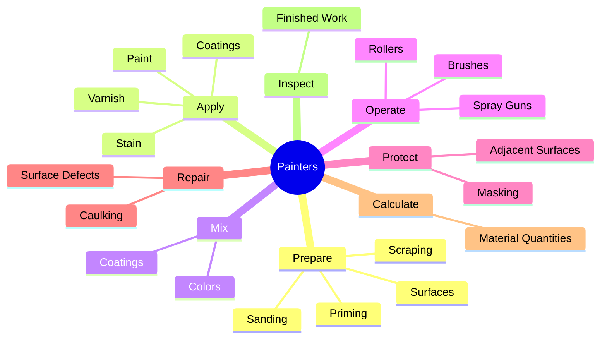
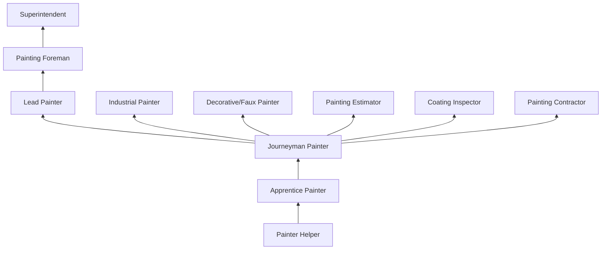
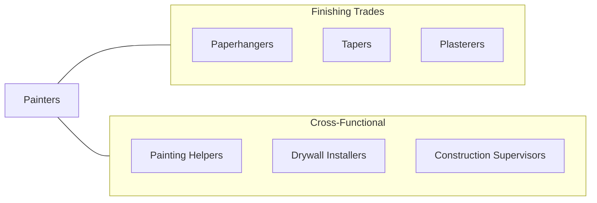

# Painters, Construction and Maintenance

> Paint walls, equipment, buildings, bridges, and other structural surfaces, using brushes, rollers, and spray guns. May remove old paint to prepare surface prior to painting. May mix colors or oils to obtain desired color or consistency.

## Overview

Construction and Maintenance Painters apply coatings to buildings, structures, equipment, and surfaces for both protective and decorative purposes. The trade encompasses residential, commercial, industrial, and infrastructure painting, each with distinct techniques, materials, and safety requirements. Painters must understand surface preparation, coating systems, color theory, and application methods to deliver durable, aesthetically pleasing finishes that protect substrates from weather, corrosion, chemicals, and UV degradation.

Surface preparation is the most critical phase of any painting project, accounting for up to 80% of coating system longevity. Painters scrape, sand, power wash, prime, caulk, and repair surfaces before applying finish coats. They select appropriate coating systems based on substrate type, environmental exposure, and performance requirements. Modern painters work with a wide range of products including latex paints, alkyds, epoxies, urethanes, elastomerics, intumescent fire retardants, and specialty industrial coatings.

The trade ranges from residential interior painting to high-complexity industrial work such as bridge coating, tank lining, and protective coatings for offshore structures. Industrial painting often involves abrasive blasting, confined space entry, and working at extreme heights, requiring additional certifications and safety training. The painting trade is represented by the International Union of Painters and Allied Trades (IUPAT).

## Classification Hierarchy

## Key Statistics

| Metric | Value |
|--------|-------|
| SOC Code | 47-2141.00 |
| Job Zone | 2 (Some Preparation) |
| Category | [Construction and Extraction](/occupations/Construction/index) |
| Task Count | 112 |
| Median Salary | $43,500 / year |
| Employment | ~200,000 |
| Job Outlook | 3% (Slower than average) |
| Physical Demands | Medium to Heavy |
| Source | O*NET |

## Core Tasks

### prepare.Surfaces

Painters prepare surfaces to ensure proper coating adhesion and longevity.

**Actions:**
- `prepare.Surfaces.by.Scraping`
- `prepare.Surfaces.by.Sanding`
- `prepare.Surfaces.by.PowerWashing`
- `prepare.Surfaces.by.Priming`

### apply.Coatings

Painters apply coating systems using appropriate application methods.

**Actions:**
- `apply.Paint.using.SprayGun`
- `apply.Paint.using.Roller`
- `apply.Paint.using.Brush`
- `apply.Stain.to.WoodSurfaces`

## Skills & Competencies

### Technical Skills
- **Surface Preparation** - Expert
- **Coating Application (Brush, Roll, Spray)** - Expert
- **Color Matching and Mixing** - Advanced
- **Spray Equipment Operation** - Expert
- **Blueprint Reading** - Intermediate
- **Material Estimation** - Advanced
- **Drywall Repair** - Intermediate
- **Caulking and Sealing** - Advanced

### Trade-Specific Skills
- **Airless Spray Systems** - Production painting
- **HVLP Spray Systems** - Fine finish work
- **Faux Finishing** - Decorative painting techniques
- **Industrial Coatings** - Epoxy, urethane, intumescent
- **Abrasive Blasting** - Surface preparation for industrial
- **Lead Paint Handling** - EPA RRP compliance

### Soft Skills
- **Attention to Detail** - Critical
- **Color Perception** - Essential
- **Physical Stamina** - Essential
- **Customer Service** - Essential (residential)
- **Patience** - Essential

## Education & Certifications

| Requirement | Details |
|-------------|---------|
| Typical Education | High school diploma or equivalent |
| Apprenticeship | 3-4 year IUPAT apprenticeship |
| On-the-Job Training | 4,000-6,000 hours |

### Certifications
- **OSHA 10/30-Hour Construction** - Safety certification
- **EPA RRP Certified Renovator** - Lead-safe work practices
- **SSPC Certification** - Industrial painting (various levels)
- **NACE Coating Inspector** - For inspection roles
- **IUPAT Journeyman Card** - Union credential
- **Scaffold User Certification** - Elevated work
- **Confined Space Entry** - Tank and vessel painting

## Career Progression

## Specializations

### Residential Painting
- Interior and exterior
- Deck and fence staining
- Cabinet refinishing
- Color consulting

### Commercial Painting
- Office and retail interiors
- Exterior building painting
- Parking structure coatings
- Multi-family complexes

### Industrial Coatings
- Bridge and structural steel
- Tank lining
- Marine coatings
- Protective and fire-retardant coatings

### Decorative and Specialty
- Faux finishing
- Murals and graphics
- Venetian plaster
- Electrostatic painting

## Tools & Equipment

### Application Tools
- Brushes (various sizes and types)
- Rollers (covers, frames, extension poles)
- Airless spray systems
- HVLP spray guns
- Electrostatic spray equipment

### Preparation Tools
- Scrapers and putty knives
- Sanders (orbital, pole)
- Power washers
- Caulking guns
- Heat guns

### Equipment
- Scaffolding and ladders
- Swing stages
- Aerial lifts (boom, scissor)
- Abrasive blasting equipment (industrial)

## Safety Considerations

- **Chemical Exposure** - Paint fumes, solvents, isocyanates; ventilation and respirators
- **Lead Paint** - Pre-1978 buildings; EPA RRP compliance mandatory
- **Falls** - Ladder, scaffold, and aerial lift work; fall protection
- **Respiratory Hazards** - Spray painting; appropriate respirator selection
- **Skin Contact** - Solvents and coatings; gloves and protective clothing
- **Fire Hazard** - Flammable materials; no ignition sources
- **Confined Spaces** - Tank and vessel painting; atmospheric monitoring

## Related Occupations

## Industries

- Painting Contractors - Primary Employment
- Building Construction - High Employment
- Industrial Maintenance - Moderate Employment
- [Government](/industries/PublicAdministration) - Moderate Employment

## Departments

- Field Operations
- Painting Division
- Industrial Coatings
- Estimating

---

*Source: O*NET 47-2141.00 - ONETOccupation*
