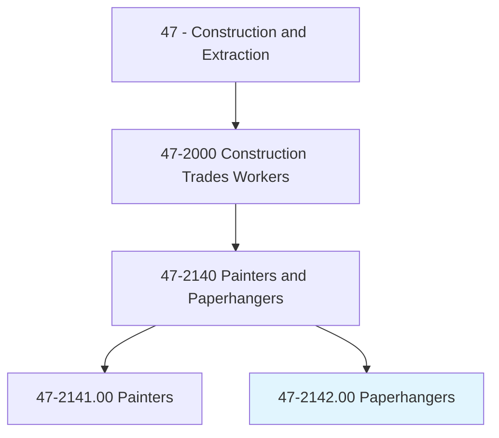
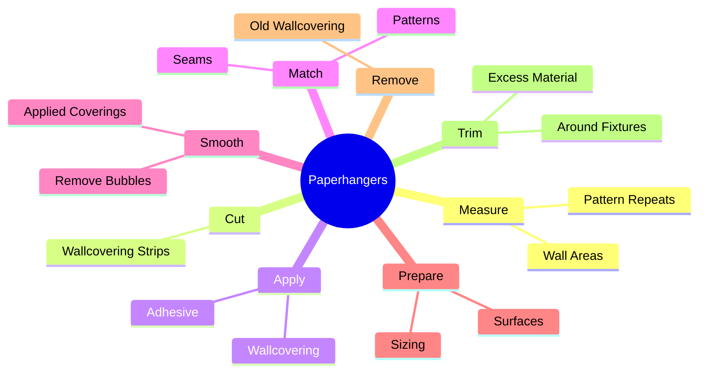
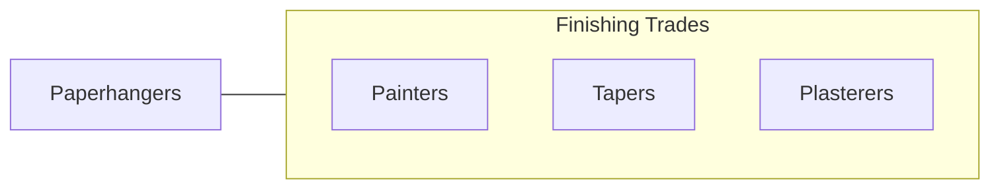

# Paperhangers

> Cover interior walls or ceilings of rooms with decorative wallpaper or fabric, or attach advertising posters on surfaces such as walls and billboards. Duties include removing old materials from surface to be papered.

## Overview

Paperhangers are specialized finishing trade workers who install wallcoverings including wallpaper, vinyl, fabric, grasscloth, and other decorative and functional wall treatments. The trade requires precise measurement, pattern matching, and surface preparation skills to achieve seamless, bubble-free installations on walls and ceilings. While residential wallpaper installation has fluctuated in popularity, commercial wallcovering remains a steady specialty, particularly in hospitality, healthcare, and corporate environments.

The work demands exceptional attention to detail, as pattern alignment errors, visible seams, and adhesive problems are immediately apparent and difficult to correct. Paperhangers must calculate material requirements accounting for pattern repeats and waste, prepare surfaces to ensure proper adhesion, and apply coverings using techniques appropriate to each material type. Modern wallcoverings range from traditional paste-applied papers to peel-and-stick vinyl, specialty fabrics, natural materials (grasscloth, cork, silk), and commercial-grade Type I and Type II vinyl.

Paperhanging is often combined with painting skills, as many professionals offer both services. The trade requires patience, steady hands, and the ability to work methodically from ceiling to floor and around obstacles. Commercial installations in hotels, restaurants, and office buildings provide the most consistent work volume, while high-end residential installations offer premium pricing for skilled craftsmen.

## Classification Hierarchy

## Key Statistics

| Metric | Value |
|--------|-------|
| SOC Code | 47-2142.00 |
| Job Zone | 3 (Medium Preparation) |
| Category | [Construction and Extraction](/occupations/Construction/index) |
| Task Count | 72 |
| Median Salary | $44,300 / year |
| Employment | ~4,000 |
| Job Outlook | -3% (Decline) |
| Physical Demands | Medium |
| Source | O*NET |

## Core Tasks

### apply.Wallcovering

Paperhangers apply wallcoverings with precise pattern alignment and smooth adhesion.

**Actions:**
- `apply.Wallcovering.to.PreparedSurfaces`
- `apply.Adhesive.to.WallcoveringBacking`
- `match.Patterns.across.Seams`

### prepare.Surfaces

Paperhangers prepare wall surfaces to ensure proper adhesion.

**Actions:**
- `prepare.Surfaces.by.Sizing`
- `prepare.Surfaces.by.RemovingOldCovering`
- `prepare.Surfaces.by.Priming`

## Skills & Competencies

### Technical Skills
- **Wallcovering Installation** - Expert
- **Pattern Matching** - Expert
- **Surface Preparation** - Expert
- **Material Estimation** - Advanced
- **Adhesive Selection** - Advanced
- **Blueprint Reading** - Intermediate

### Trade-Specific Skills
- **Commercial Vinyl (Type I/II)** - Standard commercial installations
- **Specialty Materials** - Grasscloth, silk, fabric, metallic
- **Mural Installation** - Large-format digital prints
- **Ceiling Installation** - Overhead wallcovering application
- **Old Covering Removal** - Steam and chemical methods

### Soft Skills
- **Attention to Detail** - Critical
- **Patience** - Critical
- **Precision** - Critical
- **Customer Service** - Essential
- **Problem Solving** - Essential

## Education & Certifications

| Requirement | Details |
|-------------|---------|
| Typical Education | High school diploma or equivalent |
| Apprenticeship | 3-4 year program (IUPAT) |
| On-the-Job Training | Extensive hands-on experience |

### Certifications
- **IUPAT Journeyman Card** - Union credential
- **OSHA 10-Hour Construction** - Safety certification
- **Wallcovering Installers Association (WIA)** - Professional credential
- **Manufacturer Training** - Product-specific techniques

## Career Progression

```mermaid
graph BT
    Helper["Paperhanger Helper"] --> Apprentice["Apprentice Paperhanger"]
    Apprentice --> Journey["Journeyman Paperhanger"]
    Journey --> Lead["Lead Installer"]
    Lead --> Foreman["Finishing Foreman"]

    Journey --> Commercial["Commercial Wallcovering Specialist"]
    Journey --> HighEnd["High-End Residential Specialist"]
    Journey --> Estimator["Wallcovering Estimator"]
    Journey --> Owner["Wallcovering Contractor"]
```

## Specializations

### Commercial Wallcovering
- Hotel and hospitality
- Healthcare facilities
- Corporate offices
- Retail environments

### Residential
- Custom high-end installations
- Accent walls and feature walls
- Ceiling installations
- Historic wallpaper reproduction

### Specialty Materials
- Grasscloth and natural fibers
- Silk and fabric wallcoverings
- Metallic and foil papers
- Large-format murals and graphics

## Tools & Equipment

- Wallpaper smoothing tools (brushes, rollers, squeegees)
- Seam rollers
- Utility knives with snap-off blades
- Straightedges and cutting guides
- Wallpaper paste machines
- Steam wallpaper removers
- Plumb bobs and levels
- Tape measures and laser measures
- Paste buckets and trays
- Drop cloths and surface protection

## Safety Considerations

- **Ladder and Scaffold Falls** - Elevated work; proper ladder safety
- **Chemical Exposure** - Adhesives and removal chemicals; ventilation
- **Repetitive Motion** - Smoothing and trimming; ergonomic awareness
- **Eye Irritation** - Chemical splash; safety glasses
- **Skin Contact** - Adhesives and chemicals; gloves recommended

## Related Occupations

## Industries

- Painting and Wallcovering Contractors - Primary Employment
- Commercial Interior Design - High Employment
- Hospitality Construction - Moderate Employment

## Departments

- Field Operations
- Painting and Finishing Division
- Estimating

---

*Source: O*NET 47-2142.00 - ONETOccupation*
