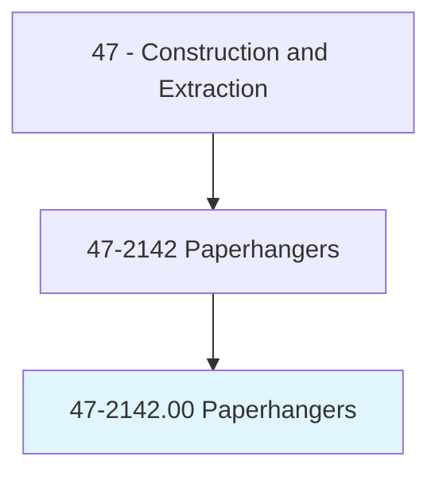
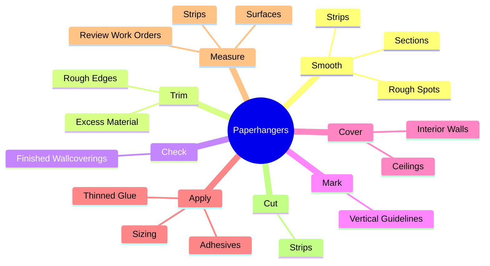
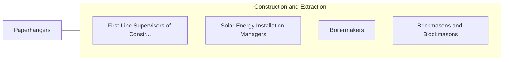

# Paperhangers

> Cover interior walls or ceilings of rooms with decorative wallpaper or fabric, or attach advertising posters on surfaces such as walls and billboards. May remove old materials or prepare surfaces to be papered.

## Overview

Paperhangers is an occupation within the Construction and Extraction category. Cover interior walls or ceilings of rooms with decorative wallpaper or fabric, or attach advertising posters on surfaces such as walls and billboards. 

## Classification Hierarchy

## Key Statistics

| Metric | Value |
|--------|-------|
| SOC Code | 47-2142.00 |
| Category | [Construction and Extraction](/occupations/Construction/index) |
| Task Count | 82 |
| Source | O*NET |

## Core Tasks

### smooth.Strips

Paperhangers smooth strips as part of their core responsibilities.

**Actions:**
- `smooth.Strips.of.PaperWithBrushes.to.remove.WrinklesBubblesToSmoothJoints`
- `smooth.Strips.of.Rollers.to.remove.WrinklesBubblesToSmoothJoints`
- `smooth.Sections.of.PaperWithBrushes.to.remove.WrinklesBubblesToSmoothJoints`
- `smooth.Sections.of.Rollers.to.remove.WrinklesBubblesToSmoothJoints`

### trim.RoughEdges

Paperhangers trim rough edges as part of their core responsibilities.

**Actions:**
- `trim.RoughEdges.from.Strips`
- `trim.RoughEdges.from.UsingStraightedges`
- `trim.RoughEdges.from.TrimmingKnives`
- `trim.ExcessMaterial.at.CeilingsUsingKnives`

### check.FinishedWallcoverings

Paperhangers check finished wallcoverings as part of their core responsibilities.

**Actions:**
- `check.FinishedWallcoverings.for.ProperAlignment`
- `check.FinishedWallcoverings.for.PatternMatching`
- `check.FinishedWallcoverings.for.Neatness.of.Seams`

## Skills & Competencies

### Technical Skills
- **Construction Methods** - Advanced
- **Blueprint Reading** - Advanced
- **Safety Compliance** - Advanced

### Soft Skills
- **Communication** - Essential
- **Problem Solving** - Essential
- **Critical Thinking** - Important
- **Teamwork** - Important
- **Adaptability** - Important

## Related Occupations

## Industries

This occupation is found across multiple industries. See [Industries](/industries) for sector-specific employment data.

## Career Progression

---

*Source: O*NET 47-2142.00 - ONETOccupation*
