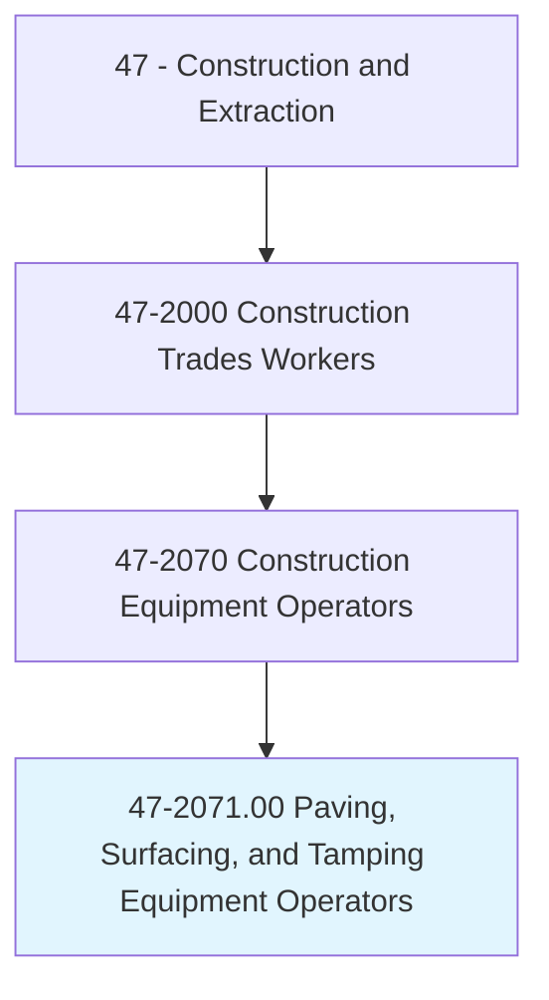
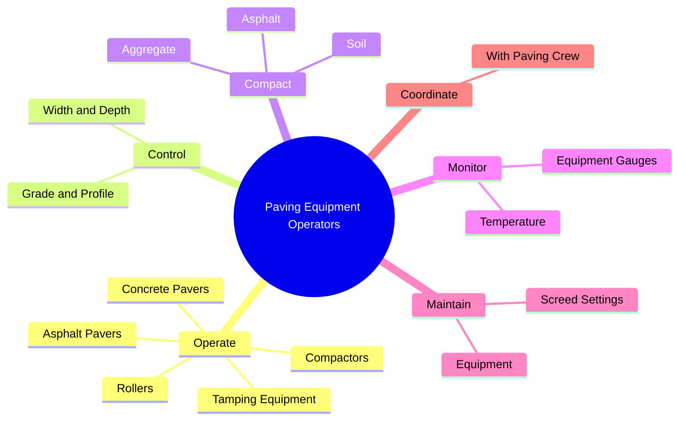
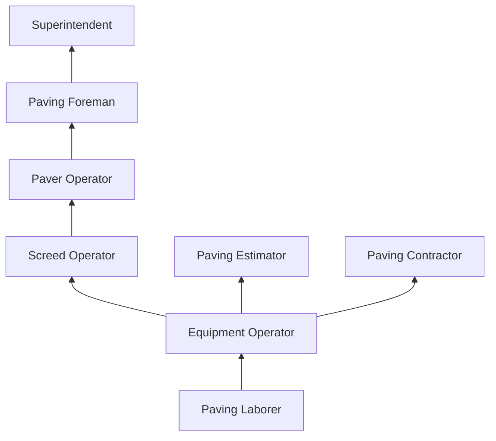
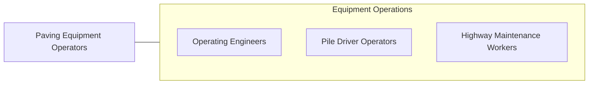

# Paving, Surfacing, and Tamping Equipment Operators

> Operate equipment used for applying concrete, asphalt, or other materials to road beds, parking areas, or airport runways and taxiways, or equipment used for tamping gravel, dirt, or other materials.

## Overview

Paving, Surfacing, and Tamping Equipment Operators run specialized machinery used to place, spread, level, and compact paving materials including asphalt, concrete, gravel, and aggregate on roads, highways, parking lots, airport runways, and other surfaces. These operators control asphalt pavers, concrete slip-form machines, rollers, compactors, and related equipment that must work in tight coordination to produce smooth, durable driving surfaces.

Asphalt paving is a time-critical operation where hot-mix asphalt must be placed and compacted within a narrow temperature window. The paver operator controls the width, depth, and crown of the mat while the roller operators compact the material before it cools. Concrete paving for highways uses slip-form machines that extrude a continuous ribbon of concrete at precise grade and profile. Both operations require excellent coordination between multiple equipment operators working as a synchronized team.

The trade is heavily weather-dependent and seasonal in colder climates, with most paving occurring between spring and fall. During peak season, operators may work extended hours to complete projects within weather windows and traffic control restrictions. Night paving is common on busy highways where daytime closures would cause unacceptable traffic disruption.

## Classification Hierarchy

## Key Statistics

| Metric | Value |
|--------|-------|
| SOC Code | 47-2071.00 |
| Job Zone | 2 (Some Preparation) |
| Category | [Construction and Extraction](/occupations/Construction/index) |
| Task Count | 95 |
| Median Salary | $45,800 / year |
| Employment | ~55,000 |
| Job Outlook | 3% (Slower than average) |
| Physical Demands | Medium to Heavy |
| Source | O*NET |

## Core Tasks

### operate.AsphaltPavers

Operators control pavers to place hot-mix asphalt at specified width and thickness.

**Actions:**
- `operate.AsphaltPavers.to.place.HotMixAsphalt`
- `operate.ConcreteSlipFormPavers.to.place.Concrete`
- `operate.Rollers.to.compact.Asphalt`
- `operate.VibratingCompactors.to.compact.Soil`

## Skills & Competencies

### Technical Skills
- **Paving Equipment Operation** - Expert
- **Compaction Equipment** - Expert
- **Grade and Profile Control** - Advanced
- **Asphalt/Concrete Knowledge** - Advanced
- **GPS Machine Control** - Advanced
- **Equipment Maintenance** - Advanced

### Soft Skills
- **Teamwork** - Critical (synchronized crew operations)
- **Concentration** - Critical
- **Communication** - Essential
- **Mechanical Aptitude** - Essential
- **Safety Consciousness** - Critical

## Education & Certifications

| Requirement | Details |
|-------------|---------|
| Typical Education | High school diploma or equivalent |
| On-the-Job Training | 6-12 months |
| CDL | Often required |

### Certifications
- **OSHA 10-Hour Construction** - Safety certification
- **CDL Class A/B** - Vehicle operation
- **NCCER Equipment Operator** - Industry credential
- **Flagger Certification** - Work zone traffic control
- **Nuclear Density Gauge** - For compaction testing (if applicable)

## Career Progression

## Specializations

- **Asphalt Paving** - Highway, commercial, residential
- **Concrete Paving** - Slip-form highway, curb and gutter
- **Compaction** - Soil, aggregate, asphalt rolling
- **Milling** - Asphalt removal and recycling
- **Chip Sealing** - Surface treatment operations

## Tools & Equipment

- Asphalt pavers (tracked and wheeled)
- Concrete slip-form pavers
- Steel drum rollers (vibratory)
- Pneumatic tire rollers
- Plate compactors
- Milling machines
- Material transfer vehicles

## Safety Considerations

- **Hot Material Burns** - Asphalt at 275-325F; protective clothing
- **Traffic Hazards** - Work zone vehicle intrusions
- **Equipment Struck-By** - Proximity to moving machines; spotters
- **Noise and Fumes** - Asphalt emissions; respiratory and hearing protection
- **Night Work** - Reduced visibility; proper lighting and reflective gear
- **Heat Illness** - Hot material plus ambient heat

## Related Occupations

## Industries

- [Highway and Street Construction](/industries/HeavyCivil) - Primary Employment
- [Paving Contractors](/industries/SpecialtyTrade) - Primary Employment
- [Airport Construction](/industries/HeavyCivil) - Moderate Employment

## Departments

- [Paving Division](/departments/Paving)
- [Field Operations](/departments/FieldOperations)
- [Equipment](/departments/Equipment)

---

*Source: O*NET 47-2071.00 - ONETOccupation*
