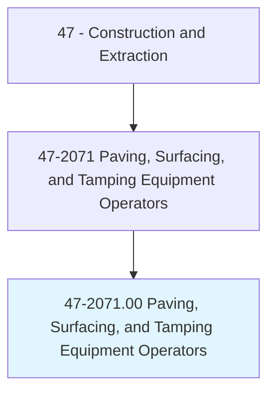
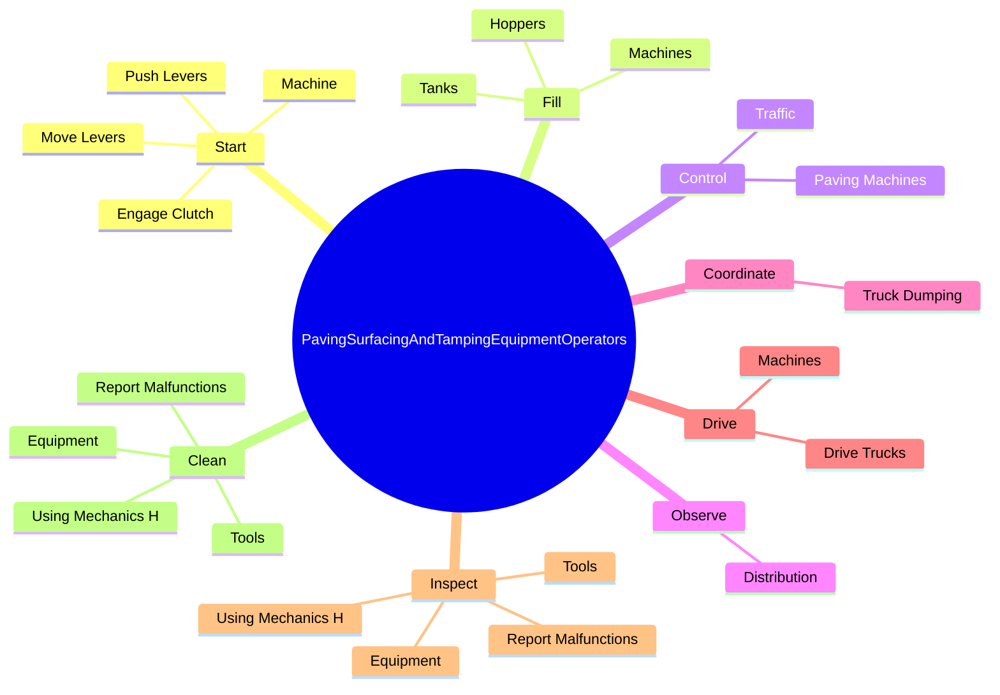
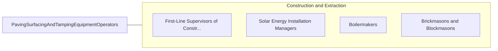

# Paving, Surfacing, and Tamping Equipment Operators

> Operate equipment used for applying concrete, asphalt, or other materials to road beds, parking lots, or airport runways and taxiways or for tamping gravel, dirt, or other materials. Includes concrete and asphalt paving machine operators, form tampers, tamping machine operators, and stone spreader operators.

## Overview

Paving, Surfacing, and Tamping Equipment Operators is an occupation within the Construction and Extraction category. Operate equipment used for applying concrete, asphalt, or other materials to road beds, parking lots, or airport runways and taxiways or for tamping gravel, dirt, or other materials. 

## Classification Hierarchy

## Key Statistics

| Metric | Value |
|--------|-------|
| SOC Code | 47-2071.00 |
| Category | [Construction and Extraction](/occupations/Construction/index) |
| Task Count | 97 |
| Source | O*NET |

## Core Tasks

### start.Machine

Paving, Surfacing, and Tamping Equipment Operators start machine as part of their core responsibilities.

**Actions:**
- `start.Machine.to.guide.MachineAlongFormsToControlOperationOfMachineAttachments`
- `start.Machine.to.GuidelinesToControlOperationOfMachineAttachments`
- `start.EngageClutch.to.guide.MachineAlongFormsToControlOperationOfMachineAttachments`
- `start.EngageClutch.to.GuidelinesToControlOperationOfMachineAttachments`

### fill.Tanks

Paving, Surfacing, and Tamping Equipment Operators fill tanks as part of their core responsibilities.

**Actions:**
- `fill.Tanks.with.PavingMaterials`
- `fill.Hoppers.with.PavingMaterials`
- `fill.Machines.with.PavingMaterials`

### control.PavingMachines

Paving, Surfacing, and Tamping Equipment Operators control paving machines as part of their core responsibilities.

**Actions:**
- `control.PavingMachines.to.push.DumpTrucksMaintainConstantFlowOfAsphaltOtherMaterialIntoHoppersScreeds`
- `control.PavingMachines.to.ToMaintainConstantFlowOfAsphaltOtherMaterialIntoHoppersScreeds`
- `control.Traffic`

## Skills & Competencies

### Technical Skills
- **Construction Methods** - Advanced
- **Blueprint Reading** - Advanced
- **Safety Compliance** - Advanced

### Soft Skills
- **Communication** - Essential
- **Problem Solving** - Essential
- **Critical Thinking** - Important
- **Teamwork** - Important
- **Adaptability** - Important

## Related Occupations

## Industries

This occupation is found across multiple industries. See [Industries](/industries) for sector-specific employment data.

## Career Progression

---

*Source: O*NET 47-2071.00 - ONETOccupation*
