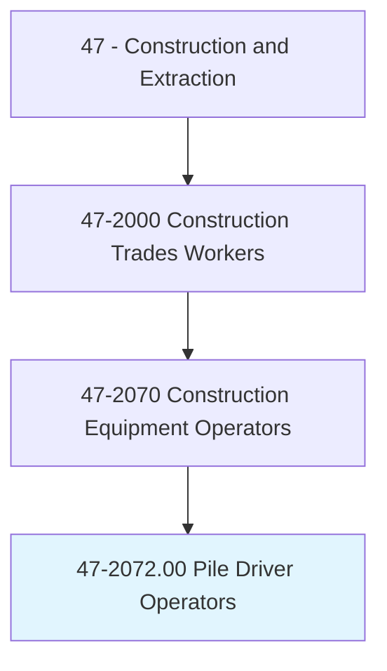
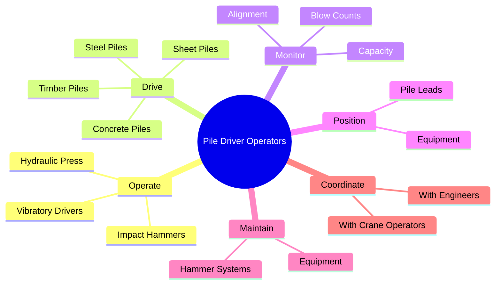
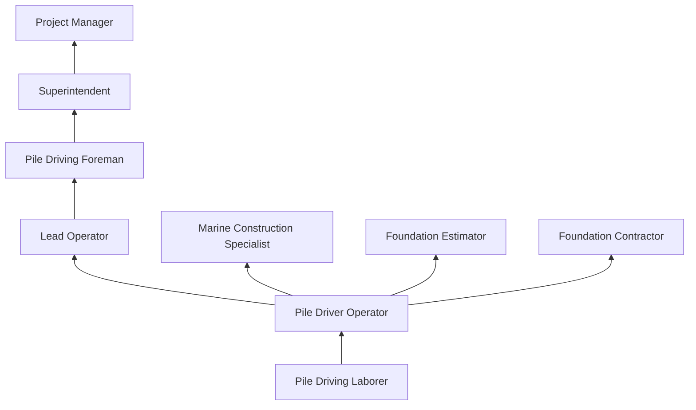
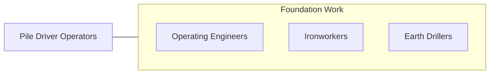

# Pile Driver Operators

> Operate large machines mounted on skids, barges, trucks, or cranes to drive piles for retaining walls, bulkheads, and foundations of structures such as buildings, bridges, and piers.

## Overview

Pile Driver Operators operate specialized equipment to drive deep foundation elements (piles) into the ground to support bridges, buildings, piers, retaining walls, and other heavy structures. They work with impact hammers, vibratory drivers, diesel hammers, and hydraulic press systems to install steel H-piles, pipe piles, sheet piles, concrete piles, and timber piles. The work is a critical component of heavy civil and marine construction, as many structures require deep foundations to transfer loads through weak surface soils to competent bearing strata.

The trade requires understanding of soil mechanics, pile driving dynamics, and structural load transfer. Operators must monitor pile driving resistance (blow counts), maintain proper alignment, and coordinate with geotechnical engineers who specify the required pile capacity. Modern pile driving uses dynamic analysis (PDA testing) to verify pile capacity and integrity during installation. Operators work from crane-mounted leads, barge-mounted rigs, and specialized pile driving equipment.

Pile driving is a loud, high-energy operation that generates significant noise, vibration, and ground disturbance. Operators must manage these impacts while maintaining precise pile placement and alignment. The work often occurs in marine environments (rivers, harbors, offshore) and on challenging terrain, requiring skill in both equipment operation and situational awareness.

## Classification Hierarchy

## Key Statistics

| Metric | Value |
|--------|-------|
| SOC Code | 47-2072.00 |
| Job Zone | 3 (Medium Preparation) |
| Category | [Construction and Extraction](/occupations/Construction/index) |
| Task Count | 75 |
| Median Salary | $63,200 / year |
| Employment | ~5,000 |
| Job Outlook | 6% (Faster than average) |
| Physical Demands | Heavy |
| Source | O*NET |

## Core Tasks

### drive.SteelPiles

Pile drivers install foundation piles to specified depth and capacity.

**Actions:**
- `drive.SteelPiles.to.SpecifiedCapacity`
- `drive.ConcretePiles.to.DesignElevation`
- `drive.SheetPiles.for.RetainingWalls`

## Skills & Competencies

### Technical Skills
- **Pile Driving Equipment** - Expert
- **Crane Operation** - Advanced
- **Soil Mechanics Basics** - Advanced
- **Blueprint Reading** - Advanced
- **Welding** - Intermediate (pile splicing)
- **Marine Construction** - Advanced

### Soft Skills
- **Mechanical Aptitude** - Critical
- **Spatial Awareness** - Critical
- **Safety Consciousness** - Critical
- **Communication** - Essential
- **Teamwork** - Critical

## Education & Certifications

| Requirement | Details |
|-------------|---------|
| Typical Education | High school diploma or equivalent |
| Apprenticeship | 3-4 year program (IUOE or Pile Drivers Union) |
| CDL | Class A or B |

### Certifications
- **NCCCO Crane Operator** - If operating cranes
- **OSHA 10/30-Hour Construction** - Safety certification
- **CDL Class A/B** - Vehicle operation
- **Welding Certification** - For pile splicing
- **First Aid/CPR** - Required
- **Maritime Credentials** - For marine pile driving (TWIC card)

## Career Progression

## Specializations

- **Bridge Foundation** - Highway and rail bridge piers
- **Marine Construction** - Piers, wharves, bulkheads
- **Building Foundation** - Deep foundation systems
- **Sheet Piling** - Earth retention and cofferdams
- **Micropiles and Drilled Shafts** - Specialty deep foundations

## Tools & Equipment

- Diesel and hydraulic impact hammers
- Vibratory pile drivers
- Crane-mounted pile leads
- Pile driving analyzers (PDA)
- Welding equipment
- Barges and marine equipment
- GPS positioning systems

## Safety Considerations

- **Noise** - Extreme noise levels; hearing protection mandatory
- **Falling Objects** - Overhead pile and equipment; hard hats and exclusion zones
- **Drowning** - Marine operations; PFDs and rescue equipment
- **Vibration** - Ground and equipment vibration; monitoring required
- **Crane Hazards** - Overhead loads; rigging safety
- **Pinch Points** - Between pile and equipment; clearance protocols

## Related Occupations

## Industries

- Foundation and Piling Contractors - Primary Employment
- Bridge Construction - High Employment
- Marine Construction - High Employment

## Departments

- Pile Driving Division
- Marine Division
- Field Operations

---

*Source: O*NET 47-2072.00 - ONETOccupation*
