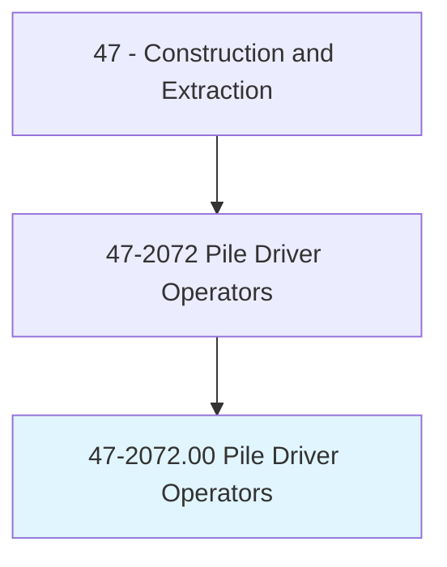
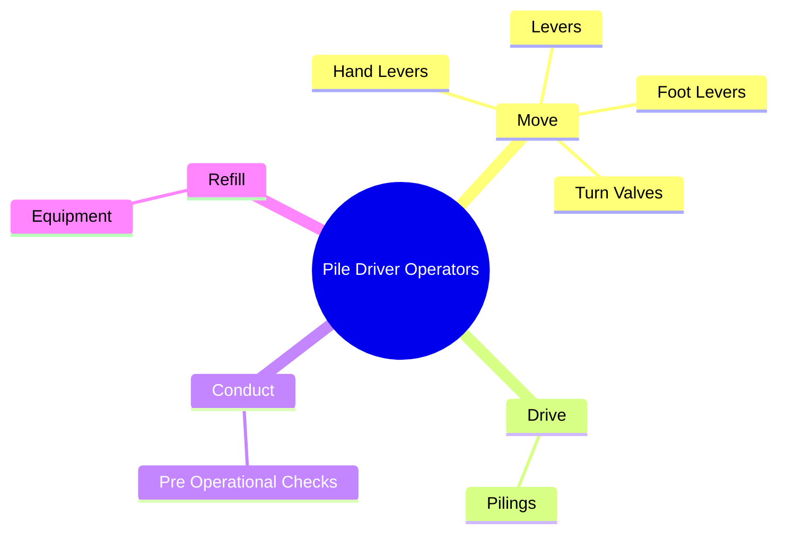
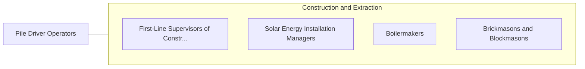

# Pile Driver Operators

> Operate pile drivers mounted on skids, barges, crawler treads, or locomotive cranes to drive pilings for retaining walls, bulkheads, and foundations of structures such as buildings, bridges, and piers.

## Overview

Pile Driver Operators is classified under Construction and Extraction (SOC 47). Operate pile drivers mounted on skids, barges, crawler treads, or locomotive cranes to drive pilings for retaining walls, bulkheads, and foundations of structures such as buildings, bridges, and piers.

## Classification Hierarchy

## Key Statistics

| Metric | Value |
|--------|-------|
| SOC Code | 47-2072.00 |
| Category | [Construction and Extraction](/occupations/Construction/index) |
| Task Count | 16 |
| Source | O*NET |

## Core Tasks

### move.HandLevers

Pile Driver Operators move hand levers as part of their core responsibilities.

**Actions:**
- `move.HandLevers.of.HoistingEquipment.to.position.PilingLeads`
- `move.HandLevers.of.HoistPilingIntoLeads`
- `move.HandLevers.of.PositionHammersOverPilings`
- `move.FootLevers.of.HoistingEquipment.to.position.PilingLeads`

### drive.Pilings

Pile Driver Operators drive pilings as part of their core responsibilities.

**Actions:**
- `drive.Pilings.to.provide.SupportForBuildingsStructuresUsingHeavyEquipmentWithPileDriverHead`
- `drive.Pilings.to.OtherStructuresUsingHeavyEquipmentWithPileDriverHead`

### conduct.PreOperationalChecks

Pile Driver Operators conduct pre operational checks as part of their core responsibilities.

**Actions:**
- `conduct.PreOperationalChecks.on.Equipment.to.ensure.ProperFunctioning`

## Skills & Competencies

### Technical Skills
- **Construction Methods** - Advanced
- **Blueprint Reading** - Advanced
- **Safety Compliance** - Advanced

### Soft Skills
- **Communication** - Essential
- **Problem Solving** - Essential
- **Critical Thinking** - Important
- **Teamwork** - Important
- **Adaptability** - Important

## Related Occupations

## Industries

This occupation is found across multiple industries. See [Industries](/industries) for sector-specific employment data.

## Career Progression

---

*Source: O*NET 47-2072.00 - ONETOccupation*
