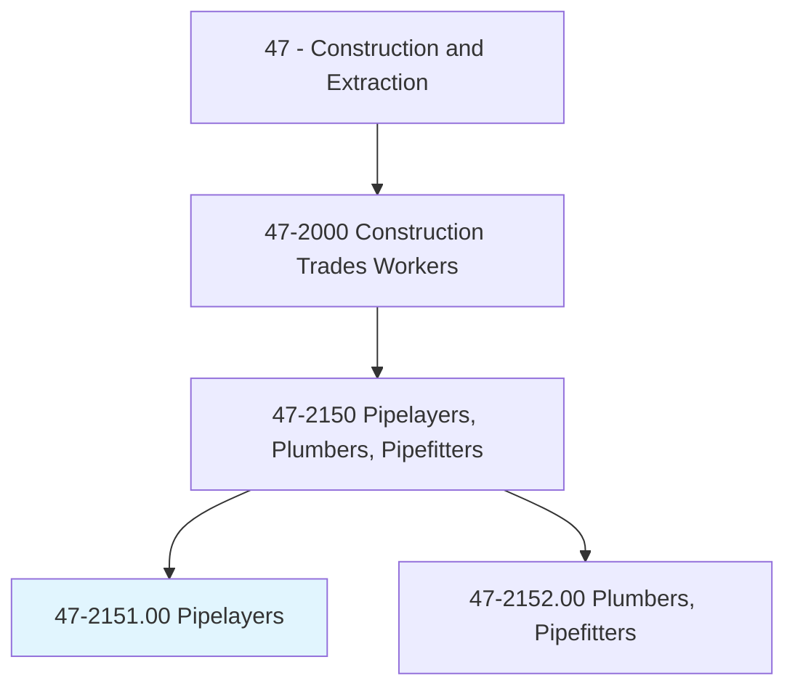
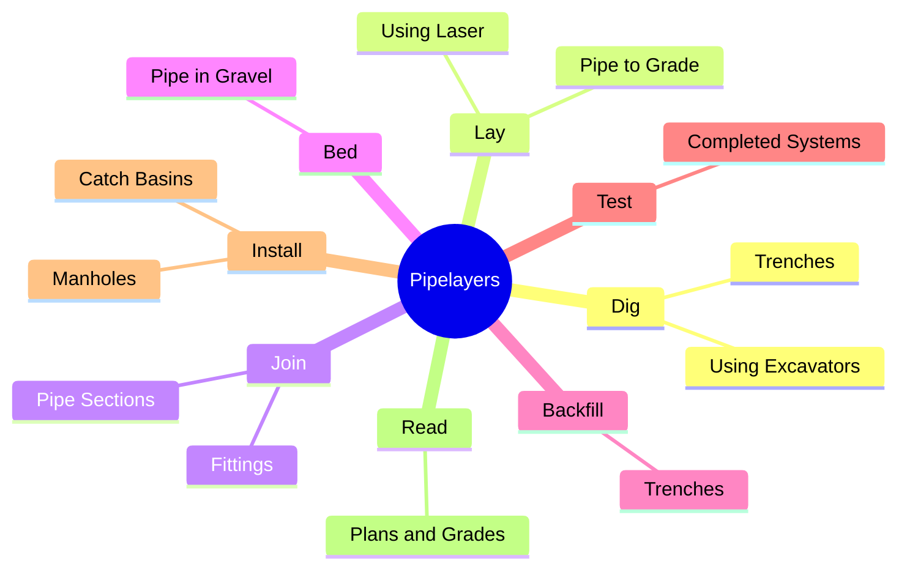
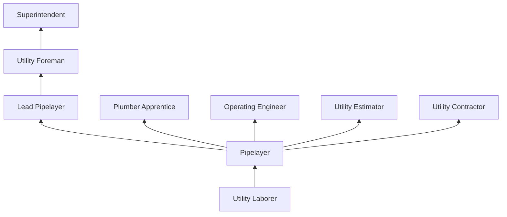
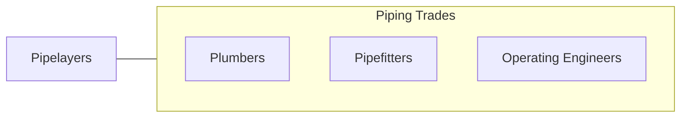

# Pipelayers

> Lay pipe for storm or sanitation sewers, drains, and water mains. Perform any combination of tasks involved in laying pipe.

## Overview

Pipelayers install underground pipe systems for water distribution, sanitary sewer, storm drainage, and other utility applications. The work involves excavation, trench preparation, pipe assembly, bedding, backfilling, and testing of completed systems. Pipelayers work with a variety of pipe materials including PVC, ductile iron, HDPE, concrete, and vitrified clay, each requiring specific joining methods and installation techniques.

The trade is fundamental to civil infrastructure construction. Every building, road, and development requires underground utility services, and pipelayers are the workers who install these hidden but essential systems. They must understand hydraulic grades, pipe slopes, trench safety, and soil conditions to install systems that will function properly for decades. Modern pipe installation uses laser-guided alignment, GPS positioning, and trenchless installation methods alongside traditional open-cut techniques.

Pipelaying is physically demanding outdoor work that involves heavy lifting, working in excavated trenches, and exposure to weather extremes. Trench safety is a paramount concern, as trench collapses are among the most lethal construction hazards. Proper shoring, sloping, and trench box protection are mandatory for excavations exceeding five feet in depth.

## Classification Hierarchy

## Key Statistics

| Metric | Value |
|--------|-------|
| SOC Code | 47-2151.00 |
| Job Zone | 2 (Some Preparation) |
| Category | [Construction and Extraction](/occupations/Construction/index) |
| Task Count | 82 |
| Median Salary | $44,100 / year |
| Employment | ~38,000 |
| Job Outlook | 6% (Faster than average) |
| Physical Demands | Very Heavy |
| Source | O*NET |

## Core Tasks

### lay.Pipe

Pipelayers install pipe to specified grade and alignment.

**Actions:**
- `lay.Pipe.to.Grade.using.LaserLevel`
- `join.PipeSections.using.GasketJoints`
- `install.Manholes.at.DesignLocations`

## Skills & Competencies

### Technical Skills
- **Pipe Installation** - Expert
- **Grade and Alignment (Laser)** - Expert
- **Trench Safety** - Expert
- **Blueprint and Plan Reading** - Advanced
- **Pipe Joining Methods** - Advanced
- **Pressure and Leak Testing** - Advanced
- **Equipment Operation** - Intermediate

### Soft Skills
- **Physical Stamina** - Critical
- **Safety Consciousness** - Critical
- **Teamwork** - Essential
- **Problem Solving** - Essential

## Education & Certifications

| Requirement | Details |
|-------------|---------|
| Typical Education | High school diploma or equivalent |
| On-the-Job Training | 6-12 months |
| CDL | Often beneficial |

### Certifications
- **OSHA 10-Hour Construction** - Safety certification
- **Competent Person (Excavation)** - OSHA trench safety
- **Confined Space Entry** - For manhole and vault work
- **CDL Class A/B** - Equipment transport
- **First Aid/CPR** - Required

## Career Progression

## Specializations

- **Water Main Installation** - Ductile iron, HDPE
- **Sanitary Sewer** - PVC, vitrified clay
- **Storm Drainage** - Concrete, corrugated pipe
- **Force Main and Pressure Pipe** - Welded and restrained joints
- **Trenchless Installation** - Horizontal directional drilling support

## Tools & Equipment

- Laser alignment systems
- Pipe cutting and beveling tools
- Compaction equipment
- Dewatering pumps
- Testing equipment (hydrostatic, air, mandrel)
- PPE (hard hat, vest, boots, gloves)

## Safety Considerations

- **Trench Collapse** - Leading cause of construction fatalities; proper shoring/sloping mandatory
- **Struck-By Equipment** - Excavators working near trench; spotters required
- **Underground Utilities** - Gas, electric strike risk; 811 locate required
- **Confined Spaces** - Manholes and vaults; atmospheric monitoring
- **Heavy Lifting** - Pipe sections; mechanical aids
- **Water Hazards** - Groundwater and flooding

## Related Occupations

## Industries

- Utility Contractors - Primary Employment
- Water and Sewer Construction - Primary Employment
- Site Development - High Employment

## Departments

- Underground Utilities
- Field Operations
- Estimating

---

*Source: O*NET 47-2151.00 - ONETOccupation*
