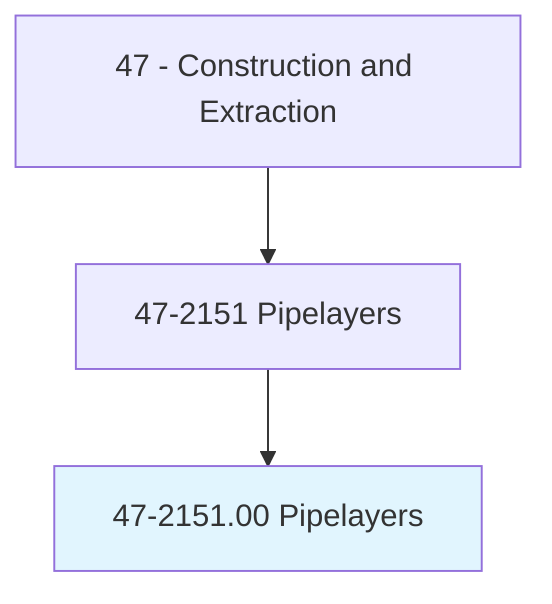
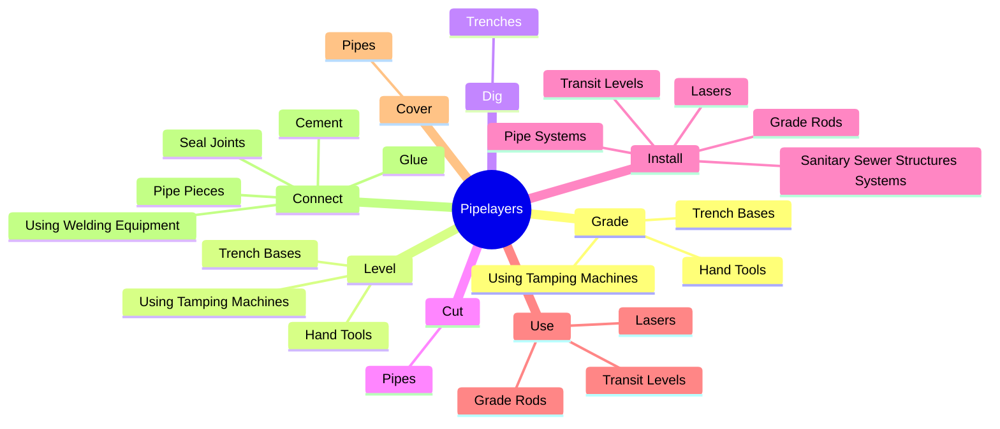
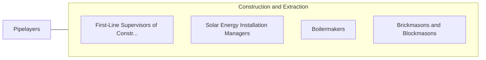

# Pipelayers

> Lay pipe for storm or sanitation sewers, drains, and water mains. Perform any combination of the following tasks: grade trenches or culverts, position pipe, or seal joints.

## Overview

Pipelayers is an occupation within the Construction and Extraction category. Lay pipe for storm or sanitation sewers, drains, and water mains. 

## Classification Hierarchy

## Key Statistics

| Metric | Value |
|--------|-------|
| SOC Code | 47-2151.00 |
| Category | [Construction and Extraction](/occupations/Construction/index) |
| Task Count | 56 |
| Source | O*NET |

## Core Tasks

### grade.TrenchBases

Pipelayers grade trench bases as part of their core responsibilities.

**Actions:**
- `grade.TrenchBases`
- `grade.UsingTampingMachines`
- `grade.HandTools`

### level.TrenchBases

Pipelayers level trench bases as part of their core responsibilities.

**Actions:**
- `level.TrenchBases`
- `level.UsingTampingMachines`
- `level.HandTools`

### dig.Trenches

Pipelayers dig trenches as part of their core responsibilities.

**Actions:**
- `dig.Trenches.to.DesiredDepths`
- `dig.Trenches.to.RequiredDepths`
- `dig.Trenches.to.ByH`
- `dig.Trenches.to.UsingTrenchingTools`

## Skills & Competencies

### Technical Skills
- **Construction Methods** - Advanced
- **Blueprint Reading** - Advanced
- **Safety Compliance** - Advanced

### Soft Skills
- **Communication** - Essential
- **Problem Solving** - Essential
- **Critical Thinking** - Important
- **Teamwork** - Important
- **Adaptability** - Important

## Related Occupations

## Industries

This occupation is found across multiple industries. See [Industries](/industries) for sector-specific employment data.

## Career Progression

---

*Source: O*NET 47-2151.00 - ONETOccupation*
