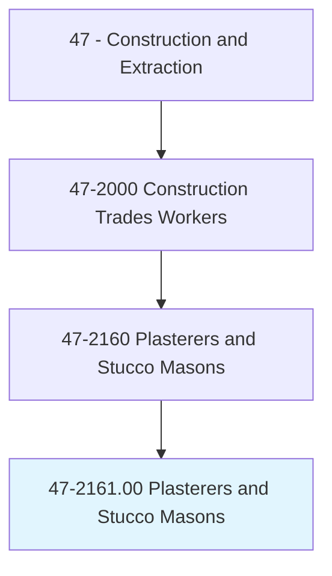
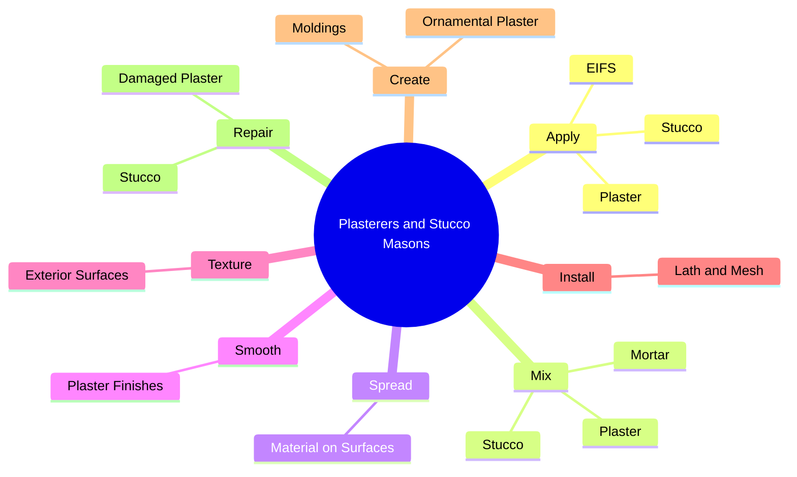
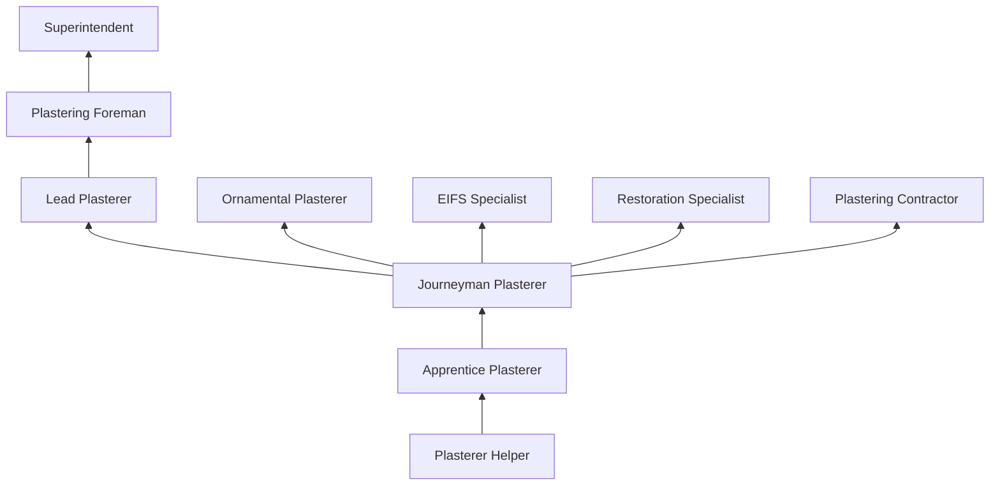

# Plasterers and Stucco Masons

> Apply interior or exterior plaster, cement, stucco, or similar materials. May also set ornamental plaster.

## Overview

Plasterers and Stucco Masons apply plaster, stucco, and related cementitious coatings to interior and exterior surfaces of buildings. Interior plasterers create smooth, durable wall and ceiling finishes using traditional lime or gypsum plaster, while stucco masons apply exterior cementitious coatings that serve as both weather protection and decorative finish. The trade encompasses both traditional craft techniques and modern synthetic systems including Exterior Insulation and Finish Systems (EIFS).

Traditional plastering is one of the oldest building crafts, producing wall surfaces of exceptional durability and acoustic quality. Modern plasterers work with conventional plaster, Venetian plaster, ornamental plaster (crown moldings, medallions, columns), and specialty finishes. Stucco masons apply three-coat conventional stucco systems or one-coat stucco over various substrates, creating textured exterior finishes that can last for decades when properly installed.

The trade requires both physical skill and artistic ability. Plasterers must achieve smooth, uniform surfaces by hand, applying and finishing wet materials overhead and on vertical surfaces before they set. Ornamental plasterers create or restore decorative elements that require sculpting and molding skills. EIFS installers combine insulation board with synthetic finish coats, requiring knowledge of thermal performance, moisture management, and aesthetic detailing.

## Classification Hierarchy

## Key Statistics

| Metric | Value |
|--------|-------|
| SOC Code | 47-2161.00 |
| Job Zone | 3 (Medium Preparation) |
| Category | [Construction and Extraction](/occupations/Construction/index) |
| Task Count | 85 |
| Median Salary | $47,600 / year |
| Employment | ~22,000 |
| Job Outlook | 2% (Slower than average) |
| Physical Demands | Heavy |
| Source | O*NET |

## Core Tasks

### apply.Plaster

Plasterers apply plaster coatings to interior walls and ceilings.

**Actions:**
- `apply.Plaster.to.InteriorWalls`
- `apply.Stucco.to.ExteriorWalls`
- `apply.EIFS.to.BuildingExterior`

## Skills & Competencies

### Technical Skills
- **Interior Plastering** - Expert
- **Exterior Stucco Application** - Expert
- **EIFS Installation** - Advanced
- **Material Mixing** - Expert
- **Lath and Mesh Installation** - Advanced
- **Ornamental Plaster** - Advanced
- **Blueprint Reading** - Intermediate

### Trade-Specific Skills
- **Three-Coat Stucco Systems** - Scratch, brown, and finish coats
- **Venetian Plaster** - Polished lime plaster finishes
- **EIFS Systems** - Dryvit, Sto, and similar brands
- **Ornamental Restoration** - Historic plaster repair and replication
- **Fireproofing** - Spray-applied fire protection

### Soft Skills
- **Physical Stamina** - Critical
- **Artistic Sensibility** - Essential
- **Patience** - Critical
- **Attention to Detail** - Critical
- **Teamwork** - Essential

## Education & Certifications

| Requirement | Details |
|-------------|---------|
| Typical Education | High school diploma or equivalent |
| Apprenticeship | 3-4 year program (OPCMIA) |
| On-the-Job Training | 4,000-6,000 hours |

### Certifications
- **OSHA 10/30-Hour Construction** - Safety certification
- **EIFS Manufacturer Certification** - System-specific training
- **OPCMIA Journeyman Card** - Union credential
- **Scaffold User Certification** - For elevated work
- **First Aid/CPR** - Required

## Career Progression

## Specializations

- **Interior Plastering** - Smooth and textured finishes
- **Exterior Stucco** - Conventional three-coat systems
- **EIFS** - Synthetic exterior insulation finish
- **Ornamental Plaster** - Decorative moldings and restoration
- **Venetian Plaster** - Polished decorative finishes
- **Fireproofing** - Spray-applied fire protection

## Tools & Equipment

- Trowels (finishing, plastering, margin)
- Hawks and mud pans
- Darbies and screeds
- Texture sprayers
- Mixing equipment (mortar mixers, drill mixers)
- Scaffolding and aerial lifts
- EIFS application tools

## Safety Considerations

- **Overhead Work** - Ceiling plastering; shoulder and neck strain
- **Chemical Burns** - Lime and cement in plaster/stucco; skin protection
- **Falls** - Scaffold and ladder work
- **Dust and Particles** - Mixing and sanding; respiratory protection
- **Repetitive Motion** - Troweling and spreading
- **Silica Exposure** - Cement-based materials; OSHA compliance

## Related Occupations

## Industries

- [Plastering and Stucco Contractors](/industries/SpecialtyTrade) - Primary Employment
- [Building Construction](/industries/BuildingConstruction) - High Employment
- [Historical Restoration](/industries/Restoration) - Specialty Employment

## Departments

- [Field Operations](/departments/FieldOperations)
- [Plastering Division](/departments/Plastering)
- [EIFS Division](/departments/EIFS)
- [Estimating](/departments/Estimating)

---

*Source: O*NET 47-2161.00 - ONETOccupation*
