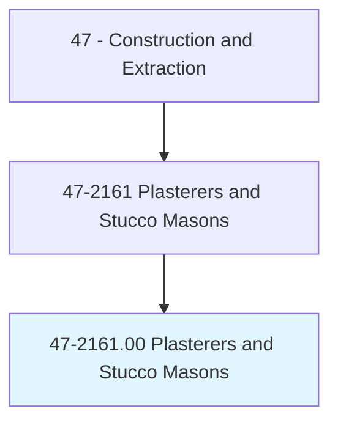
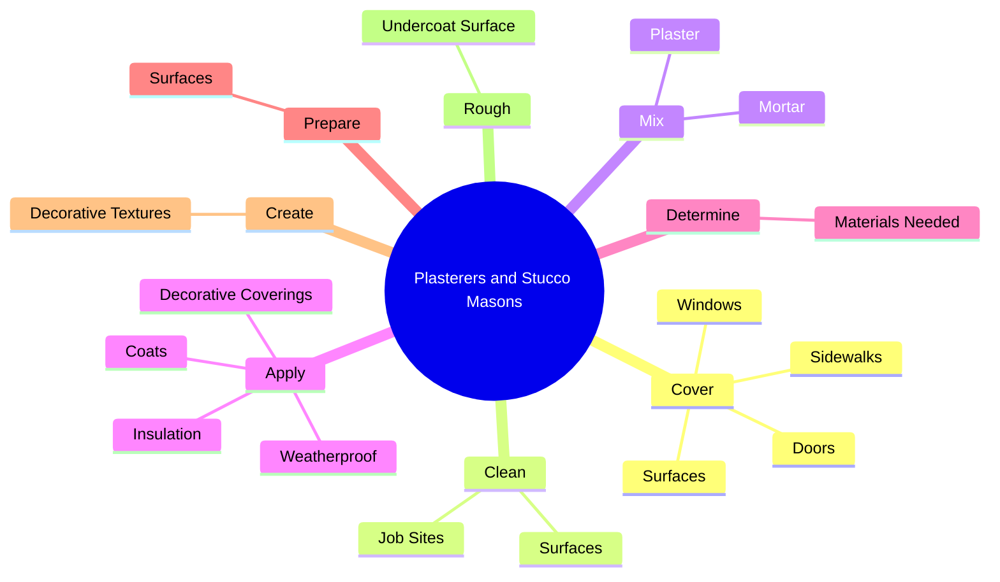
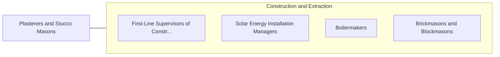

# Plasterers and Stucco Masons

> Apply interior or exterior plaster, cement, stucco, or similar materials. May also set ornamental plaster.

## Overview

Plasterers and Stucco Masons is an occupation within the Construction and Extraction category. Apply interior or exterior plaster, cement, stucco, or similar materials. 

## Classification Hierarchy

## Key Statistics

| Metric | Value |
|--------|-------|
| SOC Code | 47-2161.00 |
| Category | [Construction and Extraction](/occupations/Construction) |
| Task Count | 57 |
| Source | O*NET |

## Core Tasks

### cover.Surfaces

Plasterers and Stucco Masons cover surfaces as part of their core responsibilities.

**Actions:**
- `cover.Surfaces.to.protect.FromSplashing`
- `cover.Windows.to.protect.FromSplashing`
- `cover.Doors.to.protect.FromSplashing`
- `cover.Sidewalks.to.protect.FromSplashing`

### clean.JobSites

Plasterers and Stucco Masons clean job sites as part of their core responsibilities.

**Actions:**
- `clean.JobSites`
- `clean.Surfaces.for.Applications.of.Plaster`
- `clean.Surfaces.for.Cement`
- `clean.Surfaces.for.Stucco`

### mix.Mortar

Plasterers and Stucco Masons mix mortar as part of their core responsibilities.

**Actions:**
- `mix.Mortar.to.DesiredConsistency`
- `mix.Mortar.to.direct.WorkersWhoPerformMixing`
- `mix.Plaster.to.DesiredConsistency`
- `mix.Plaster.to.direct.WorkersWhoPerformMixing`

## Skills & Competencies

### Technical Skills
- **Construction Methods** - Advanced
- **Blueprint Reading** - Advanced
- **Safety Compliance** - Advanced

### Soft Skills
- **Communication** - Essential
- **Problem Solving** - Essential
- **Critical Thinking** - Important
- **Teamwork** - Important
- **Adaptability** - Important

## Related Occupations

## Industries

This occupation is found across multiple industries. See [Industries](/industries) for sector-specific employment data.

## Career Progression

---

*Source: O*NET 47-2161.00 - ONETOccupation*
