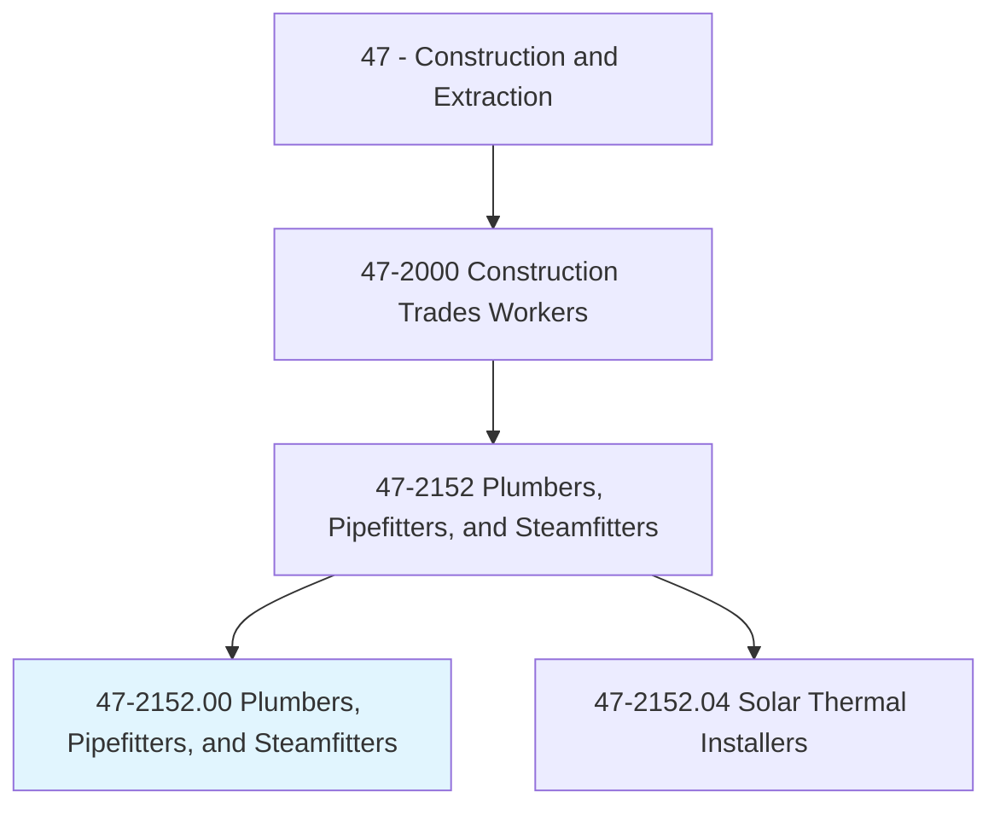
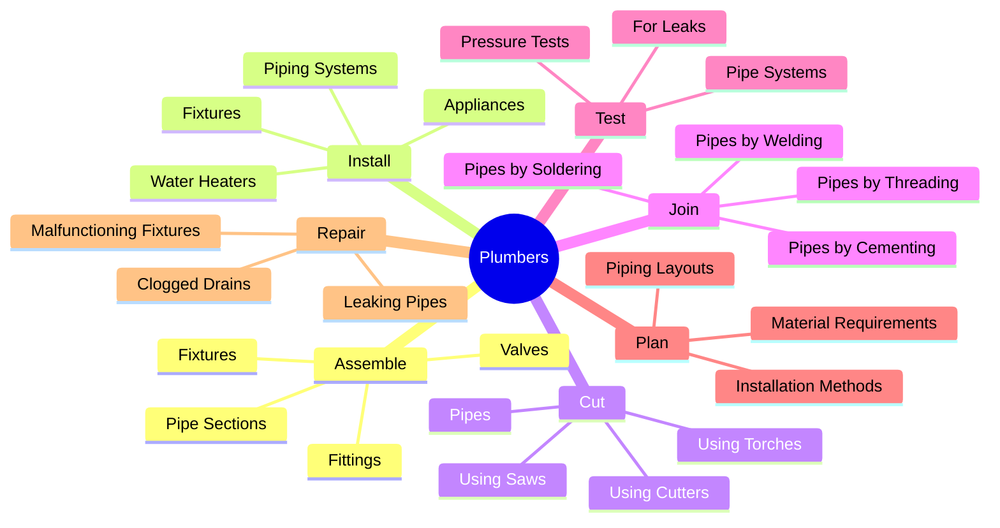
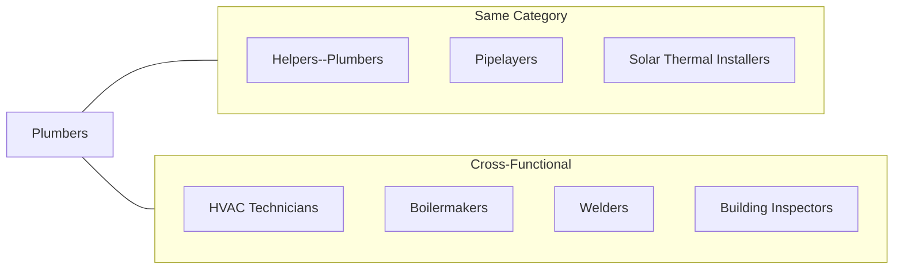
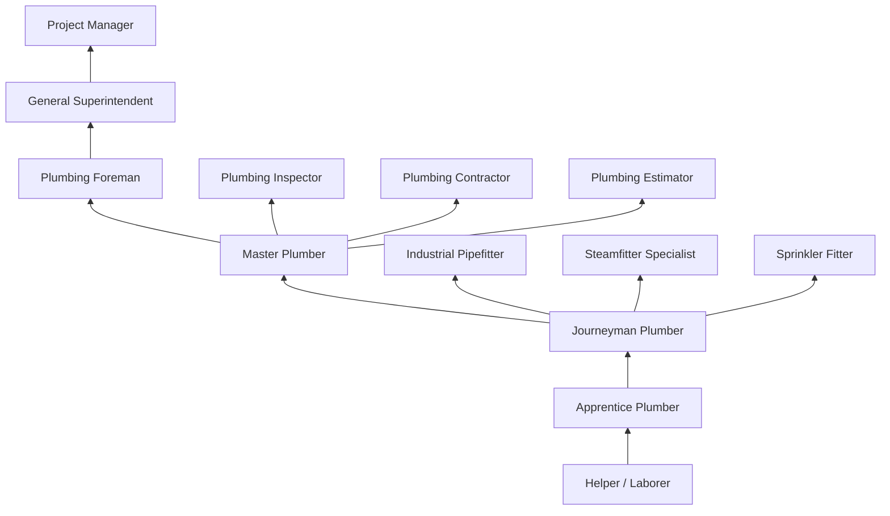

# Plumbers, Pipefitters, and Steamfitters

> Assemble, install, alter, and repair pipelines or pipe systems that carry water, steam, air, or other liquids or gases. May install heating and cooling equipment and mechanical control systems. Includes sprinkler fitters.

## Overview

Plumbers, Pipefitters, and Steamfitters are essential skilled tradespeople who install and maintain piping systems that form the circulatory systems of buildings and industrial facilities. These workers handle everything from residential water supply and drainage to complex industrial process piping and high-pressure steam systems. The occupation requires knowledge of plumbing codes, hydraulics, and various pipe joining methods. Given the critical nature of these systems for health, safety, and industrial operations, plumbers must maintain high standards of workmanship and code compliance.

## Classification Hierarchy

## Key Statistics

| Metric | Value |
|--------|-------|
| SOC Code | 47-2152.00 |
| Job Zone | 3-4 (Medium to Considerable Preparation) |
| Category | [Construction](/occupations/Construction/index) |
| Core Tasks | 15+ |
| Physical Demands | Heavy |
| Licensing | Required in most jurisdictions |
| Source | O*NET |

## Core Tasks

### assemble.PipeSystems

Plumbers connect pipes, fittings, and fixtures to create complete piping systems.

**Actions:**
- `assemble.PipeSections.using.Fittings` - Connect pipe lengths with fittings
- `assemble.Pipes.using.Valves` - Install flow control devices
- `assemble.Fixtures.to.PipeSystems` - Connect sinks, toilets, and appliances
- `assemble.PipeSystems.for.Water` - Build water supply systems
- `assemble.PipeSystems.for.Steam` - Construct steam distribution
- `assemble.PipeSystems.for.Gas` - Install gas piping

### install.PipingSystems

Plumbers position and secure piping throughout buildings and facilities.

**Actions:**
- `install.PipingSystems.in.Buildings` - Route pipes through structures
- `install.Fixtures.in.Bathrooms` - Mount toilets, sinks, and tubs
- `install.Fixtures.in.Kitchens` - Connect sinks and appliances
- `install.WaterHeaters.in.Buildings` - Set up water heating equipment
- `install.Appliances.to.PipeSystems` - Connect washers, dishwashers
- `install.SprinklerSystems.for.FireProtection` - Install fire suppression

### cut.Pipes

Plumbers cut pipes to required lengths using various methods.

**Actions:**
- `cut.Pipes.using.PipeCutters` - Use rotary cutting tools
- `cut.Pipes.using.Saws` - Cut with reciprocating or band saws
- `cut.Pipes.using.CuttingTorches` - Use oxy-fuel cutting for steel
- `cut.Openings.in.Walls` - Create access for pipe routing

### join.Pipes

Plumbers connect pipes using methods appropriate for the material and application.

**Actions:**
- `join.Pipes.by.Soldering` - Sweat copper fittings
- `join.Pipes.by.Brazing` - High-temperature copper joining
- `join.Pipes.by.Welding` - Weld steel and stainless pipes
- `join.Pipes.by.Cementing` - Glue PVC and CPVC pipes
- `join.Pipes.by.Threading` - Connect threaded steel pipes
- `join.Pipes.using.Compression` - Use mechanical fittings
- `join.Pipes.using.PressConnect` - Use press-fit systems

### test.PipeSystems

Plumbers verify the integrity and function of completed installations.

**Actions:**
- `test.PipeSystems.for.Leaks` - Check all connections
- `test.PipeSystems.using.Pressure` - Perform hydrostatic tests
- `test.DrainSystems.for.Flow` - Verify proper drainage
- `inspect.Systems.for.CodeCompliance` - Ensure regulation adherence

### repair.PlumbingSystems

Plumbers diagnose and fix problems in existing installations.

**Actions:**
- `repair.LeakingPipes.in.Buildings` - Fix pipe leaks
- `repair.MalfunctioningFixtures.in.Buildings` - Service fixtures
- `clear.CloggedDrains.using.Equipment` - Open blocked drains
- `replace.DamagedPipes.in.Systems` - Swap out failed piping

## Specializations

### Residential Plumber
- Home plumbing systems
- Fixture installation
- Water heater service
- Drain cleaning
- Bathroom/kitchen remodels

### Commercial Plumber
- Office and retail building systems
- Multi-story drain/vent systems
- Commercial fixtures and equipment
- Grease interceptors
- Backflow prevention

### Industrial Pipefitter
- Process piping systems
- High-pressure applications
- Specialized materials (stainless, alloys)
- Welded piping systems
- Industrial equipment connections

### Steamfitter
- Steam heating systems
- High-pressure steam piping
- Boiler connections
- Condensate return systems
- Steam traps and specialties

### Sprinkler Fitter
- Fire sprinkler systems
- Wet and dry systems
- Standpipe systems
- Fire pump installations
- System inspections and testing

### Medical Gas Installer
- Medical air and vacuum systems
- Oxygen and nitrous oxide piping
- WAGD (waste anesthetic gas disposal)
- Laboratory gas systems
- Certification required (ASSE 6010)

## Skills & Competencies

### Technical Skills
- **Plumbing Code** - Expert
- **Blueprint Reading** - Expert
- **Pipe Joining Methods** - Expert
- **Mathematics (Geometry)** - Advanced
- **Welding (Pipefitters)** - Expert
- **Hydraulics** - Advanced
- **Material Knowledge** - Expert

### Soft Skills
- **Problem Solving** - Critical
- **Attention to Detail** - Critical
- **Physical Stamina** - Critical
- **Customer Service** - Essential
- **Communication** - Essential
- **Time Management** - Important

## Related Occupations

## Industries

- [Construction](/industries/Construction/index) - High Employment
- Specialty Trade Contractors - High Employment
- Self-Employed - High Employment
- [Government](/industries/PublicAdministration) - Moderate Employment
- [Manufacturing](/industries/Manufacturing/index) - Moderate Employment
- Building Services - Moderate Employment

## Career Progression

## Apprenticeship Path

| Year | Focus Areas | Hours |
|------|-------------|-------|
| Year 1 | Safety, hand tools, copper and plastic piping, basic drainage | 2,000 OJT + 144 classroom |
| Year 2 | DWV systems, water distribution, fixture installation | 2,000 OJT + 144 classroom |
| Year 3 | Gas piping, water heaters, commercial systems | 2,000 OJT + 144 classroom |
| Year 4 | Code mastery, medical gas, welding (pipefitters) | 2,000 OJT + 144 classroom |
| Year 5 | Advanced systems, project leadership, exam prep | 2,000 OJT + 144 classroom |

**Total Program**: 4-5 years (8,000-10,000 hours on-the-job training + 576-720 hours classroom instruction)

## Education & Training

| Requirement | Details |
|-------------|---------|
| Typical Education | High school diploma or equivalent |
| Apprenticeship | 4-5 year state-approved program |
| Licensing | Journeyman and Master licenses required |
| Continuing Education | Required for license renewal in most jurisdictions |

## Licensing Requirements

### Journeyman License
- Completion of approved apprenticeship or equivalent experience
- Passing score on journeyman plumbing examination
- Minimum 8,000-10,000 hours of supervised work experience
- Knowledge of plumbing code and practices

### Master License
- Valid journeyman license for minimum period (typically 2-4 years)
- Passing score on master plumber examination
- Additional work experience (varies by jurisdiction)
- Enables supervision of apprentices and pulling permits

### Plumbing Contractor License
- Master plumber license
- Business registration and insurance
- Bond requirements (varies by jurisdiction)
- Enables bidding and performing plumbing work

## Certifications

- **State Journeyman License** - Required for practice
- **State Master Plumber License** - Advanced credential
- **OSHA 10-Hour Construction** - Basic safety certification
- **OSHA 30-Hour Construction** - Comprehensive safety certification
- **Backflow Prevention Certification** - Required for backflow work
- **Medical Gas Certification (ASSE 6010)** - Healthcare facilities
- **NITC Pipefitter Certification** - Industrial piping
- **AWS Welding Certifications** - For welded piping
- **EPA 608 Certification** - Refrigerant handling
- **First Aid/CPR** - Emergency response certification

## Safety Requirements

### Personal Protective Equipment
- Safety glasses
- Hard hat (construction sites)
- Steel-toed boots
- Work gloves
- Hearing protection
- Respiratory protection (when soldering/welding)
- Knee pads

### Common Hazards
- Burns from torches and hot pipes
- Cuts from sharp tools and materials
- Exposure to lead (older buildings)
- Asbestos exposure (older insulation)
- Biological hazards in drain work
- Working in confined spaces
- Fall hazards

### Required Training
- Trench safety and excavation
- Confined space entry
- Hot work safety
- Lead awareness
- Asbestos awareness
- Lock-out/tag-out procedures

## Tools & Equipment

### Hand Tools
- Pipe wrenches (multiple sizes)
- Adjustable wrenches
- Basin wrench
- Tubing cutters
- PVC cutters
- Hacksaw
- Files and reamers
- Plunger and auger
- Torpedo level
- Tape measure

### Power Tools
- Drill / Impact driver
- Rotary hammer
- Reciprocating saw
- Threading machine
- Groove cutting machine
- Press-fit tool
- Drain cleaning machine
- Inspection camera

### Joining Equipment
- Propane torch
- MAPP gas torch
- Acetylene welding outfit
- Soldering equipment
- PVC primer and cement
- Propress or MegaPress tool

### Testing Equipment
- Pressure gauges
- Test plugs and caps
- Manometer
- Leak detection equipment
- Smoke testing equipment

## Code Compliance

### Plumbing Codes
- International Plumbing Code (IPC)
- Uniform Plumbing Code (UPC)
- State and local amendments
- NFPA 13 (Sprinkler systems)
- ASME B31.9 (Building services piping)

### Related Standards
- ASSE standards for fixtures and equipment
- ASTM material specifications
- NSF standards for potable water
- ASME pressure vessel codes
- AWS welding standards

## Work Environment

### Physical Demands
- Kneeling, crouching, crawling in tight spaces
- Working in trenches and excavations
- Lifting materials up to 100 pounds
- Working overhead
- Fine motor skills for detail work

### Work Conditions
- Indoor and outdoor work
- Construction sites (new work)
- Occupied buildings (service)
- Industrial facilities
- Underground utilities
- Variable weather conditions
- Emergency call-outs

## Departments

This occupation typically works in:
- Field Operations
- Service Department
- Industrial Division
- New Construction
- Fire Protection

## Union Affiliation

Many plumbers, pipefitters, and steamfitters are members of the United Association of Journeymen and Apprentices of the Plumbing and Pipe Fitting Industry (UA), which provides:
- Apprenticeship training programs
- Job referral services
- Health and pension benefits
- Continuing education opportunities
- Welding certification programs
- Safety training programs

## Variants

### Solar Thermal Installers and Technicians
A specialized variant focusing on solar water heating systems.
- [Solar Thermal Installers and Technicians](./SolarThermalInstallers.mdx) - 47-2152.04

---

*Source: O*NET 47-2152.00 - ONETOccupation*
