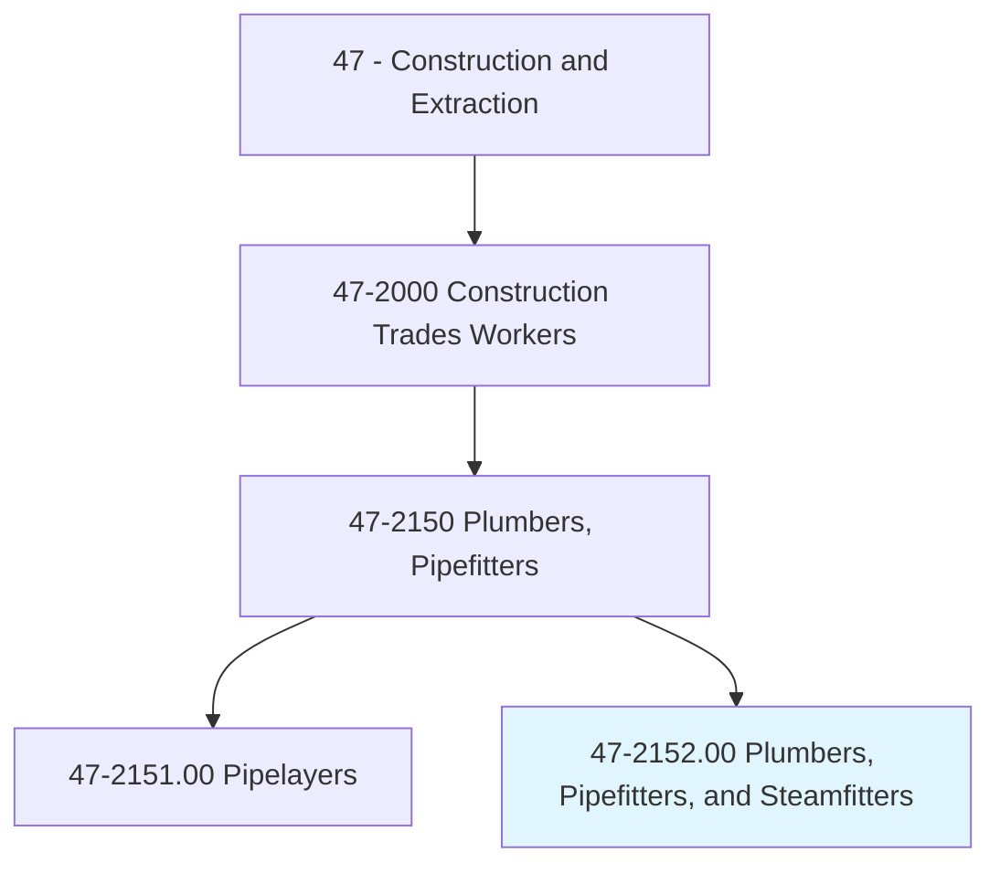
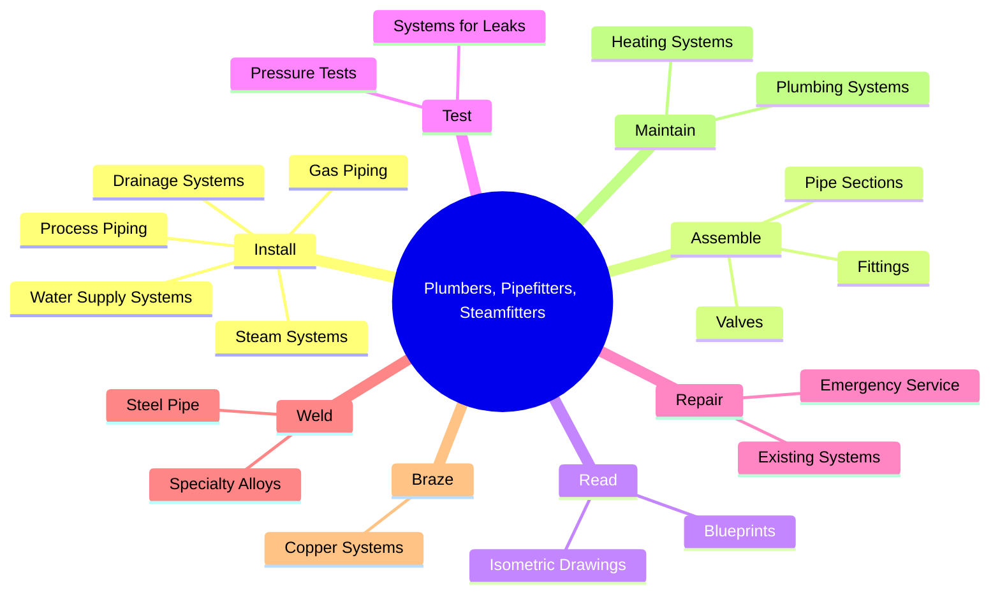
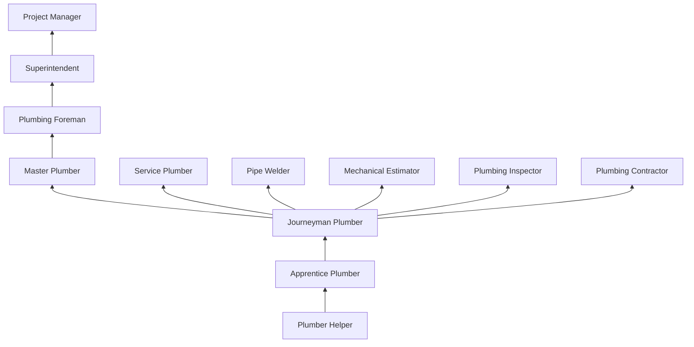
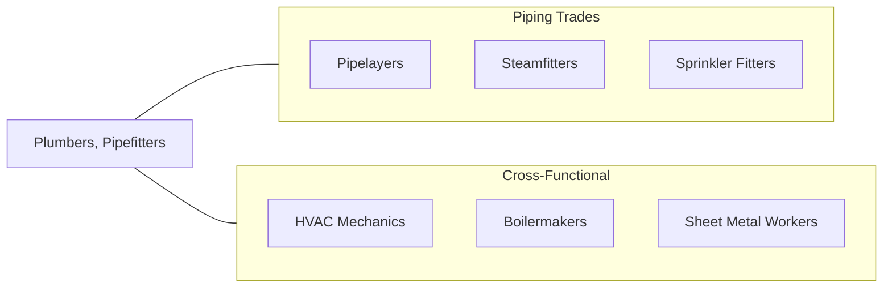

# Plumbers, Pipefitters, and Steamfitters

> Assemble, install, alter, and repair pipelines or pipe systems that carry water, steam, air, or other liquids or gases. May install heating and cooling equipment and mechanical control systems.

## Overview

Plumbers, Pipefitters, and Steamfitters install and maintain pipe systems that carry water, gas, steam, chemicals, and other fluids in residential, commercial, industrial, and institutional buildings. This is one of the largest, most versatile, and highest-paying construction trades, encompassing residential plumbing, commercial building mechanical systems, industrial process piping, and high-pressure steam systems. Each specialty requires distinct skills, materials, and code knowledge.

Plumbers focus on water supply, drainage, waste, and vent (DWV) systems in buildings, working with copper, PVC, CPVC, PEX, and cast iron. Pipefitters install process piping systems in industrial facilities including refineries, power plants, and manufacturing facilities, working primarily with welded steel, stainless steel, and specialty alloys. Steamfitters specialize in high-pressure steam systems for heating, power generation, and industrial processes, where system failures can be catastrophic.

The trade requires deep knowledge of fluid dynamics, building codes (UPC/IPC), piping codes (ASME B31), welding procedures, and system design. Modern plumbing and piping systems incorporate advanced technologies including PEX manifold systems, hydronic radiant heating, medical gas systems, and building automation integration. The apprenticeship is rigorous, typically lasting 4-5 years with extensive classroom training in mathematics, physics, and code requirements.

## Classification Hierarchy

## Key Statistics

| Metric | Value |
|--------|-------|
| SOC Code | 47-2152.00 |
| Job Zone | 4 (Considerable Preparation) |
| Category | [Construction and Extraction](/occupations/Construction/index) |
| Task Count | 148 |
| Median Salary | $59,900 / year |
| Employment | ~490,000 |
| Job Outlook | 6% (Faster than average) |
| Physical Demands | Heavy |
| Source | O*NET |

## Core Tasks

### install.WaterSupplySystems

Plumbers install complete water supply and distribution systems.

**Actions:**
- `install.WaterSupplySystems.in.Buildings`
- `install.DrainageSystems.per.Code`
- `install.GasPiping.per.NationalFuelGasCode`
- `install.SteamSystems.per.ASMECode`

## Skills & Competencies

### Technical Skills
- **Plumbing Code (UPC/IPC)** - Expert
- **Blueprint and Isometric Reading** - Expert
- **Pipe Welding (SMAW, GTAW)** - Expert (pipefitters)
- **Soldering and Brazing** - Expert
- **System Design** - Advanced
- **Mathematics** - Advanced
- **Backflow Prevention** - Advanced
- **Medical Gas Systems** - Advanced (specialty)

### Trade-Specific Skills
- **Residential Plumbing** - Complete DWV and supply systems
- **Commercial Mechanical** - Large building piping systems
- **Industrial Process Piping** - Refinery, chemical plant, power plant
- **Steam Systems** - High-pressure boiler and distribution
- **Fire Sprinkler** - Related but often separate specialty

### Soft Skills
- **Problem Solving** - Critical
- **Mechanical Aptitude** - Critical
- **Mathematics** - Essential
- **Communication** - Essential
- **Customer Service** - Essential (service plumbing)

## Education & Certifications

| Requirement | Details |
|-------------|---------|
| Typical Education | High school diploma with math/science |
| Apprenticeship | 4-5 year registered apprenticeship (UA) |
| On-the-Job Training | 8,000-10,000 hours |
| Classroom Training | 200+ hours/year |
| Licensing | Required in most jurisdictions |

### Certifications
- **State/Local Plumbing License** - Journeyman and Master
- **OSHA 10/30-Hour Construction** - Safety certification
- **Welding Certification (ASME)** - Various positions and processes
- **Backflow Prevention Tester** - Cross-connection control
- **Medical Gas Installer (ASSE 6010)** - Healthcare piping
- **UA Journeyman Card** - United Association union credential
- **CDL (if applicable)** - For service vehicles
- **Brazing Certification** - Per ASME standards

## Career Progression

## Specializations

- **Residential Plumbing** - New construction and service
- **Commercial Plumbing** - Multi-story buildings
- **Industrial Pipefitting** - Process piping and welding
- **Steamfitting** - High-pressure steam systems
- **Medical Gas** - Hospital and laboratory piping
- **Fire Protection** - Sprinkler systems (often separate trade)

## Tools & Equipment

### Hand Tools
- Pipe wrenches, tubing cutters, reamers
- Soldering torches and brazing equipment
- Thread cutting dies and equipment
- Levels, squares, and measuring tools

### Power Tools
- Pipe threading machines
- Pipe cutting and beveling machines
- Press-fit tools (ProPress)
- Drain cleaning machines
- Welding equipment (SMAW, GTAW, orbital)

### Testing Equipment
- Hydrostatic test pumps
- Air test gauges
- Cameras (pipe inspection)
- Gas leak detectors
- Backflow test kits

## Safety Considerations

- **Burns** - Soldering, brazing, welding; fire protection
- **Confined Spaces** - Utility vaults, tunnels; atmospheric monitoring
- **Chemical Exposure** - Flux, solvent cement, sewer gas (H2S)
- **Trench Safety** - Underground piping; shoring required
- **Heavy Lifting** - Pipe and equipment; mechanical aids
- **Electrical Hazards** - Working near electrical systems
- **Asbestos** - Older pipe insulation; awareness required

## Related Occupations

## Industries

- [Plumbing Contractors](/industries/SpecialtyTrade) - Primary Employment
- [Mechanical Contractors](/industries/MechanicalContractors) - Primary Employment
- [Industrial Construction](/industries/IndustrialConstruction) - High Employment
- [Building Construction](/industries/BuildingConstruction) - High Employment

## Departments

- [Plumbing Division](/departments/Plumbing)
- [Mechanical Division](/departments/Mechanical)
- [Industrial Piping](/departments/IndustrialPiping)
- [Service Division](/departments/Service)
- [Estimating](/departments/Estimating)

---

*Source: O*NET 47-2152.00 - ONETOccupation*
