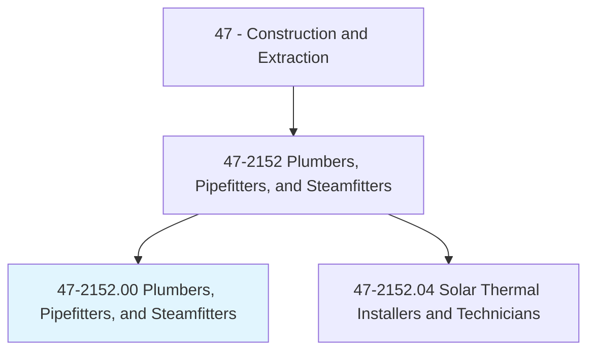
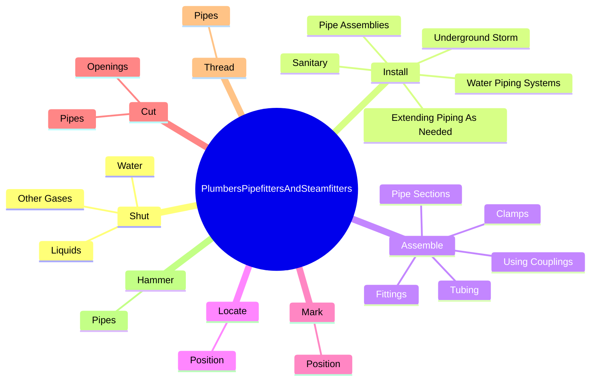
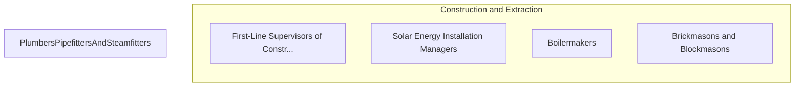

# Plumbers, Pipefitters, and Steamfitters

> Assemble, install, alter, and repair pipelines or pipe systems that carry water, steam, air, or other liquids or gases. May install heating and cooling equipment and mechanical control systems. Includes sprinkler fitters.

## Overview

Plumbers, Pipefitters, and Steamfitters is an occupation within the Construction and Extraction category. Assemble, install, alter, and repair pipelines or pipe systems that carry water, steam, air, or other liquids or gases. May install heating and cooling equipment and mechanical control systems.

## Classification Hierarchy

## Key Statistics

| Metric | Value |
|--------|-------|
| SOC Code | 47-2152.00 |
| Category | [Construction and Extraction](/occupations/Construction/index) |
| Task Count | 174 |
| Source | O*NET |

## Core Tasks

### shut.Water

Plumbers, Pipefitters, and Steamfitters shut water as part of their core responsibilities.

**Actions:**
- `shut.Water.from.PipeSections`
- `shut.Water.from.UsingValveKeys`
- `shut.Water.from.Wrenches`
- `shut.OtherGases.from.PipeSections`

### install.UndergroundStorm

Plumbers, Pipefitters, and Steamfitters install underground storm as part of their core responsibilities.

**Actions:**
- `install.UndergroundStorm.to.connect.Fixtures`
- `install.UndergroundStorm.to.Plumbing`
- `install.Sanitary.to.connect.Fixtures`
- `install.Sanitary.to.Plumbing`

### assemble.PipeSections

Plumbers, Pipefitters, and Steamfitters assemble pipe sections as part of their core responsibilities.

**Actions:**
- `assemble.PipeSections`
- `assemble.Tubing`
- `assemble.Fittings`
- `assemble.UsingCouplings`

## Skills & Competencies

### Technical Skills
- **Construction Methods** - Advanced
- **Blueprint Reading** - Advanced
- **Safety Compliance** - Advanced

### Soft Skills
- **Communication** - Essential
- **Problem Solving** - Essential
- **Critical Thinking** - Important
- **Teamwork** - Important
- **Adaptability** - Important

## Related Occupations

## Industries

This occupation is found across multiple industries. See [Industries](/industries) for sector-specific employment data.

## Career Progression

---

*Source: O*NET 47-2152.00 - ONETOccupation*
