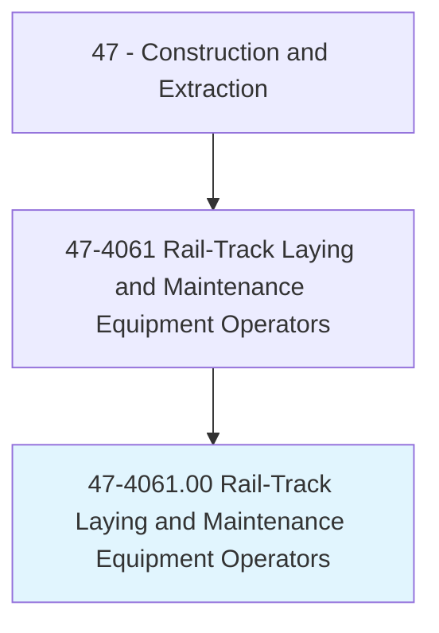
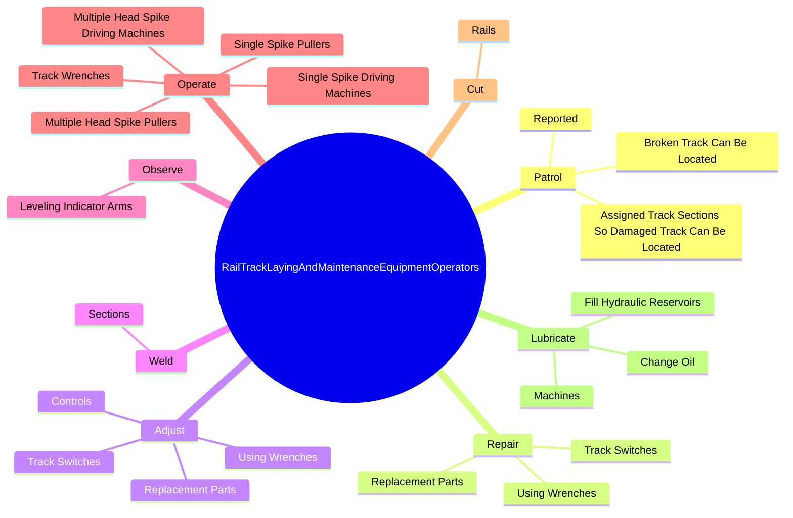
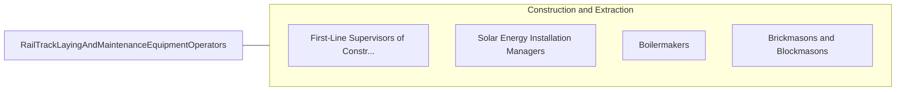

# Rail-Track Laying and Maintenance Equipment Operators

> Lay, repair, and maintain track for standard or narrow-gauge railroad equipment used in regular railroad service or in plant yards, quarries, sand and gravel pits, and mines. Includes ballast cleaning machine operators and railroad bed tamping machine operators.

## Overview

Rail-Track Laying and Maintenance Equipment Operators is an occupation within the Construction and Extraction category. Lay, repair, and maintain track for standard or narrow-gauge railroad equipment used in regular railroad service or in plant yards, quarries, sand and gravel pits, and mines. 

## Classification Hierarchy

## Key Statistics

| Metric | Value |
|--------|-------|
| SOC Code | 47-4061.00 |
| Category | [Construction and Extraction](/occupations/Construction) |
| Task Count | 98 |
| Source | O*NET |

## Core Tasks

### patrol.AssignedTrackSectionsSoDamagedTrackCanBeLocated

Rail-Track Laying and Maintenance Equipment Operators patrol assigned track sections so damaged track can be located as part of their core responsibilities.

**Actions:**
- `patrol.AssignedTrackSectionsSoDamagedTrackCanBeLocated`
- `patrol.Reported`
- `patrol.BrokenTrackCanBeLocated`

### repair.TrackSwitches

Rail-Track Laying and Maintenance Equipment Operators repair track switches as part of their core responsibilities.

**Actions:**
- `repair.TrackSwitches`
- `repair.UsingWrenches`
- `repair.ReplacementParts`

### adjust.TrackSwitches

Rail-Track Laying and Maintenance Equipment Operators adjust track switches as part of their core responsibilities.

**Actions:**
- `adjust.TrackSwitches`
- `adjust.UsingWrenches`
- `adjust.ReplacementParts`
- `adjust.Controls.of.MachinesSpread`

## Skills & Competencies

### Technical Skills
- **Construction Methods** - Advanced
- **Blueprint Reading** - Advanced
- **Safety Compliance** - Advanced

### Soft Skills
- **Communication** - Essential
- **Problem Solving** - Essential
- **Critical Thinking** - Important
- **Teamwork** - Important
- **Adaptability** - Important

## Related Occupations

## Industries

This occupation is found across multiple industries. See [Industries](/industries) for sector-specific employment data.

## Career Progression

---

*Source: O*NET 47-4061.00 - ONETOccupation*
