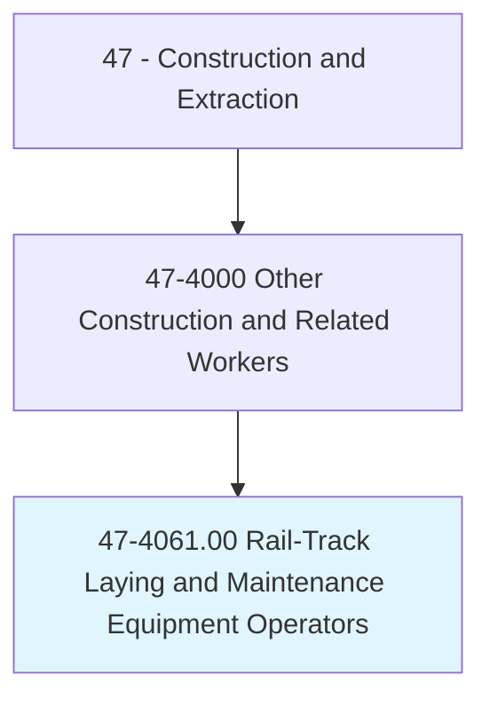
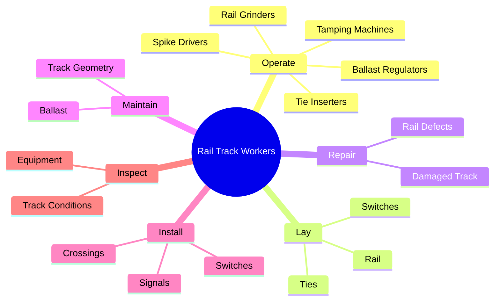
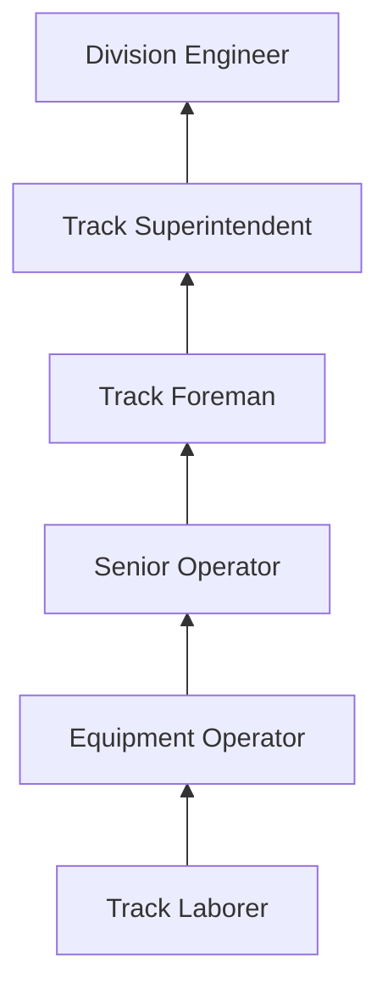
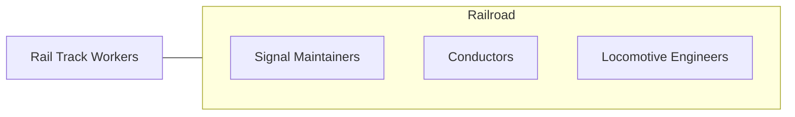

# Rail-Track Laying and Maintenance Equipment Operators

> Lay, repair, and maintain track for standard or narrow-gauge railroad equipment used in regular railroad service or in plant yards, quarries, sand and gravel pits, and mines. Includes ballast cleaning machine operators and railroad bed tamping machine operators.

## Overview

Rail-Track Laying and Maintenance Equipment Operators install, repair, and maintain railroad track systems including rails, ties, switches, crossings, and ballast. They operate specialized heavy equipment including tamping machines, ballast regulators, rail grinders, spike drivers, and tie inserters. This trade is essential to maintaining the safety and efficiency of freight and passenger rail systems, as track geometry defects can cause derailments with catastrophic consequences.

Track maintenance is a continuous operation, as the enormous weight and vibration of passing trains constantly degrades track geometry. Tamping machines lift and realign track to precise tolerances, ballast regulators distribute and shape the crushed stone bed, and rail grinders remove surface defects to extend rail life. New track construction involves placing ties, installing rail, spiking or clipping rail to ties, and surfacing the track to design geometry using GPS-guided equipment.

Workers operate in an extremely hazardous environment, as much maintenance occurs on active railroad lines with limited clearance for approaching trains. Strict safety protocols govern on-track work, including flagging protection, watchman/lookout systems, and exclusive track occupancy rules. The Federal Railroad Administration (FRA) regulates track safety standards, and workers must complete railroad safety training before performing any on-track work.

## Classification Hierarchy

## Key Statistics

| Metric | Value |
|--------|-------|
| SOC Code | 47-4061.00 |
| Job Zone | 2 (Some Preparation) |
| Category | [Construction and Extraction](/occupations/Construction/index) |
| Task Count | 88 |
| Median Salary | $58,600 / year |
| Employment | ~12,000 |
| Job Outlook | 2% (Slower than average) |
| Physical Demands | Heavy |
| Source | O*NET |

## Core Tasks

### operate.TampingMachines

Operators align and surface track using automated tamping equipment.

**Actions:**
- `operate.TampingMachines.to.align.Track`
- `operate.BallastRegulators.to.shape.TrackBed`
- `operate.RailGrinders.to.restore.RailProfile`

## Skills & Competencies

### Technical Skills
- **Track Maintenance Equipment** - Expert
- **Track Geometry** - Advanced
- **Railroad Safety Rules** - Expert
- **Heavy Equipment Operation** - Advanced
- **Welding (Thermite Rail Welding)** - Advanced
- **FRA Track Safety Standards** - Expert

### Soft Skills
- **Safety Consciousness** - Critical
- **Concentration** - Critical
- **Physical Stamina** - Critical
- **Communication** - Essential
- **Teamwork** - Essential

## Education & Certifications

| Requirement | Details |
|-------------|---------|
| Typical Education | High school diploma or equivalent |
| Railroad Safety Training | Mandatory before on-track work |
| On-the-Job Training | 6-12 months |

### Certifications
- **FRA Roadway Worker Protection** - Mandatory
- **Railroad Operating Rules** - Company-specific
- **Thermite Welding** - Rail welding certification
- **Equipment-Specific Certification** - For each machine type
- **First Aid/CPR** - Required
- **CDL (if applicable)** - For hi-rail vehicles

## Career Progression

## Specializations

- **Track Surfacing** - Tamping and lining operations
- **Rail Grinding** - Preventive rail maintenance
- **Switch and Crossing** - Turnout installation and repair
- **New Construction** - Track laying from grade
- **Transit/Light Rail** - Urban rail maintenance

## Tools & Equipment

- Tamping machines (Plasser & Theurer, Harsco)
- Ballast regulators and undercutters
- Rail grinders (Loram, Speno)
- Spike drivers and rail saws
- Thermite welding kits
- Hi-rail vehicles
- Track geometry measurement systems

## Safety Considerations

- **Train Strikes** - Working on active rail lines; flagging protection mandatory
- **Equipment Entanglement** - Complex machinery; lockout/tagout
- **Noise** - Extreme noise levels; hearing protection
- **Vibration** - Equipment operation; whole-body vibration exposure
- **Weather Exposure** - Year-round outdoor operations
- **Heavy Lifting** - Rail sections and components
- **Electrical** - Third rail and overhead catenary on electrified lines

## Related Occupations

## Industries

- [Railroad Transportation](/industries/Railroad) - Primary Employment
- [Rail Construction Contractors](/industries/SpecialtyTrade) - High Employment
- [Transit Authorities](/industries/Transit) - Moderate Employment

## Departments

- [Track Maintenance](/departments/TrackMaintenance)
- [Engineering](/departments/Engineering)
- [Capital Projects](/departments/CapitalProjects)

---

*Source: O*NET 47-4061.00 - ONETOccupation*
