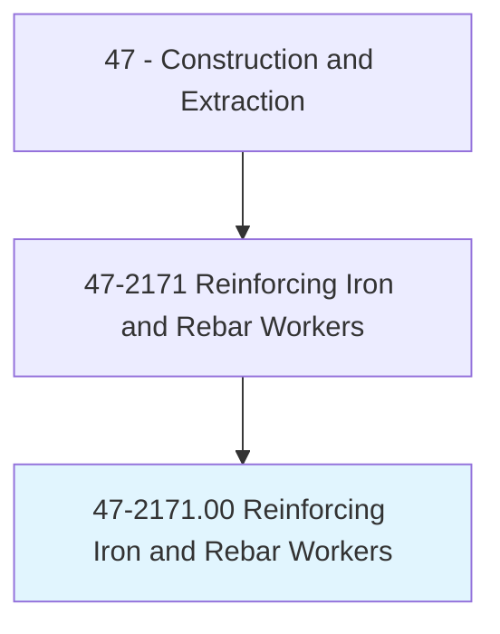
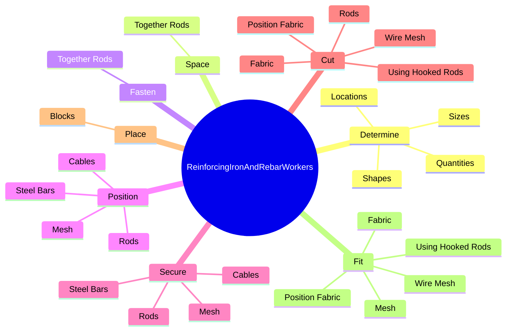
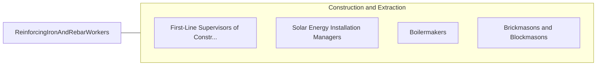

# Reinforcing Iron and Rebar Workers

> Position and secure steel bars or mesh in concrete forms in order to reinforce concrete. Use a variety of fasteners, rod-bending machines, blowtorches, and hand tools. Includes rod busters.

## Overview

Reinforcing Iron and Rebar Workers is an occupation within the Construction and Extraction category. Position and secure steel bars or mesh in concrete forms in order to reinforce concrete. Use a variety of fasteners, rod-bending machines, blowtorches, and hand tools.

## Classification Hierarchy

## Key Statistics

| Metric | Value |
|--------|-------|
| SOC Code | 47-2171.00 |
| Category | [Construction and Extraction](/occupations/Construction) |
| Task Count | 76 |
| Source | O*NET |

## Core Tasks

### determine.Quantities

Reinforcing Iron and Rebar Workers determine quantities as part of their core responsibilities.

**Actions:**
- `determine.Quantities.of.ReinforcingRods.from.Blueprints`
- `determine.Quantities.of.Sketches`
- `determine.Quantities.of.OralInstructions`
- `determine.Sizes.of.ReinforcingRods.from.Blueprints`

### space.TogetherRods

Reinforcing Iron and Rebar Workers space together rods as part of their core responsibilities.

**Actions:**
- `space.TogetherRods.in.FormsAccording.to.Blueprints`
- `space.TogetherRods.in.UsingWire`
- `space.TogetherRods.in.Pliers`

### fasten.TogetherRods

Reinforcing Iron and Rebar Workers fasten together rods as part of their core responsibilities.

**Actions:**
- `fasten.TogetherRods.in.FormsAccording.to.Blueprints`
- `fasten.TogetherRods.in.UsingWire`
- `fasten.TogetherRods.in.Pliers`

## Skills & Competencies

### Technical Skills
- **Construction Methods** - Advanced
- **Blueprint Reading** - Advanced
- **Safety Compliance** - Advanced

### Soft Skills
- **Communication** - Essential
- **Problem Solving** - Essential
- **Critical Thinking** - Important
- **Teamwork** - Important
- **Adaptability** - Important

## Related Occupations

## Industries

This occupation is found across multiple industries. See [Industries](/industries) for sector-specific employment data.

## Career Progression

---

*Source: O*NET 47-2171.00 - ONETOccupation*
