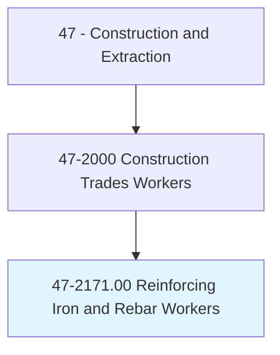
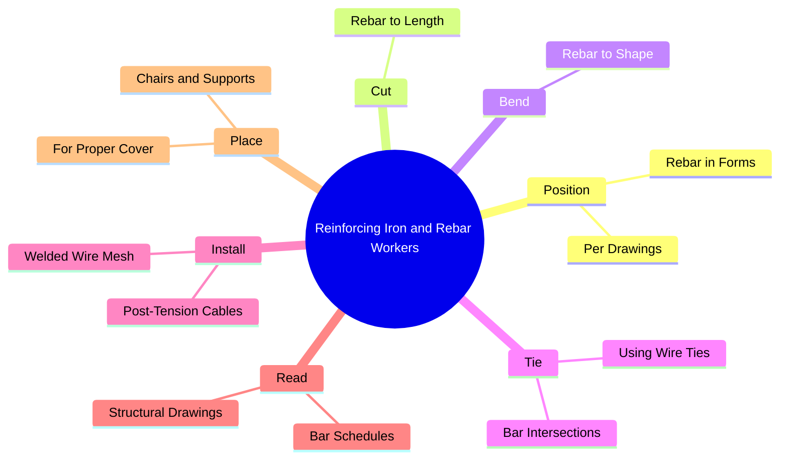
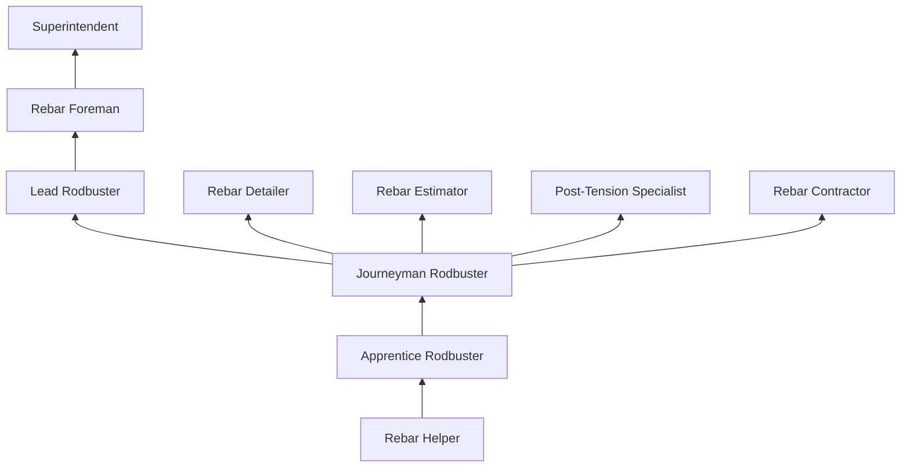
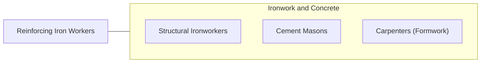

# Reinforcing Iron and Rebar Workers

> Position and secure steel bars, rods, cables, or mesh in concrete forms in order to reinforce concrete. Use a variety of fasteners, rod-bending machines, blowtorches, and hand tools.

## Overview

Reinforcing Iron and Rebar Workers (commonly called "rodbusters") position, cut, bend, and tie steel reinforcing bars (rebar), welded wire mesh, and post-tensioning cables within concrete formwork to provide structural strength to concrete structures. Without reinforcement, concrete has excellent compressive strength but minimal tensile strength; rebar provides the tension resistance that allows concrete structures to withstand bending, earthquake, and wind forces.

The work is physically demanding, requiring workers to handle heavy steel bars (a single #11 rebar weighs 5.3 pounds per foot), often while bending, kneeling, and working on elevated formwork. Rodbusters use wire ties to secure individual bars at intersections, creating three-dimensional cages that must precisely match engineering drawings. They also install epoxy-coated rebar for corrosion resistance, headed bars for mechanical anchorage, and post-tensioning tendons for prestressed concrete.

Rebar placement is governed by detailed structural engineering drawings that specify bar sizes, spacings, lap lengths, hook dimensions, and concrete cover requirements. Accuracy is critical: improperly placed reinforcement can compromise structural integrity and trigger costly rework. Building inspectors verify rebar placement before any concrete pour is approved, making the quality of rodbuster work a direct gating factor for construction schedules.

## Classification Hierarchy

## Key Statistics

| Metric | Value |
|--------|-------|
| SOC Code | 47-2171.00 |
| Job Zone | 2 (Some Preparation) |
| Category | [Construction and Extraction](/occupations/Construction/index) |
| Task Count | 82 |
| Median Salary | $48,700 / year |
| Employment | ~22,000 |
| Job Outlook | 4% (As fast as average) |
| Physical Demands | Very Heavy |
| Source | O*NET |

## Core Tasks

### position.Rebar

Rodbusters position rebar per structural engineering drawings.

**Actions:**
- `position.Rebar.in.ConcreteFormwork`
- `tie.BarIntersections.using.WireTies`
- `install.PostTensionCables.in.SlabFormwork`

## Skills & Competencies

### Technical Skills
- **Rebar Placement** - Expert
- **Structural Drawing Reading** - Expert
- **Bar Bending and Cutting** - Expert
- **Wire Tying** - Expert
- **Post-Tensioning** - Advanced
- **Mathematics (Bar Schedules)** - Advanced
- **Welding (Tack)** - Intermediate

### Soft Skills
- **Physical Stamina** - Critical
- **Attention to Detail** - Critical
- **Teamwork** - Essential
- **Safety Consciousness** - Critical

## Education & Certifications

| Requirement | Details |
|-------------|---------|
| Typical Education | High school diploma or equivalent |
| Apprenticeship | 3-4 year program (Ironworkers) |
| On-the-Job Training | 4,000-6,000 hours |

### Certifications
- **OSHA 10/30-Hour Construction** - Safety certification
- **Ironworkers Union Journeyman Card** - Trade credential
- **CRSI Certification** - Concrete Reinforcing Steel Institute
- **Fall Protection** - For elevated work
- **Welding Certification** - If welding rebar
- **First Aid/CPR** - Required

## Career Progression

## Specializations

- **Structural Rebar** - Buildings, bridges, walls
- **Post-Tensioning** - Prestressed concrete systems
- **Epoxy-Coated Rebar** - Corrosion-resistant applications
- **Heavy Civil** - Dams, tunnels, infrastructure
- **Precast** - Rebar cages for precast elements

## Tools & Equipment

- Rebar benders (manual and powered)
- Rebar cutters (manual and hydraulic)
- Wire reels and tie wire tools (automatic)
- Rebar chairs and bolsters
- Tape measures and levels
- Blowtorches (for heating bends)
- PPE (hard hat, gloves, safety glasses, boots)

## Safety Considerations

- **Impalement** - Exposed rebar ends; rebar caps mandatory
- **Heavy Lifting** - Steel bars are heavy; mechanical aids for large bars
- **Falls** - Working on elevated formwork; fall protection
- **Cuts and Punctures** - Sharp bar ends and tie wire; cut-resistant gloves
- **Back Injuries** - Repetitive bending and lifting; proper body mechanics
- **Struck-By** - Crane-lifted rebar bundles; rigging safety

## Related Occupations

## Industries

- [Concrete Contractors](/industries/SpecialtyTrade) - Primary Employment
- [Building Construction](/industries/BuildingConstruction) - High Employment
- [Heavy/Civil Construction](/industries/HeavyCivil) - High Employment

## Departments

- [Rebar Division](/departments/Rebar)
- [Field Operations](/departments/FieldOperations)
- [Detailing](/departments/Detailing)

---

*Source: O*NET 47-2171.00 - ONETOccupation*
