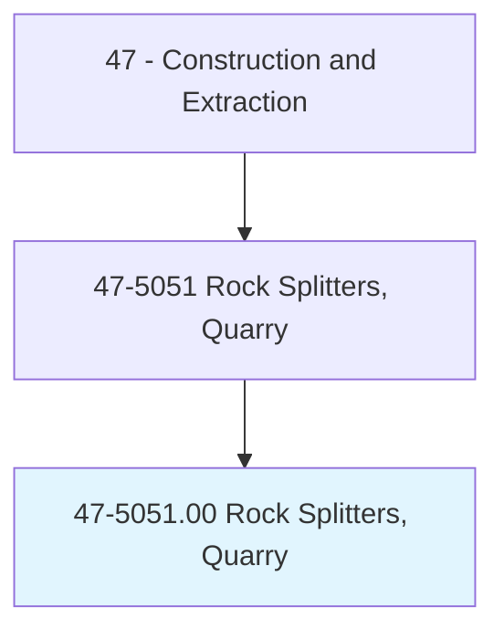
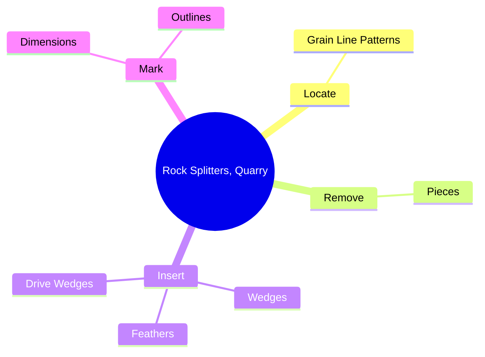
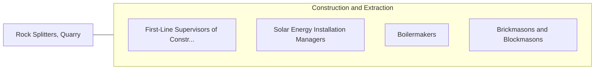

# Rock Splitters, Quarry

> Separate blocks of rough dimension stone from quarry mass using jackhammers, wedges, or chop saws.

## Overview

Rock Splitters, Quarry is classified under Construction and Extraction (SOC 47). Separate blocks of rough dimension stone from quarry mass using jackhammers, wedges, or chop saws.

## Classification Hierarchy

## Key Statistics

| Metric | Value |
|--------|-------|
| SOC Code | 47-5051.00 |
| Category | [Construction and Extraction](/occupations/Construction) |
| Task Count | 25 |
| Source | O*NET |

## Core Tasks

### locate.GrainLinePatterns

Rock Splitters, Quarry locate grain line patterns as part of their core responsibilities.

**Actions:**
- `locate.GrainLinePatterns.to.determine.HowRocksWillSplitWhenCut`

### remove.Pieces

Rock Splitters, Quarry remove pieces as part of their core responsibilities.

**Actions:**
- `remove.Pieces.of.Stone.from.LargerMasses`
- `remove.Pieces.of.UsingJackhammers`
- `remove.Pieces.of.Wedges`
- `remove.Pieces.of.OtherTools`

### insert.Wedges

Rock Splitters, Quarry insert wedges as part of their core responsibilities.

**Actions:**
- `insert.Wedges.into.HolesWithSledgehammers.to.split.StoneSectionsFromMasses`
- `insert.Feathers.into.HolesWithSledgehammers.to.split.StoneSectionsFromMasses`
- `insert.DriveWedges.with.Sledgehammers.to.split.StoneSectionsFromMasses`

## Skills & Competencies

### Technical Skills
- **Construction Methods** - Advanced
- **Blueprint Reading** - Advanced
- **Safety Compliance** - Advanced

### Soft Skills
- **Communication** - Essential
- **Problem Solving** - Essential
- **Critical Thinking** - Important
- **Teamwork** - Important
- **Adaptability** - Important

## Related Occupations

## Industries

This occupation is found across multiple industries. See [Industries](/industries) for sector-specific employment data.

## Career Progression

---

*Source: O*NET 47-5051.00 - ONETOccupation*
