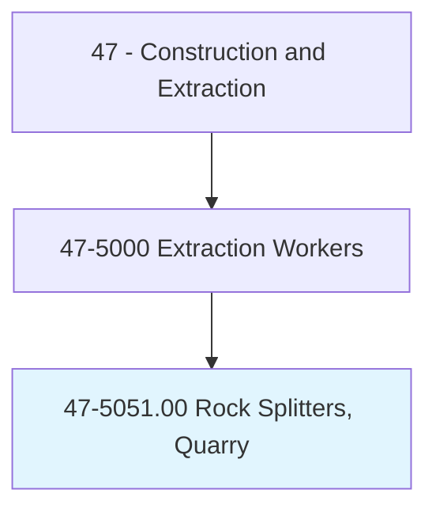
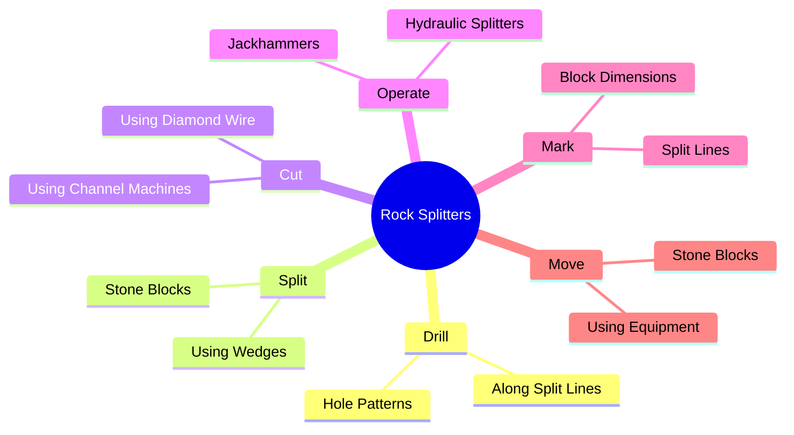
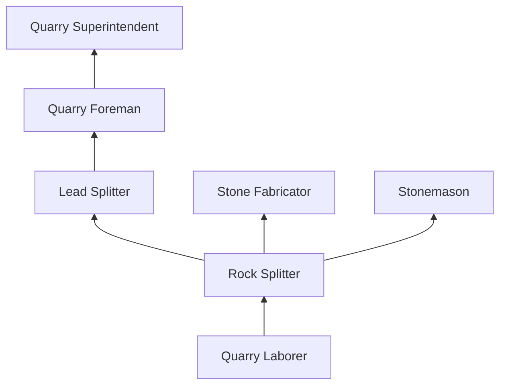
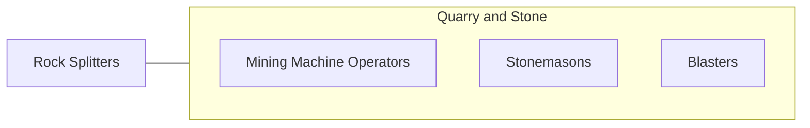

# Rock Splitters, Quarry

> Separate blocks of rough dimension stone from quarry mass using jackhammer and wedges, plug and feather, or channeling machines.

## Overview

Rock Splitters in quarry operations separate large blocks of dimension stone from the quarry face using a combination of drilling, wedging, and splitting techniques. Unlike aggregate quarrying that fragments rock through blasting, dimension stone quarrying aims to extract large, intact blocks of granite, marble, limestone, sandstone, and slate that will be further processed into building stone, countertops, monuments, and decorative elements. The work requires understanding stone grain, geology, and fracture mechanics to split stone cleanly along desired planes.

The trade combines traditional hand skills with modern technology. Workers use pneumatic and hydraulic drills to bore precise patterns of holes, then insert wedges and feathers (shims) to create controlled fractures along the desired split line. Diamond wire saws, chain saws, and jet-piercing torches are used for larger cuts. The work demands patience, geological knowledge, and physical endurance in outdoor quarry environments.

Quarry rock splitting is a declining but specialized occupation concentrated in regions with commercially valuable stone deposits. Workers are exposed to significant dust, noise, and physical hazards inherent in quarry operations. MSHA regulations govern safety in quarry environments, and all workers must complete required safety training.

## Classification Hierarchy

## Key Statistics

| Metric | Value |
|--------|-------|
| SOC Code | 47-5051.00 |
| Job Zone | 2 (Some Preparation) |
| Category | [Construction and Extraction](/occupations/Construction/index) |
| Task Count | 62 |
| Median Salary | $40,200 / year |
| Employment | ~3,000 |
| Job Outlook | -5% (Decline) |
| Physical Demands | Very Heavy |
| Source | O*NET |

## Core Tasks

### split.StoneBlocks

Rock splitters fracture stone along desired planes using precise wedging techniques.

**Actions:**
- `split.StoneBlocks.using.WedgesAndFeathers`
- `drill.HolePatterns.along.SplitLines`
- `cut.Stone.using.DiamondWireSaw`

## Skills & Competencies

### Technical Skills
- **Stone Splitting Techniques** - Expert
- **Drilling** - Expert
- **Geological Knowledge** - Advanced
- **Equipment Operation** - Advanced
- **Stone Properties** - Advanced

### Soft Skills
- **Physical Stamina** - Critical
- **Patience** - Critical
- **Attention to Detail** - Essential
- **Safety Consciousness** - Critical

## Education & Certifications

| Requirement | Details |
|-------------|---------|
| Typical Education | High school diploma or equivalent |
| On-the-Job Training | 6-12 months |
| MSHA Training | Required |

### Certifications
- **MSHA New Miner Training (Part 46)** - Mandatory
- **MSHA Annual Refresher** - 8-hour requirement
- **Equipment-Specific Certification** - Company-provided
- **First Aid/CPR** - Required

## Career Progression

## Tools & Equipment

- Pneumatic and hydraulic drills
- Wedges, feathers (shims), and plugs
- Diamond wire saws
- Channel cutting machines
- Jackhammers
- Cranes and forklifts (block handling)
- PPE (hard hat, hearing protection, dust mask, glasses, boots)

## Safety Considerations

- **Silica Dust** - Stone cutting and splitting; respiratory protection mandatory
- **Noise** - Drilling and splitting equipment; hearing protection
- **Falling Rock** - Quarry face instability; exclusion zones
- **Heavy Lifting** - Stone block handling; mechanical aids required
- **Struck-By Hazards** - Flying rock fragments; eye and face protection
- **Vibration** - Pneumatic tool use; hand-arm vibration syndrome

## Related Occupations

## Industries

- [Stone Quarrying](/industries/QuarryMining) - Primary Employment
- [Dimension Stone Mining](/industries/Mining) - Primary Employment
- [Stone Fabrication](/industries/Manufacturing) - Moderate Employment

## Departments

- [Quarry Operations](/departments/QuarryOps)
- [Production](/departments/Production)

---

*Source: O*NET 47-5051.00 - ONETOccupation*
