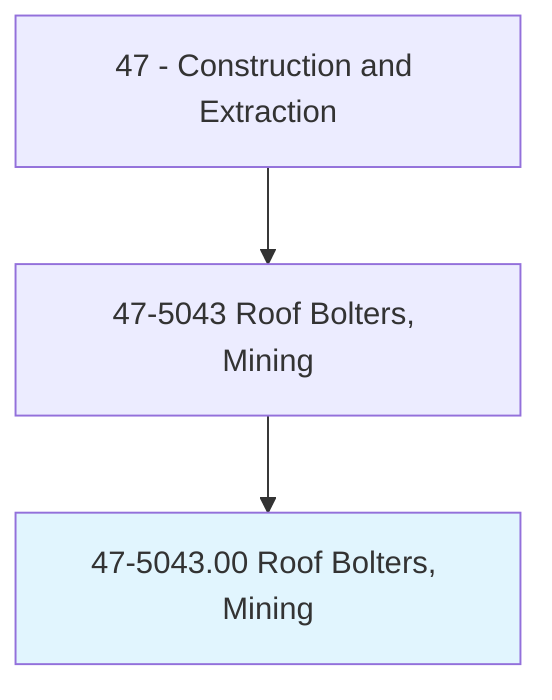
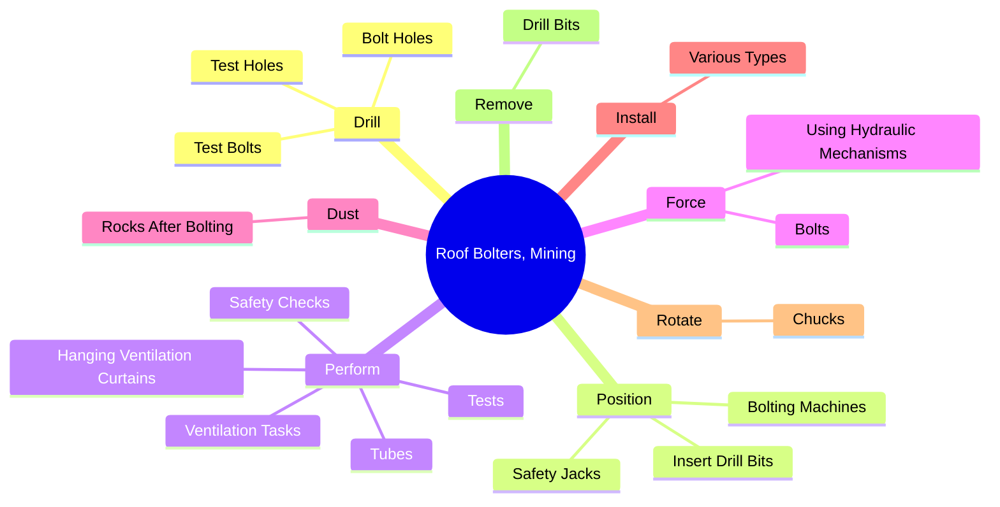
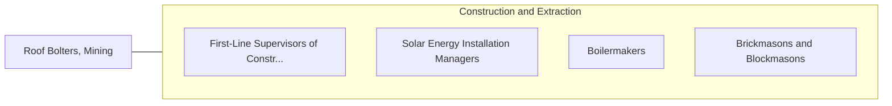

# Roof Bolters, Mining

> Operate machinery to install roof support bolts in underground mine.

## Overview

Roof Bolters, Mining is classified under Construction and Extraction (SOC 47). Operate machinery to install roof support bolts in underground mine.

## Classification Hierarchy

## Key Statistics

| Metric | Value |
|--------|-------|
| SOC Code | 47-5043.00 |
| Category | [Construction and Extraction](/occupations/Construction/index) |
| Task Count | 28 |
| Source | O*NET |

## Core Tasks

### drill.BoltHoles

Roof Bolters, Mining drill bolt holes as part of their core responsibilities.

**Actions:**
- `drill.BoltHoles.into.Roofs.at.SpecifiedDistancesFromRibsBolts`
- `drill.BoltHoles.into.Roofs.at.AdjacentBolts`
- `drill.TestHoles.for.SpecifiedTension`
- `drill.TestHoles.for.UsingTorqueWrenches`

### position.BoltingMachines

Roof Bolters, Mining position bolting machines as part of their core responsibilities.

**Actions:**
- `position.BoltingMachines`
- `position.InsertDrillBits.into.Chucks`
- `position.SafetyJacks.to.support.UndergroundMineRoofsUntilBoltsCanBeInstalled`

### perform.SafetyChecks

Roof Bolters, Mining perform safety checks as part of their core responsibilities.

**Actions:**
- `perform.SafetyChecks.on.EquipmentBeforeOperating`
- `perform.Tests.to.determine.IfMethaneGasIsPresent`
- `perform.VentilationTasks`
- `perform.HangingVentilationCurtains`

## Skills & Competencies

### Technical Skills
- **Construction Methods** - Advanced
- **Blueprint Reading** - Advanced
- **Safety Compliance** - Advanced

### Soft Skills
- **Communication** - Essential
- **Problem Solving** - Essential
- **Critical Thinking** - Important
- **Teamwork** - Important
- **Adaptability** - Important

## Related Occupations

## Industries

This occupation is found across multiple industries. See [Industries](/industries) for sector-specific employment data.

## Career Progression

---

*Source: O*NET 47-5043.00 - ONETOccupation*
