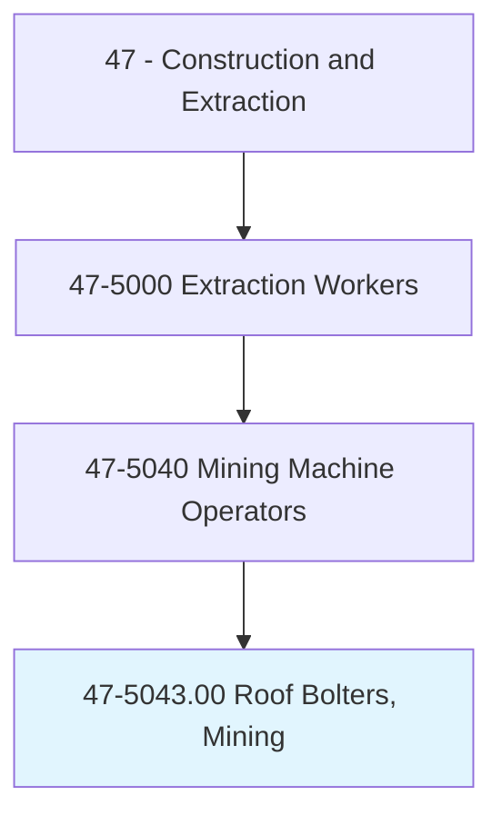
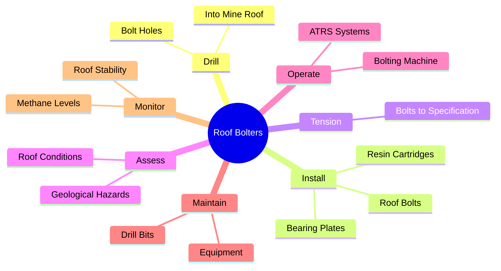
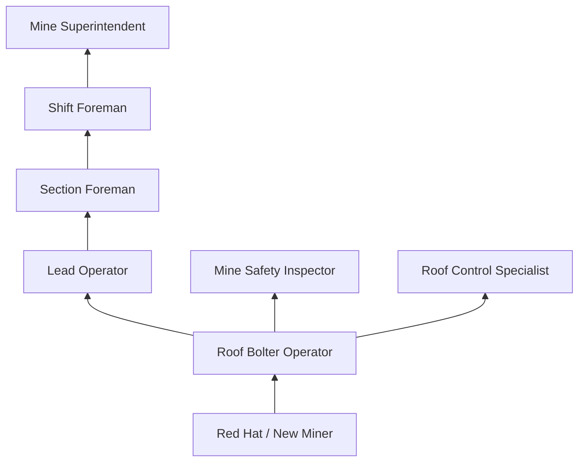
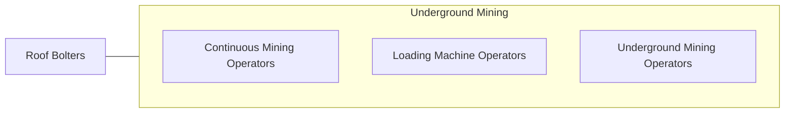

# Roof Bolters, Mining

> Operate machinery to install roof support bolts in underground mine.

## Overview

Roof Bolters operate specialized drilling machines in underground mines to install roof support bolts that prevent roof collapses in mine entries and intersections. Roof falls are the second-leading cause of fatalities in underground mining, making the roof bolter operator one of the most safety-critical positions in any mine. These operators drill holes into the mine roof, then insert and tension steel bolts with bearing plates to bind weak roof strata to stronger layers above, creating a stable rock beam.

The work is performed in the immediate vicinity of freshly exposed, unsupported roof, making it inherently dangerous. Operators must assess roof conditions continuously, identifying geological anomalies, water seepage, and structural weaknesses that could indicate imminent collapse. They work from the roof bolting machine's canopy, which provides temporary overhead protection, but must extend beyond this protection to install bolts at the face.

Modern roof bolting machines are equipped with automated drilling and bolting capabilities, dust suppression systems, and temporary roof support (ATRS) that extends protection toward the face. Despite these advances, operator judgment remains critical for selecting bolt patterns, identifying hazardous conditions, and making real-time safety decisions in an environment where conditions can change rapidly.

## Classification Hierarchy

## Key Statistics

| Metric | Value |
|--------|-------|
| SOC Code | 47-5043.00 |
| Job Zone | 2 (Some Preparation) |
| Category | [Construction and Extraction](/occupations/Construction/index) |
| Task Count | 72 |
| Median Salary | $55,200 / year |
| Employment | ~5,000 |
| Job Outlook | -10% (Decline) |
| Physical Demands | Heavy |
| Source | O*NET |

## Core Tasks

### install.RoofBolts

Roof bolters drill and install support bolts per the mine's roof control plan.

**Actions:**
- `install.RoofBolts.per.RoofControlPlan`
- `drill.BoltHoles.into.MineRoof`
- `tension.Bolts.to.RequiredTorque`

## Skills & Competencies

### Technical Skills
- **Roof Bolting Machine Operation** - Expert
- **Roof Condition Assessment** - Expert
- **Geological Reading** - Advanced
- **Equipment Maintenance** - Advanced
- **Roof Control Plan Knowledge** - Expert
- **Methane Monitoring** - Advanced

### Soft Skills
- **Safety Consciousness** - Critical
- **Situational Awareness** - Critical
- **Quick Decision Making** - Critical
- **Physical Stamina** - Critical
- **Communication** - Essential

## Education & Certifications

| Requirement | Details |
|-------------|---------|
| Typical Education | High school diploma or equivalent |
| MSHA Training | 40-hour new miner + annual refresher |
| On-the-Job Training | 3-6 months |

### Certifications
- **MSHA New Miner Training (Part 48)** - Mandatory
- **MSHA Annual Refresher** - 8-hour requirement
- **State Mining License** - Where required
- **Electrical Certification** - For underground electrical work
- **First Aid/CPR** - Required

## Career Progression

## Safety Considerations

- **Roof Falls** - Working under unsupported roof; the primary hazard
- **Equipment Entanglement** - Rotating drill steel; lockout procedures
- **Methane Accumulation** - Near-face gas monitoring; ventilation
- **Dust Exposure** - Drilling generates respirable dust; suppression systems
- **Noise** - Drilling noise; hearing protection
- **Electrical Hazards** - High-voltage equipment underground
- **Confined Space** - Low ceiling underground entries

## Related Occupations

## Industries

- [Coal Mining](/industries/CoalMining) - Primary Employment
- [Metal Ore Mining](/industries/MetalMining) - Moderate Employment
- [Nonmetallic Mineral Mining](/industries/MineralMining) - Moderate Employment

## Departments

- [Underground Operations](/departments/UndergroundOps)
- [Production](/departments/Production)
- [Safety](/departments/Safety)

---

*Source: O*NET 47-5043.00 - ONETOccupation*
