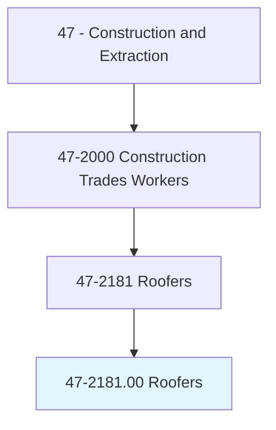
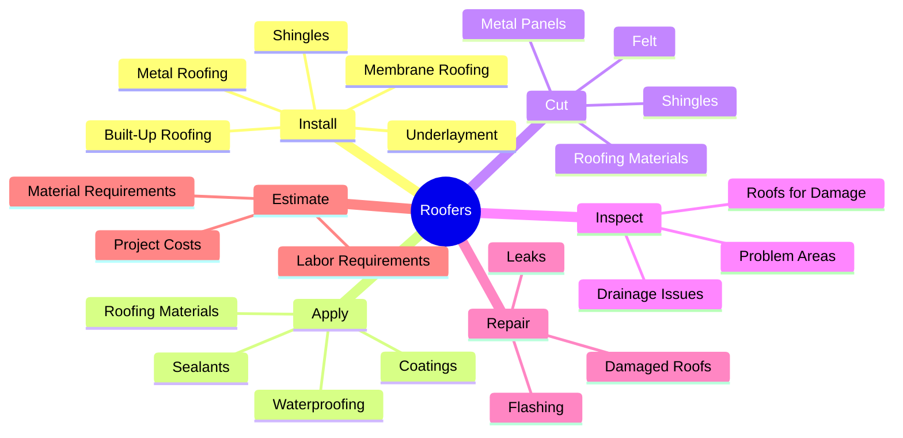
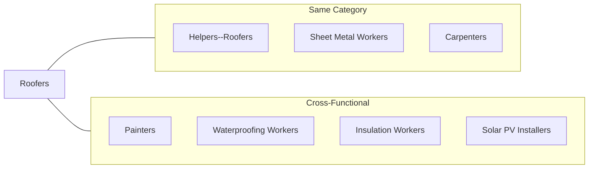
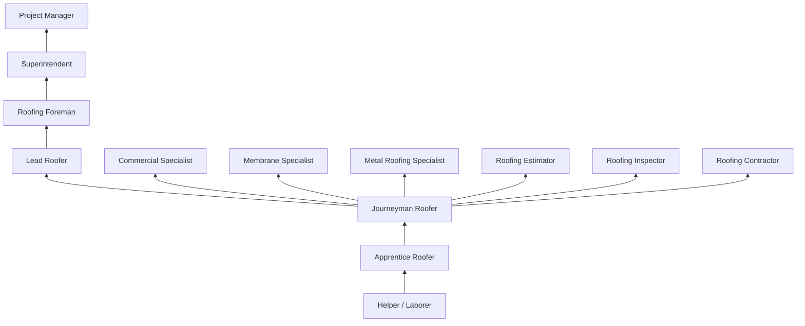

# Roofers

> Cover roofs of structures with shingles, slate, asphalt, aluminum, wood, or related materials. May spray roofs, sidings, and walls with material to bind, seal, insulate, or soundproof sections of structures.

## Overview

Roofers are skilled tradespeople who install and repair roofs on buildings, protecting structures from weather and the elements. This physically demanding occupation requires working at heights in various weather conditions while handling heavy materials and using specialized equipment. Roofers must understand different roofing systems, including shingles, membrane roofing, metal panels, and built-up roofing, and select appropriate materials and methods for each application. Safety awareness is paramount due to fall hazards and exposure to heat, cold, and UV radiation.

## Classification Hierarchy

## Key Statistics

| Metric | Value |
|--------|-------|
| SOC Code | 47-2181.00 |
| Job Zone | 2-3 (Some to Medium Preparation) |
| Category | [Construction](/occupations/Construction/index) |
| Core Tasks | 12+ |
| Physical Demands | Very Heavy |
| Source | O*NET |

## Core Tasks

### install.RoofingSystems

Roofers apply various roofing materials to protect structures from weather.

**Actions:**
- `install.Shingles.on.Roofs` - Apply asphalt, wood, or composite shingles
- `install.MembraneRoofing.on.FlatRoofs` - Apply TPO, EPDM, or PVC membranes
- `install.MetalRoofing.on.Structures` - Mount metal panels and standing seam
- `install.BuiltUpRoofing.on.CommercialBuildings` - Apply layers of felt and asphalt
- `install.SlateOrTile.on.Roofs` - Set natural or concrete tiles
- `install.Underlayment.before.Roofing` - Apply moisture barrier layers
- `install.Flashing.around.Penetrations` - Waterproof roof openings

### apply.Materials

Roofers spread, spray, or attach materials to create weather-tight surfaces.

**Actions:**
- `apply.RoofingMaterials.to.Roofs` - Spread roofing products
- `apply.Waterproofing.to.Surfaces` - Create moisture barriers
- `apply.Sealants.around.Edges` - Seal joints and penetrations
- `apply.Coatings.for.Protection` - Spray reflective or protective coatings
- `apply.HotAsphalt.to.BuiltUpRoofs` - Pour and mop hot asphalt

### cut.Materials

Roofers size and shape materials to fit roof configurations.

**Actions:**
- `cut.RoofingMaterials.to.Size` - Size shingles and membranes
- `cut.Felt.for.Underlayment` - Trim roofing felt
- `cut.MetalPanels.to.Length` - Size metal roofing
- `cut.Holes.for.Vents` - Create openings for penetrations

### inspect.Roofs

Roofers assess existing conditions and identify problems.

**Actions:**
- `inspect.Roofs.for.Damage` - Identify deterioration
- `inspect.Roofs.for.Leaks` - Find moisture intrusion points
- `inspect.DrainageSystems.for.Issues` - Check gutters and drains
- `document.Conditions.for.Estimates` - Record findings

### repair.Roofs

Roofers fix problems to restore roof function.

**Actions:**
- `repair.DamagedRoofs.after.Storms` - Fix weather damage
- `repair.Leaks.in.Roofing` - Stop moisture intrusion
- `replace.DamagedShingles.on.Roofs` - Swap out failed materials
- `repair.Flashing.around.Chimneys` - Fix weatherproofing details

## Specializations

### Residential Roofing
- Asphalt shingle installation
- Wood shake and shingle roofs
- Roof tear-off and replacement
- Storm damage repair
- Gutter installation

### Commercial Roofing
- Low-slope membrane systems
- Built-up roofing (BUR)
- Modified bitumen
- Metal panel systems
- Roof maintenance programs

### Industrial Roofing
- Large-scale roof systems
- Spray polyurethane foam (SPF)
- Metal building re-roofing
- Specialty coatings
- Industrial maintenance

### Green Roofing
- Vegetative roof systems
- Cool roof coatings
- Solar-ready roofing
- Sustainable materials
- LEED compliance

## Skills & Competencies

### Technical Skills
- **Roofing Systems Knowledge** - Expert
- **Material Application** - Expert
- **Blueprint Reading** - Intermediate
- **Mathematics (Measurement)** - Advanced
- **Safety Procedures** - Expert
- **Equipment Operation** - Advanced

### Soft Skills
- **Physical Stamina** - Critical
- **Balance and Coordination** - Critical
- **Heat/Cold Tolerance** - Critical
- **Attention to Detail** - Essential
- **Team Coordination** - Essential
- **Problem Solving** - Important

## Related Occupations

## Industries

- Specialty Trade Contractors - High Employment
- Self-Employed - High Employment
- Residential Construction - High Employment
- Commercial Construction - Moderate Employment
- Building Maintenance - Moderate Employment

## Career Progression

## Apprenticeship Path

| Year | Focus Areas | Hours |
|------|-------------|-------|
| Year 1 | Safety, hand tools, material handling, tear-off, underlayment | 2,000 OJT + 144 classroom |
| Year 2 | Shingle installation, flashing, repairs | 2,000 OJT + 144 classroom |
| Year 3 | Commercial systems, membrane, built-up roofing | 2,000 OJT + 144 classroom |

**Total Program**: 3 years (6,000 hours on-the-job training + 432 hours classroom instruction)

## Education & Training

| Requirement | Details |
|-------------|---------|
| Typical Education | High school diploma or equivalent |
| Apprenticeship | 2-3 year program |
| On-the-Job Training | Moderate, learning while working |
| Certifications | Manufacturer certifications, OSHA |

## Certifications

- **OSHA 10-Hour Construction** - Basic safety certification
- **OSHA 30-Hour Construction** - Comprehensive safety certification
- **Manufacturer Certifications** - GAF, CertainTeed, Owens Corning, etc.
- **NRCA ProCertification** - Industry recognition
- **TPO/EPDM Certification** - Single-ply membrane systems
- **Torch Applied Certification** - Modified bitumen systems
- **Fall Protection Competent Person** - Safety certification
- **First Aid/CPR** - Emergency response certification

## Safety Requirements

### Personal Protective Equipment
- Hard hat
- Safety glasses
- Steel-toed boots with slip-resistant soles
- Work gloves
- Knee pads
- High-visibility clothing
- Sunscreen and sun protection

### Fall Protection
- Personal fall arrest systems (PFAS)
- Guardrails and safety nets
- Warning line systems
- Roof brackets and toe boards
- Ladder safety devices
- Anchor points and lifelines

### Common Hazards
- Falls from heights (leading cause of fatalities)
- Heat-related illness
- Burns from hot materials
- Overexertion and musculoskeletal injuries
- Struck by falling objects
- Electrical hazards
- Weather-related dangers
- Chemical exposure

### Required Training
- Fall protection and rescue
- Ladder safety
- Heat illness prevention
- Hot work safety
- Aerial lift operation
- Hazard communication
- Silica awareness

## Tools & Equipment

### Hand Tools
- Roofing hammer / hatchet
- Utility knife
- Tape measure
- Chalk line
- Pry bar / roofing shovel
- Tin snips
- Seam roller
- Caulking gun

### Power Tools
- Nail gun (roofing, coil)
- Circular saw
- Reciprocating saw
- Heat gun
- Screw gun
- Hot air welder (membrane)

### Equipment
- Extension ladders
- Roof brackets
- Scaffolding
- Material hoists
- Hot asphalt kettle
- Spray equipment
- Safety harnesses and lanyards

## Work Environment

### Physical Demands
- Working at heights constantly
- Heavy lifting (up to 100+ pounds)
- Kneeling, bending, and squatting
- Climbing ladders repeatedly
- Extreme heat exposure in summer
- Cold weather work in winter
- Carrying materials up ladders

### Work Conditions
- Primarily outdoor work
- Weather-dependent scheduling
- Seasonal employment fluctuations
- Early start times in hot weather
- Physical exhaustion common
- High injury risk profession

## Departments

This occupation typically works in:
- Residential Division
- Commercial Division
- Service/Repair Department
- Storm Damage Division

## Union Affiliation

Many roofers are members of the United Union of Roofers, Waterproofers and Allied Workers, which provides:
- Apprenticeship training programs
- Job referral services
- Health and pension benefits
- Safety training programs
- Certification assistance

---

*Source: O*NET 47-2181.00 - ONETOccupation*
